# ABHI Unified KYC Ledger
## Implementation Blueprint & Production Architecture

**A permissioned blockchain holding proof — not data — of every identity verification ABHI has performed.**

| | |
|---|---|
| **Document** | Implementation Blueprint v1.0 |
| **Author** | Muhammad Shahnoor Sajid, Digital Products, ABHI Microfinance Bank |
| **Date** | 17 August 2026 |
| **Status** | For review — Technology Leadership, Compliance, Risk, Executive Committee |
| **Classification** | Internal · Confidential |
| **Supersedes** | Nothing. Extends `ABHI_KYC_Ledger_IDEA.md` (17 Aug 2026) |
| **Amended** | 23 August 2026 after the end-to-end review; 24 August 2026 after the POC scope change. See the notes below |

> **Amendment note — 23 August 2026**
>
> The body of this document is the blueprint **as written on 17 August**, deliberately
> left intact so the record shows what was believed at design time. The review of
> 23 August added inline annotations in five places, each marked in bold, and one new
> row to the open-items register:
>
> - **[OPEN-F]** (§A.1, and annotated at §1.8, §2.3.2, §2.3.3, §10.4 and §15.5) — whether the
>   fingerprint and live-selfie step at Product Manual Part Two §9.3 is customer due
>   diligence or per-request transaction authorisation. **It is unresolved, and it moves
>   the business case in either direction.** The EWA "zero rail calls" target state
>   throughout this document is conditional on it, **including POC success criterion 6**.
> - **§3.5 integration layer, e-CIB row** — the row's "never bypassed" requirement was
>   implemented as "always called, answer discarded". Corrected; see `SEC-18` in
>   `docs/SECURITY_AUDIT.md`.
> - **§8.9 S-5** — the employer roster control described there existed but was not
>   connected to the HTTP surface. Corrected; see `SEC-16`.
>
> Findings are recorded in full in `docs/SECURITY_AUDIT.md` revision 4 and
> `docs/GAP_ANALYSIS.md` NEW-08 to NEW-13. Nothing in the original text was deleted.

> **Amendment note — 24 August 2026**
>
> Two changes were made to the POC console on 24 August. The first contradicts this
> document in six places; the second moves the console **towards** it. Both are
> annotated where they bite, and as with the 23 August review nothing in the original
> text was deleted.
>
> **1 — The customer now performs their own step-up checks.** The console had a
> profile control, *"Run missing checks"*, that ran a customer's outstanding
> verification from the operator's screen. It was removed. The checks are performed by
> the customer in the customer-facing journey, which commits the step-up when the last
> one clears; the internal profile shows their status and offers no control that would
> perform one. **This brings the console closer to §8.2's separation** — writes tracing
> to a customer journey rather than to a member of staff — and §8.2 is annotated with
> what still falls short of it. It changes nothing in the architecture this document
> specifies; it corrects an interface that had drifted from it.
>
> **2 — The cost dashboard was withdrawn, and every figure denominated in rupees was
> removed from the console interface with it.** This document specifies that dashboard
> in six places — §9.4 (Phase 4 deliverables, the S3 task table, and the POC acceptance
> criteria), §10.5 (the Sprint 3 backlog and demo spine item 9), and §12.8 item 36.
>
> **The economic model is unaffected.** The unit-cost table, the sensitivity analysis
> and the ROI case are arguments made on paper, and none of them ran through the
> screen. The gateway still computes and returns every cost field — `/metrics` and the
> employer bulk-lookup response are unchanged — so the dashboard is a UI decision that
> can be reversed without backend work.
>
> **What the withdrawal costs the demo, stated plainly.** The employer-upload saving
> was the POC's headline commercial exhibit, and it is no longer on screen. A reader
> reaching §10.5 will find item 9 described as "the one the CFO remembers"; that beat
> no longer exists in the running console, and any gate pack built from this document
> must source the figure from `npm run numbers` or the gateway directly, with the
> standing caveat that **the unit costs are modelled placeholders, not ABHI's
> contracted rates**. That caveat was always attached to them; removing the screen
> removed the place it was displayed.

> **Companion documents**
> - `ABHI_KYC_Ledger_IDEA.md` — **the concept.** Why this exists, in full, self-contained. Read that first if you have seen nothing else.
> - `ABHI_KYC_Ledger_POC_Plan.docx` — the sprint proposal: scope, timeline, ask.
> - `BUILD.md` — 41 numbered steps to build the POC.
> - **This document** — the implementation blueprint. What a development team builds, in what order, against which controls, and how it becomes a production banking platform.

---

## How to read this

This document has three audiences and they should not read all of it.

| If you are… | Read | Skip |
|---|---|---|
| **Executive Committee / CEO** | §1, §14, §15 | Everything else |
| **Compliance / Risk / AML** | §1, §2, §6, §7, §8.6–8.9, §15 | §3.2–3.5, §5, §12 |
| **Technology leadership / CTO** | §1, §3, §9, §11, §13, §15 | §12 |
| **Development team** | §3, §4, §5, §6, §12 — then §9, §10 | §1, §7, §15 |
| **SBP inspector / external auditor** | §4, §6, §7, §8, §13.8 | §9, §10, §12 |

### Provenance key

Every substantive claim in this document carries one of four markers. This exists because the fastest way to lose a compliance review is to present an assumption in the same typeface as a fact.

| Marker | Meaning |
|---|---|
| **[M]** | Sourced from ABHI internal documentation — *Consolidated Product Manual v2* (Part One: Digital Products, Part Two: Lending Products), *ABHI Lending Products Manual V10* |
| **[R]** | Public regulatory source, cited by instrument. **Clause-level verification is a Compliance action, not an engineering one** — see §7.1 |
| **[A]** | Assumption made to keep the blueprint actionable. Every one is listed in Appendix A with an owner |
| **[OPEN-n]** | Cannot be answered without ABHI input. Extends the open-questions register in `IDEA.md` §13; consolidated in Appendix A |

### Three assumptions made to keep this document actionable

Stated here rather than buried, because if any is wrong the plan changes shape.

1. **[A-1] Sprint cadence is two weeks**, team as specified: 1 PM, 1 Architect, 2 Backend, 1 Blockchain, 1 Frontend, 1 QA. §10 is built on this and re-phases cleanly if the cadence changes.
2. **[A-2] No ROI figure in this document is an ABHI number.** §1.6 gives a model and a sensitivity grid over placeholder inputs. The inputs do not currently exist anywhere in the bank — which is itself a finding, and Sprint 0 instruments for them. Substituting real actuals is a Finance action.
3. **[A-3] The POC runs entirely on mocked verification rails.** No production NADRA, e-CIB, CBS or Mobiliser credentials are requested, obtained, or used. This is what makes a seven-to-eight-week build possible and what keeps the POC out of change-control.

---

## Contents

| § | Section | For |
|---|---|---|
| **1** | [Executive Summary](#1-executive-summary) | ExCo |
| **2** | [Current State Analysis](#2-current-state-analysis) | All |
| **3** | [Solution Architecture](#3-solution-architecture) | Technology |
| **4** | [Data Model Design](#4-data-model-design) | Development |
| **5** | [Smart Contract Design](#5-smart-contract-design) | Development |
| **6** | [Assurance Framework](#6-assurance-framework) | Compliance, Risk |
| **7** | [Regulatory & Compliance Analysis](#7-regulatory--compliance-analysis) | Compliance |
| **8** | [Security Architecture](#8-security-architecture) | Security |
| **9** | [Development Roadmap](#9-development-roadmap) | Delivery |
| **10** | [Sprint-by-Sprint Plan](#10-sprint-by-sprint-plan) | Delivery |
| **11** | [Complete Technical Stack](#11-complete-technical-stack) | Technology |
| **12** | [POC Build Guide](#12-poc-build-guide) | Development |
| **13** | [Production Readiness Plan](#13-production-readiness-plan) | Operations |
| **14** | [Success Metrics](#14-success-metrics) | Product, Finance |
| **15** | [Executive Recommendations](#15-executive-recommendations) | ExCo |
| **A–D** | [Open questions · RACI · Glossary · References](#appendix-a--open-questions-and-assumptions) | All |

---

# 1. Executive Summary

## 1.1 Problem statement

ABHI cannot answer, instantly and provably, a question it should never have to think about:

> **Is this CNIC verified, to what standard, when, by whom, and is that verification still valid?**

The bank verifies the same person's identity repeatedly across at least eleven distinct touchpoints **[M]**. Each verification is defensible in isolation. Collectively they mean ABHI holds several independently-drifting records of one human being, with no field anywhere that distinguishes *"an employer typed this CNIC into a spreadsheet"* from *"NADRA matched this person's fingerprints on both hands."*

That missing distinction is not a data-quality nuisance. It is a risk control that does not exist.

## 1.2 Existing KYC challenges at ABHI

Four defects, each traceable to product documentation rather than inferred **[M]**:

| # | Defect | Evidence | Consequence |
|---|---|---|---|
| **1** | **Contradictory records on one person** | Employer portal records an unverified CNIC (Part Two §8.2); Asaan Digital Account records the same CNIC verified to NADRA's highest standard (Part One §2). Both are stored as *"we have this customer's CNIC"* | Risk decisions cannot be made on verification strength, because verification strength is not recorded |
| **2** | **Updates do not propagate** | *"KYC expiry"* is monitored per product (Part Two §14.7). A CNIC renewed through the wallet journey does not notify the lending platform | A CNIC expiring mid-SBL flags nowhere. The reverse — a renewal the bank paid for — benefits one product only |
| **3** | **Cost paid repeatedly, and untracked** | Every Verisys and biometric call carries a per-call cost. No system counts how many are repeat verifications of an already-verified customer | The bank cannot size its own waste. **This is the finding that makes the business case, and it is currently unmeasurable** |
| **4** | **Friction paid by the customer** | Fingerprint and face verification capped at **3 attempts per day each** (Part Two §9.3) | A customer whose prints read poorly — common among manual workers, precisely ABHI's target market — is locked out of a loan they qualify for for 24 hours. They already proved who they are weeks ago |

Defect 4 deserves a sentence of its own. ABHI's core customer is a salaried manual worker. Worn fingerprints are an occupational characteristic of that population. A three-attempt daily cap therefore fails hardest against exactly the customers the bank exists to serve, in a journey they have already completed successfully once.

## 1.3 The proposal

A permissioned Hyperledger Fabric ledger, internal to ABHI, holding a tamper-evident, versioned record of every KYC verification the bank performs.

**No personal data goes on the ledger.** What goes on the ledger is a cryptographic commitment — a salted Merkle root over the verified attribute set — plus the assurance level achieved, the methods used, who verified, when, and when it expires.

Products query the ledger *before* running KYC:

- **A sufficient verification exists** → consume a selective-disclosure proof. Zero NADRA calls.
- **A partial one exists** → run only the missing method. One biometric scan, not the whole onboarding pack.
- **Nothing exists** → run the full journey, and record it so the next product does not have to.

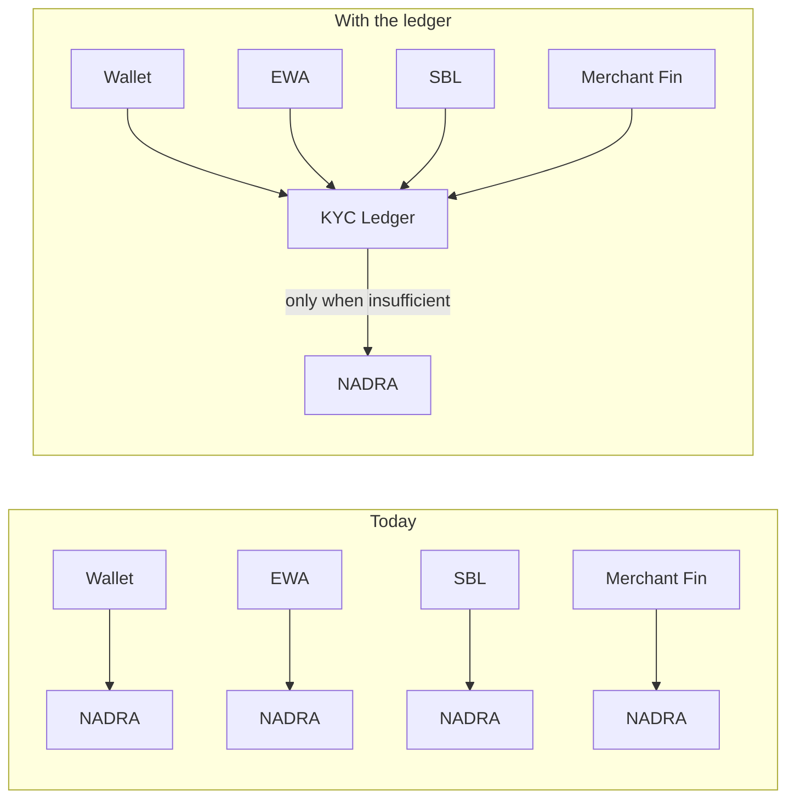
```mermaid
flowchart LR
    subgraph T["Today"]
        direction TB
        P1["Wallet"] --> N1["NADRA"]
        P2["EWA"] --> N2["NADRA"]
        P3["SBL"] --> N3["NADRA"]
        P4["Merchant Fin"] --> N4["NADRA"]
    end
    subgraph W["With the ledger"]
        direction TB
        Q1["Wallet"] --> L["KYC Ledger"]
        Q2["EWA"] --> L
        Q3["SBL"] --> L
        Q4["Merchant Fin"] --> L
        L -->|"only when insufficient"| N5["NADRA"]
    end
```

## 1.4 Business opportunity

| Opportunity | Mechanism | Realisable |
|---|---|---|
| **Eliminate duplicate verification spend** | `VerifyKYC` returns ALLOW; no rail is called | Immediately on first cross-product reuse |
| **Convert full re-verification into step-up** | Response names exactly which methods are missing | Immediately |
| **Recover abandoned journeys** | Customer locked out by the 3-attempt cap is never asked to scan again | Immediately |
| **Employer activation at onboard time** | Corporate portal sees which of 1,000 uploaded employees are already A2 | Sprint 8+ |
| **One integration per new product** | New products call `VerifyKYC` instead of re-implementing KYC | Structural, compounds |
| **Consonance readiness** | Joining PBA's platform requires one canonical KYC record per customer. ABHI does not have one | Strategic prerequisite |

## 1.5 Strategic value

Three properties justify a ledger rather than a flag on the core banking system. They are the entire architectural argument and should be tested hard in review.

1. **No unilateral write.** Compliance must co-endorse every KYC status change alongside the originating product organization. No product team, and no database administrator, can declare a customer verified alone. This is enforced by the network's endorsement policy, not by application code that a sufficiently privileged operator can bypass.
2. **Auditable history.** Every version is hash-chained to its predecessor. *"What did the bank know about this customer, and when?"* becomes a query returning a cryptographically verifiable answer, rather than a forensic investigation across four systems.
3. **National alignment.** In December 2023 SBP advised all banks to join a shared e-KYC platform built by the Pakistan Banks' Association on distributed ledger technology, with data held at the banks and access gated by consent **[R]**. Joining requires publishing one canonical KYC record per customer. **The internal ledger is the prerequisite for Consonance, not a competitor to it.**

## 1.6 Expected ROI — a model, not a number

**[A-2]** No figure below is an ABHI number. The three inputs the business case actually turns on do not exist in any ABHI system today, which is Defect 3 restated. This section gives the model, the grid, and the instrumentation plan that produces the real answer.

### The model

```
Annual gross saving  S  =  V × r × ĉ × e   +   D × LTV   +   H × w

where
  V    = annual identity verification events across all products      [OPEN-3]
  r    = proportion that re-verify an already-verified subject        [OPEN-3] ← the critical unknown
  ĉ    = blended cost per avoided verification (Verisys + biometric
         + liveness, weighted by product mix)                         [OPEN-3]
  e    = reuse efficiency — proportion of repeats the policy engine
         can actually satisfy from an existing record (ALLOW or
         partial STEP_UP), net of expiry and assurance shortfalls     [A]
  D    = journeys recovered that today abandon at repeat KYC          [A]
  LTV  = contribution margin per recovered customer                   Finance
  H    = manual compliance/ops hours avoided                          [A]
  w    = fully-loaded hourly cost                                     Finance
```

**Net = S − (build cost + annual run cost).** Build and run are estimated in §10.7 and §13.9 and are the only two terms in this model that engineering can size without the business.

### Sensitivity grid — illustrative grid points, *not* estimates

Cell values are annual gross saving on the rail-cost term only (`V × r × ĉ × e`), with `e = 0.7` **[A]**. Read this as *"what would have to be true"*, not as a forecast.

| `V` (annual verifications) | `r = 15%` | `r = 30%` | `r = 45%` |
|---|---|---|---|
| **100,000** @ ĉ = PKR 25 | PKR 0.26M | PKR 0.53M | PKR 0.79M |
| **100,000** @ ĉ = PKR 75 | PKR 0.79M | PKR 1.58M | PKR 2.36M |
| **250,000** @ ĉ = PKR 25 | PKR 0.66M | PKR 1.31M | PKR 1.97M |
| **250,000** @ ĉ = PKR 75 | PKR 1.97M | PKR 3.94M | PKR 5.91M |
| **500,000** @ ĉ = PKR 25 | PKR 1.31M | PKR 2.63M | PKR 3.94M |
| **500,000** @ ĉ = PKR 75 | PKR 3.94M | PKR 7.88M | PKR 11.81M |

**What this grid actually says.** On rail costs alone, the initiative does not pay for a seven-person team at low volume and low repeat rates. The rail saving is real but it is not, by itself, the business case at ABHI's current scale.

**The business case is therefore load-bearing on the other two terms** — recovered journeys (`D × LTV`) and the strategic Consonance prerequisite, which the grid cannot price at all. Anyone presenting this to ExCo should lead with drop-off recovery and Consonance readiness, and treat rail savings as the term that makes the run cost self-funding. Leading with "blockchain saves NADRA fees" will not survive contact with Finance.

### Instrumentation — how the real number gets produced

The honest position is that ABHI should not approve a production programme on this grid. It should approve a POC that produces the actual inputs. Three deliverables, all in the POC scope:

| Deliverable | Sprint | Produces |
|---|---|---|
| **Verification event census** — instrument every rail call across all products with subject, product, method, timestamp, cost tag | S0–S1 | `V` and `ĉ` from real traffic |
| **Retrospective duplication analysis** — derive subject IDs over historical verification logs, count distinct subjects vs total events | S1 | **`r` — the number that decides this programme** |
| **Cost-instrumented mock rails** — every mocked call increments a counter with a configurable unit cost | S2 | Live "saved vs spent" counter in the demo |

**[OPEN-3] remains the single highest-value question in this document.** It can be answered in one sprint from data the bank already has.

## 1.7 Cost reduction potential

Beyond rail spend, four cost pools are affected. None are quantified here **[A]**; each is named so Finance can size it.

| Pool | Today | Mechanism of reduction |
|---|---|---|
| **NADRA rail spend** | Per-call, per-product, uncounted | Avoided calls on ALLOW; partial calls on STEP_UP |
| **Manual compliance review** | Per-product KYC expiry monitoring (Part Two §14.7) **[M]** | One expiry surface; ledger-driven alerts |
| **Engineering cost per new product** | Every product re-implements KYC | One integration: `VerifyKYC` |
| **Audit and inspection preparation** | Reconstruct history across systems | Query returns a verifiable chain (§13.8) |

## 1.8 Customer experience impact

| Journey | Today **[M]** | With the ledger |
|---|---|---|
| Wallet customer requests EWA | Full KYC/CDD applies; CNIC screening per request | Instant. Zero rail calls. e-CIB still runs — **but see [OPEN-F]**, which may reduce this to one live selfie |
| A2 customer requests SBL | Full onboarding pack repeated | One liveness selfie — the single missing method |
| Fingerprint fails 3× | Locked out 24 hours; loan delayed | Never re-scanned; existing A2 proof consumed |
| Employer bulk-uploads 1,000 staff | 1,000 unverified CNICs, no visibility | Immediate split: activate now vs onboard |
| Customer renews CNIC | Benefits the product they renewed through | v2 appended; **every product sees it on its next call** |

## 1.9 Regulatory relevance

| Instrument | Posture |
|---|---|
| **SBP BPRD Circular Letter No. 22 of 2023** — shared e-KYC platform, DLT, bank-held data, consent-gated **[R]** | **Regulatory endorsement of exactly this architecture.** The strongest external validation available |
| **SBP BPRD Circular No. 01 of 2025** — Consolidated Customer Onboarding Framework **[R]** | The framework the assurance ladder must map onto (§6.6) |
| **SBP AML/CFT/CPF Regulations** **[R]** | No obligation altered. The ledger *evidences* discharge and preserves the evidence |
| **Personal Data Protection Bill 2023** (not enacted as at Aug 2026) **[R]** | Right to erasure anticipated structurally via crypto-shredding (§3.4.5) |
| **SBP Regulatory Sandbox** **[R]** | **Not required.** An internal ledger changes no customer-facing regulatory outcome |

Full mapping, including the gaps this design does *not* close, is §7.

## 1.10 The ask

| | |
|---|---|
| **Decision requested** | Approve a POC: 7 people, 8 weeks, mocked rails, no production integration |
| **What the POC proves** | Three MSPs with a real endorsement policy; append-only version chains; selective disclosure verified in bytes; the STEP_UP path; suspension propagating in one action |
| **What the POC produces for the business** | **The measured value of `r`** — the duplicate verification rate — from ABHI's own historical data |
| **What it does not require** | Production credentials, customer-facing change, regulatory approval, sandbox entry |
| **Gate to production** | §15.5 success criteria, all measurable, all pass/fail |

---

# 2. Current State Analysis

## 2.1 Every place ABHI verifies identity

Drawn from the *Consolidated Product Manual v2* **[M]**. **I** = Part One (Digital Products), **II** = Part Two (Lending Products) — the two parts number their sections independently.

| # | Touchpoint | What runs | Verified against | Source |
|---|---|---|---|---|
| 1 | Asaan Digital Account opening | CNIC + DOB, NADRA security questions, personal details, FATCA declaration, CNIC front/back capture with OCR and document-authenticity cross-check, 1:1 fingerprint match both hands | NADRA Verisys + biometric | I §2 |
| 2 | Sign-in / Forgot PIN | Security-question answers, SIM ownership re-confirmation | NADRA / core banking + telco | I §1 |
| 3 | EWA disbursement | *"Full KYC/CDD applies, since disbursement is to an already-existing wallet/core account"*; CNIC screening and e-CIB per request | ABHI Bank | II §6.1, §6.3a |
| 4 | EWA / ASA / SBL request | Fingerprint both hands, then live-selfie face verification — **capped at 3 attempts per day each** | NADRA | II §9.3 |
| 5 | Employer portal — add employee | CNIC (mandatory), DOB, name, salary account — **asserted by the employer, verified by nothing** | — | II §8.2 |
| 6 | Employer portal — bulk CSV | 15-column template; CNIC mandatory | — | II §8.2 |
| 7 | Merchant Financing onboarding | Marketplace collects documentation and pre-screens; ABHI Risk verifies; ECIB/CIR, AML, duplicate and exposure checks | ABHI Risk + e-CIB | II §14.3, §14.5, §14.7 |
| 8 | Organization onboarding (KYB) | Name, industry, business type, address, contacts, Master Murabaha and Wakalah agreements | Manual review | II §1.1 |
| 9 | Open API partner (Push) | Partner exposes its own CNIC-verification endpoint | Partner | II §10.2 |
| 10 | IBFT and internal transfers | KYC tier-limit headroom, freeze flags, AML/sanctions screening | Core banking | I §3, §4 |
| 11 | Compliance module | e-CIB, single CNIC or bulk CSV; scheduled via the `ecib-compliance` cron | e-CIB | II §3.1, §5.1 |

## 2.2 The as-is picture

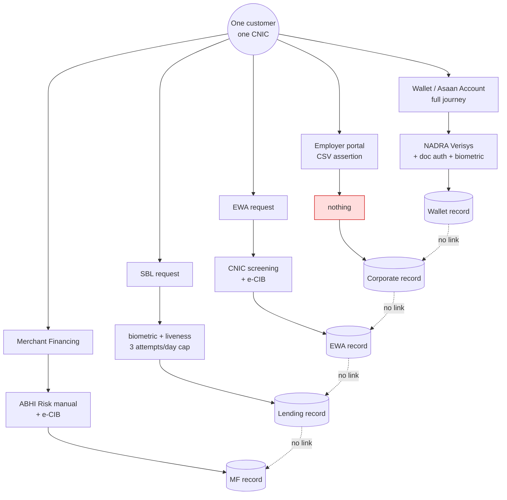
```mermaid
flowchart TB
    C(("One customer<br/>one CNIC"))

    C --> T1["Wallet / Asaan Account<br/>full journey"]
    C --> T5["Employer portal<br/>CSV assertion"]
    C --> T3["EWA request"]
    C --> T4["SBL request"]
    C --> T7["Merchant Financing"]

    T1 --> R1["NADRA Verisys<br/>+ doc auth + biometric"]
    T5 --> R5["nothing"]
    T3 --> R3["CNIC screening<br/>+ e-CIB"]
    T4 --> R4["biometric + liveness<br/>3 attempts/day cap"]
    T7 --> R7["ABHI Risk manual<br/>+ e-CIB"]

    R1 --> S1[("Wallet record")]
    R5 --> S5[("Corporate record")]
    R3 --> S3[("EWA record")]
    R4 --> S4[("Lending record")]
    R7 --> S7[("MF record")]

    S1 -.->|"no link"| S5
    S5 -.->|"no link"| S3
    S3 -.->|"no link"| S4
    S4 -.->|"no link"| S7

    style R5 fill:#fdd,stroke:#c00
    style C fill:#eef
```

The dotted lines are the problem. Five records of one person, no linkage, no shared notion of verification strength, no propagation of updates.

## 2.3 Per-product analysis

### 2.3.1 Asaan Digital Account **[M]** — Part One §2

| | |
|---|---|
| **Current KYC process** | CNIC + DOB capture → NADRA security questions → personal details → FATCA declaration → CNIC front/back capture with OCR → document-authenticity cross-check → NADRA 1:1 fingerprint match, both hands |
| **Verification sources** | NADRA Verisys; NADRA biometric |
| **Assurance achieved** | **A2** (A3 where liveness also runs) |
| **Pain points** | The most expensive journey in the bank, and its output is invisible to every other product |
| **Risks** | None material in itself. This is the gold standard journey |
| **Cost drivers** | Verisys call; document authenticity; biometric 1:1 |
| **Duplicate opportunity** | **This is the source record.** Every other touchpoint is a candidate consumer of it. The single highest-value record in the bank to make reusable |

### 2.3.2 Earned Wage Access (EWA) **[M]** — Part Two §6.1, §6.3a, §9.3

| | |
|---|---|
| **Current KYC process** | *"Full KYC/CDD applies, since disbursement is to an already-existing wallet/core account"*; CNIC screening and e-CIB per request; fingerprint both hands then live-selfie |
| **Verification sources** | ABHI Bank; NADRA; e-CIB |
| **Pain points** | The product manual's own justification — *disbursement is to an already-existing wallet/core account* — is precisely the case where the bank has **already** performed the strongest verification it offers. Full CDD is applied to a customer the bank verified biometrically weeks earlier, with no mechanism to rely on that |
| **Risks** | 3-attempt daily cap converts a transient biometric failure into a next-day disbursement delay on a wage-advance product, where timing is the entire value proposition |
| **Cost drivers** | Per-request biometric and liveness; per-request e-CIB (unavoidable, and correctly so) |
| **Duplicate opportunity** | **Highest in the bank.** Requires A2; the wallet journey already produces A2. Target state: zero rail calls, e-CIB unchanged |
| **[OPEN-F] — unresolved** | This row and the Cost drivers row above are in tension, and the review of 23 Aug 2026 could not settle it from the manual. "Current KYC process" records a live-selfie on every EWA request, per Part Two §9.3. If that selfie is **CDD**, EWA requires A3, the wallet's A2 does not satisfy it, and the target state is one selfie rather than zero rail calls. If it is **transaction authorisation** — which §9.3's wording suggests, *"before the request proceeds to approval"*, capped at 3 attempts per day — then it authenticates a specific request, is not reusable by anything, and the modelled saving is overstated by that share. Compliance and Product must decide. See `packages/policy/src/policies.ts`, where EWA is configured A2 |

### 2.3.3 Advance Salary Access (ASA) **[M]**

| | |
|---|---|
| **Current KYC process** | As EWA — biometric both hands then live-selfie per request, 3-attempt cap |
| **Verification sources** | NADRA; e-CIB |
| **Pain points** | Identical to EWA. Same customer, same rails, different product code |
| **Risks** | Same cap-induced lockout |
| **Cost drivers** | Per-request biometric + liveness |
| **Duplicate opportunity** | High. A2 within 365 days satisfies it. Also duplicates **EWA's own** verification for customers using both |
| **[OPEN-F] — unresolved** | Applies here exactly as it does to EWA (§2.3.2): "Current KYC process" above records a live-selfie per request, which is A3 if it is CDD and not reusable at all if it is transaction authorisation. ASA is configured A2 |

### 2.3.4 Salary-Backed Lending (SBL) **[M]** — Part Two §9.3

| | |
|---|---|
| **Current KYC process** | Fingerprint both hands, then live-selfie face verification |
| **Verification sources** | NADRA biometric + liveness |
| **Pain points** | Highest-friction identity journey at the highest-stakes moment. Both caps apply independently |
| **Risks** | An A2 customer must re-run everything to reach A3, when only liveness is missing. **A step-up problem misdiagnosed as an onboarding problem** |
| **Cost drivers** | Biometric + liveness per request; abandoned applications |
| **Duplicate opportunity** | **The clearest STEP_UP case in the bank.** A2 → A3 is one liveness call, not a full pack |

### 2.3.5 Merchant Financing **[M]** — Part Two §14.3, §14.5, §14.7

| | |
|---|---|
| **Current KYC process** | Marketplace collects documentation and pre-screens; ABHI Risk verifies; ECIB/CIR, AML, duplicate and exposure checks. KYC expiry monitored by the MF team |
| **Verification sources** | ABHI Risk (manual); e-CIB; marketplace partner |
| **Pain points** | Third independent collection of the same documentation set. **KYC expiry monitored per product** — the clearest evidence of the propagation defect |
| **Risks** | Manual verification is the weakest link and the least auditable. Expiry monitoring in one team's process, not in the platform |
| **Cost drivers** | Manual Risk review hours; documentation handling; duplicate checks |
| **Duplicate opportunity** | High for merchants who are also wallet customers. Requires A3; the SBL path already produces A3 |

### 2.3.6 Employer Portal **[M]** — Part Two §8.2

| | |
|---|---|
| **Current KYC process** | Add employee: CNIC (mandatory), DOB, name, salary account. Bulk: 15-column CSV, CNIC mandatory |
| **Verification sources** | **None. The employer asserts; nothing verifies** |
| **Assurance achieved** | **A0** — and A0 exists in this framework specifically because this touchpoint does |
| **Pain points** | Injects unverified CNICs into the bank's records with no marker distinguishing them from biometrically-verified ones. HR has no visibility into which employees already bank with ABHI |
| **Risks** | **The most serious structural risk in the current state.** An asserted CNIC and a NADRA-matched CNIC are stored identically. Typos, transpositions and stale HR records enter as facts. Formatting differs from the app — the CSV template strips dashes, the app captures them — so even exact-match reconciliation fails |
| **Cost drivers** | Downstream rework; failed activations; support load |
| **Duplicate opportunity** | Inverted — this is a **lookup** opportunity. On upload, resolve each CNIC to a subject and split the file: already A2 (activate now), A0 only (needs onboarding). Highest-visibility demo in the POC |

### 2.3.7 Open API Partners (Push model) **[M]** — Part Two §10.2

| | |
|---|---|
| **Current KYC process** | Partner exposes its own CNIC-verification endpoint |
| **Verification sources** | The partner's, on the partner's terms |
| **Pain points** | Verification standard is defined outside ABHI and is not recorded in any comparable form |
| **Risks** | **Assurance laundering** — a partner's weak verification enters ABHI's records indistinguishable from a strong one. Under the ledger this must map to an explicit, capped assurance level with the partner named in `verifiedBy` |
| **Cost drivers** | Partner integration; dispute handling |
| **Duplicate opportunity** | Medium. **[OPEN-7] Should partners write to the ledger, or only read?** Recommendation in §15.7: **read-only in v1**, write capability only after a partner-assurance attestation regime exists |

### 2.3.8 Compliance Module **[M]** — Part Two §3.1, §5.1

| | |
|---|---|
| **Current KYC process** | e-CIB checks, single CNIC or bulk CSV, scheduled via the `ecib-compliance` cron |
| **Verification sources** | e-CIB |
| **Pain points** | Batch-oriented and credit-focused. No identity-verification status surface exists for Compliance at all |
| **Risks** | Compliance has no single place to see, or freeze, a customer's identity standing across products |
| **Cost drivers** | Manual review; batch reconciliation |
| **Duplicate opportunity** | **Not a duplication target — e-CIB must keep running at every origination.** It is a credit check, not an identity check. The opportunity is the reverse: give Compliance `SuspendKYC`, a control it does not have today |
| **[OPEN-6]** | The **LFD tab** in this module was not captured in the product manual. Does it bear on identity verification? |

## 2.4 Duplication matrix

Rows: what the bank already holds. Columns: what a product needs. **Green = reusable today under the proposed policies** (§6.4).

| Existing ↓ / Needed → | EWA (A2/365d) | ASA (A2/365d) | SBL (A3/180d) | MF (A3/180d) | Employer activate (A2/365d) |
|---|---|---|---|---|---|
| **Wallet A2, ≤365d** | ✅ ALLOW | ✅ ALLOW | ⚠️ STEP_UP — liveness only | ⚠️ STEP_UP — liveness only | ✅ ALLOW |
| **Wallet A2, >365d** | ⚠️ STEP_UP — re-affirm | ⚠️ STEP_UP | ⚠️ STEP_UP | ⚠️ STEP_UP | ⚠️ STEP_UP |
| **SBL A3, ≤180d** | ✅ ALLOW | ✅ ALLOW | ✅ ALLOW | ✅ ALLOW | ✅ ALLOW |
| **Employer A0** | ❌ FULL_KYC | ❌ FULL_KYC | ❌ FULL_KYC | ❌ FULL_KYC | ❌ FULL_KYC |
| **CNIC expired, any level** | ⛔ DENY | ⛔ DENY | ⛔ DENY | ⛔ DENY | ⛔ DENY |
| **SUSPENDED, any level** | ⛔ DENY | ⛔ DENY | ⛔ DENY | ⛔ DENY | ⛔ DENY |

Every ✅ is a rail call not made. Every ⚠️ is a partial journey instead of a full one. The value of the programme is the volume-weighted sum of this matrix — which is `r`, and which nobody currently measures **[OPEN-3]**.

## 2.5 Risk register — current state

| Risk | Likelihood | Impact | Current control | Under the ledger |
|---|---|---|---|---|
| Unverified CNIC treated as verified | **High** — happens by design at touchpoint 5 | High | None | Assurance level on every record; A0 grants nothing |
| Expired CNIC on an active facility | Medium | High | Per-product monitoring **[M]** | Hard DENY at decision time, all products |
| Customer verified at one product, frozen at another | Medium | **High** | Manual coordination | `SuspendKYC` — one action, every product |
| Cannot reconstruct what was known when | Medium | High | Manual forensics | Hash-chained version history |
| Partner-supplied verification of unknown strength | Medium | Medium | None | Capped assurance + `verifiedBy` attribution |
| Repeat-verification spend | **High** | Medium | **None — not even measured** | Measured first, then reduced |

---
# 3. Solution Architecture

## 3.0 Design principles

Five principles. Every subsequent decision in this document derives from one of them, and a reviewer should be able to challenge any design choice by challenging its principle.

| # | Principle | Consequence |
|---|---|---|
| **P1** | **Commitments on-chain, data off-chain** | The ledger holds hashes and metadata only. Makes erasure possible, keeps the chain small, means a leaked chain discloses nothing |
| **P2** | **No unilateral write** | Every state change requires Compliance plus one product organization. Enforced by endorsement policy, not application code |
| **P3** | **Append-only** | Nothing is updated or deleted. Corrections are new versions, hash-linked to predecessors |
| **P4** | **Least disclosure** | A product receives only the attributes its policy names, proven individually against the on-chain root |
| **P5** | **Policy outside the chaincode** | Product requirements change quarterly; chaincode upgrades need multi-org approval. Policy lives in the gateway, versioned and audited, and the *decision* is written to the ledger as an event |

**P5 is a genuine trade-off, not a free choice.** Putting the policy engine in the gateway means a gateway compromise can produce a wrong ALLOW. Putting it in chaincode means every EWA policy tweak becomes a network-wide chaincode lifecycle event requiring multi-org endorsement. §8.5 covers the compensating controls; §15.2 lists it as an accepted residual risk.

## 3.1 System context

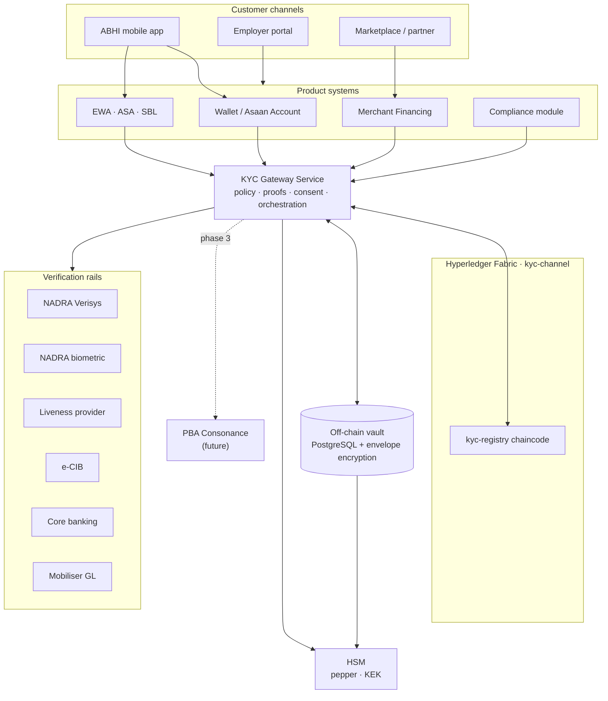
```mermaid
flowchart TB
    subgraph CUST["Customer channels"]
        APP["ABHI mobile app"]
        POR["Employer portal"]
        MKT["Marketplace / partner"]
    end

    subgraph PROD["Product systems"]
        WAL["Wallet / Asaan Account"]
        LEN["EWA · ASA · SBL"]
        MF["Merchant Financing"]
        CMP["Compliance module"]
    end

    GW["KYC Gateway Service<br/>policy · proofs · consent · orchestration"]

    subgraph FAB["Hyperledger Fabric · kyc-channel"]
        CC["kyc-registry chaincode"]
    end

    VA[("Off-chain vault<br/>PostgreSQL + envelope encryption")]
    HSM["HSM<br/>pepper · KEK"]

    subgraph RAILS["Verification rails"]
        NAD["NADRA Verisys"]
        BIO["NADRA biometric"]
        LIV["Liveness provider"]
        ECIB["e-CIB"]
        CBS["Core banking"]
        MOB["Mobiliser GL"]
    end

    FUT["PBA Consonance<br/>(future)"]

    APP --> WAL
    APP --> LEN
    POR --> PROD
    MKT --> MF

    WAL --> GW
    LEN --> GW
    MF --> GW
    CMP --> GW

    GW <--> CC
    GW <--> VA
    GW --> HSM
    VA --> HSM
    GW --> RAILS
    GW -.->|"phase 3"| FUT
```

**One property to read off this diagram:** every product talks to the gateway, and only the gateway talks to the ledger, the vault and the rails. That is deliberate — it is what makes "one integration per new product" true, and it is also what makes the gateway the crown-jewel service (§8.5).

## 3.2 Hyperledger Fabric architecture

### 3.2.1 Organizations, and why each exists

| MSP | Represents | Why it exists as a separate organization |
|---|---|---|
| **ABHIBankMSP** | Wallet, Asaan Digital Account, core banking | Originates the strongest verifications in the bank. Must be able to write KYC records but must not be able to grant itself lending assurance |
| **ABHILendingMSP** | EWA, ASA, SBL, Merchant Financing | The heaviest *consumer* of verifications and an originator of step-ups. Separated from Bank so that a lending incentive cannot unilaterally create or upgrade an identity record |
| **ABHIComplianceMSP** | Compliance, Risk, AML | **The control organization.** Must co-endorse every write; holds sole authority over `SuspendKYC` and `MarkShredded`. Its existence is the entire governance argument |

### 3.2.2 The endorsement policy

```
AND( 'ABHIComplianceMSP.peer',
     OR('ABHIBankMSP.peer', 'ABHILendingMSP.peer') )
```

Read aloud: *Compliance, and at least one product organization.* Neither can write alone.

### 3.2.3 The objection this design must survive

> *"All three organizations are ABHI. You have built an expensive database and drawn a governance diagram over it."*

This objection is **correct in its premise and wrong in its conclusion**, and the blueprint should say so rather than dodge it.

**Correct in its premise.** Three MSPs under one corporate parent are not three independent trust domains. Fabric's Byzantine-fault assumptions are not satisfied by an org chart. A determined ABHI insider with sufficient infrastructure authority can, in principle, obtain signing material for more than one MSP.

**Wrong in its conclusion**, for three reasons:

1. **The comparison is not to a perfect system, it is to today.** Today a single product team's database write is sufficient to change KYC state, and it leaves no independently verifiable trace. Requiring two organizations' HSM-held signing keys, on separate infrastructure, under separate administrative control, is a materially higher bar — the same bar that makes four-eyes approval worth having even though two colleagues could collude.
2. **The controls are separable, and this design separates them.** §8.3 specifies distinct HSM partitions per MSP, distinct cloud accounts, distinct administrators, and dual control on MSP admin operations. The strength of the separation is an *operational* commitment ABHI must actually make; the architecture makes it possible and makes its absence visible.
3. **The trust boundary is designed to widen.** The moment an external organization joins — an external auditor node, a marketplace partner, or PBA Consonance — the argument becomes unconditional. §15.4 recommends adding a **read-only external auditor peer in Phase 2**, which is the cheapest available way to convert this from an internal governance claim into an external one.

**The honest verdict, carried forward to §15.4:** if ABHI will not commit to genuine administrative separation between the three MSPs, *and* has no intention of joining Consonance, then §9.1's signed append-only database is the better engineering decision. This document recommends the ledger because ABHI's answer to the second condition is expected to be yes — but the recommendation is conditional, and stating the condition is what makes it credible.

### 3.2.4 Network topology

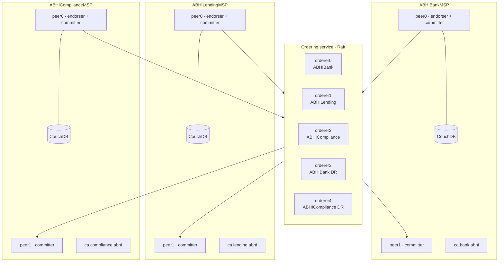
```mermaid
flowchart TB
    subgraph ORD["Ordering service · Raft"]
        O1["orderer0<br/>ABHIBank"]
        O2["orderer1<br/>ABHILending"]
        O3["orderer2<br/>ABHICompliance"]
        O4["orderer3<br/>ABHIBank DR"]
        O5["orderer4<br/>ABHICompliance DR"]
    end

    subgraph B["ABHIBankMSP"]
        BP1["peer0 · endorser + committer"]
        BP2["peer1 · committer"]
        BCA["ca.bank.abhi"]
        BDB[("CouchDB")]
        BP1 --- BDB
    end

    subgraph L["ABHILendingMSP"]
        LP1["peer0 · endorser + committer"]
        LP2["peer1 · committer"]
        LCA["ca.lending.abhi"]
        LDB[("CouchDB")]
        LP1 --- LDB
    end

    subgraph CO["ABHIComplianceMSP"]
        CP1["peer0 · endorser + committer"]
        CP2["peer1 · committer"]
        CCA["ca.compliance.abhi"]
        CDB[("CouchDB")]
        CP1 --- CDB
    end

    BP1 --> ORD
    LP1 --> ORD
    CP1 --> ORD
    ORD --> BP2
    ORD --> LP2
    ORD --> CP2
```

| Component | POC | Production |
|---|---|---|
| **Peers** | 1 per org (3 total), Docker Compose, single host | 2 per org (6 total) across ≥2 AZs; endorser/committer split |
| **Ordering service** | 3-node Raft, single host | 5-node Raft across 3 AZs — survives 2 failures |
| **State database** | CouchDB (rich query needed for `GetVersionChain`) | CouchDB, dedicated volumes, per-peer |
| **CAs** | Fabric CA per org, file-based | Fabric CA per org, HSM-backed (PKCS#11), offline root, online intermediates |
| **Channel** | `kyc-channel` | `kyc-channel` + `kyb-channel` (Phase 2) |
| **Chaincode** | TypeScript, `kyc-registry` v1.0 | Same, with formal lifecycle approval by all 3 orgs |
| **TLS** | Enabled, self-signed | Mutual TLS, ABHI PKI, 90-day rotation |

### 3.2.5 Channel design

| Channel | Members | Contents | Status |
|---|---|---|---|
| **`kyc-channel`** | Bank, Lending, Compliance | Individual KYC records, consent, verification and audit events | **POC + production v1** |
| **`kyb-channel`** | Bank, Lending, Compliance | Organization/merchant KYB records (touchpoint 8) | Phase 2. Separate channel because the record shape and endorsement needs differ, and because merchant partners may eventually join it and must not see individual KYC |
| **`consonance-channel`** | + PBA / external | Interop projection of ABHI's canonical record | Phase 3, contingent on **[OPEN-2]** |

**On private data collections.** Fabric PDCs are deliberately **not** used for the KYC record itself. The record contains no personal data by construction (P1), so a PDC would add operational complexity — collection lifecycle, purge policy, hash-only dissemination — for no privacy gain. PDCs are, however, the right mechanism if ABHI later needs per-organization visibility restriction on *consent scope details* or on a KYB channel with external members. Flagged as a Phase 2 design decision, deliberately deferred **[A]**.

### 3.2.6 Certificate authority hierarchy

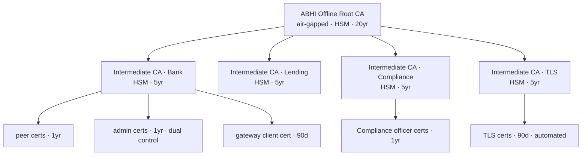
```mermaid
flowchart TD
    RCA["ABHI Offline Root CA<br/>air-gapped · HSM · 20yr"]
    RCA --> ICA1["Intermediate CA · Bank<br/>HSM · 5yr"]
    RCA --> ICA2["Intermediate CA · Lending<br/>HSM · 5yr"]
    RCA --> ICA3["Intermediate CA · Compliance<br/>HSM · 5yr"]
    RCA --> ICA4["Intermediate CA · TLS<br/>HSM · 5yr"]

    ICA1 --> E1["peer certs · 1yr"]
    ICA1 --> E2["admin certs · 1yr · dual control"]
    ICA1 --> E3["gateway client cert · 90d"]
    ICA3 --> E4["Compliance officer certs · 1yr"]
    ICA4 --> E5["TLS certs · 90d · automated"]
```

Identity classes, and what each may do:

| Identity class | Issued to | Attributes (OU / role) | May invoke |
|---|---|---|---|
| **Peer** | Fabric peers | `OU=peer` | Endorsement only |
| **Gateway client** | KYC Gateway, per MSP | `OU=client`, `kyc.role=gateway` | All transaction functions permitted to its MSP |
| **Compliance officer** | Named individuals | `OU=client`, `kyc.role=compliance-officer` | `SuspendKYC`, `ReinstateKYC`, `MarkShredded` |
| **Auditor** | Internal Audit, external auditor | `OU=client`, `kyc.role=auditor` | Read-only queries; **no** invoke |
| **MSP admin** | 2 named individuals per org | `OU=admin` | Channel config, chaincode lifecycle — dual control |

Attribute-based access control uses Fabric's certificate attribute extensions (`cid.GetAttributeValue`), checked inside chaincode — see §5.2.

## 3.3 KYC Gateway architecture

The gateway is where all the interesting logic lives, and consequently where all the interesting risk lives.

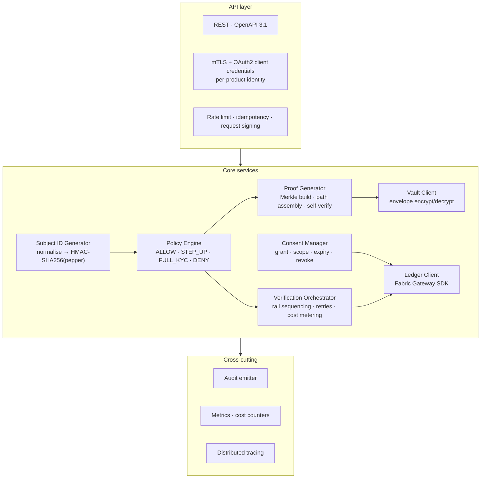
```mermaid
flowchart TB
    subgraph API["API layer"]
        REST["REST · OpenAPI 3.1"]
        AUTH["mTLS + OAuth2 client credentials<br/>per-product identity"]
        RL["Rate limit · idempotency · request signing"]
    end

    subgraph CORE["Core services"]
        SID["Subject ID Generator<br/>normalise → HMAC-SHA256(pepper)"]
        POL["Policy Engine<br/>ALLOW · STEP_UP · FULL_KYC · DENY"]
        ORCH["Verification Orchestrator<br/>rail sequencing · retries · cost metering"]
        PROOF["Proof Generator<br/>Merkle build · path assembly · self-verify"]
        CONS["Consent Manager<br/>grant · scope · expiry · revoke"]
        LEDG["Ledger Client<br/>Fabric Gateway SDK"]
        VAULT["Vault Client<br/>envelope encrypt/decrypt"]
    end

    subgraph X["Cross-cutting"]
        AUD["Audit emitter"]
        MET["Metrics · cost counters"]
        TRC["Distributed tracing"]
    end

    API --> CORE
    SID --> POL
    POL --> ORCH
    POL --> PROOF
    PROOF --> VAULT
    CONS --> LEDG
    ORCH --> LEDG
    CORE --> X
```

### 3.3.1 Subject ID Generator

```
subject_id = HMAC-SHA256( pepper, normalise(CNIC) )
```

**Why HMAC and not SHA-256.** A CNIC is 13 digits — about 10¹³ values, exhaustible against SHA-256 on a commodity GPU in hours. **Hashing a CNIC does not anonymise it.** The pepper is a high-entropy secret that never leaves the HSM; without it, on-chain identifiers cannot be correlated to real people even by an adversary holding a complete copy of the ledger *and* every CNIC in Pakistan.

**Normalisation** — order matters and must be identical everywhere:

```
1. Strip all non-digit characters      "61101-1234567-8" → "6110112345678"
2. Reject if length ≠ 13               fail closed, do not pad
3. Reject if all-zero or all-same      obvious test data
4. UTF-8 encode
```

This matters operationally: the employer CSV template strips dashes while the app captures them **[M]**. Without shared normalisation the same customer resolves to two subjects and the entire premise fails.

**HSM interaction.** The gateway never holds the pepper. It calls the HSM's HMAC operation over PKCS#11 with a non-extractable key handle. Consequences: HSM latency is on the critical path of every request (budget 5–15 ms **[A]**), and HSM availability is a hard dependency — covered in §13.3.

**Rotation.** Every record carries a `pepperEpoch`. Rotation is a genuine operational cost, designed for rather than discovered later — procedure in §8.4.3.

### 3.3.2 Policy Engine

Deterministic, side-effect-free, and the most heavily unit-tested component in the system. Given `(record, productPolicy, now)` it returns a decision. Same inputs must always produce the same output — this is what makes it auditable.

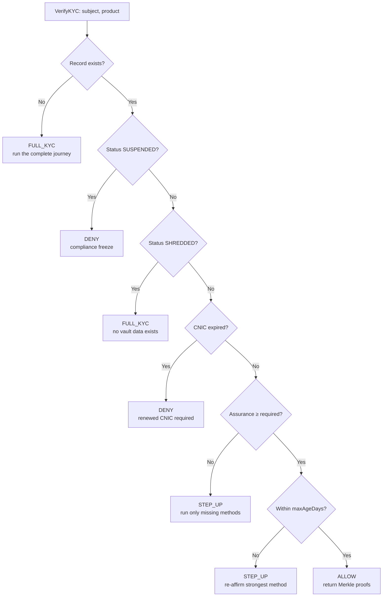
```mermaid
flowchart TD
    A["VerifyKYC: subject, product"] --> B{"Record exists?"}
    B -- No --> FK["FULL_KYC<br/>run the complete journey"]
    B -- Yes --> C{"Status SUSPENDED?"}
    C -- Yes --> D1["DENY<br/>compliance freeze"]
    C -- No --> SH{"Status SHREDDED?"}
    SH -- Yes --> D3["FULL_KYC<br/>no vault data exists"]
    SH -- No --> D{"CNIC expired?"}
    D -- Yes --> D2["DENY<br/>renewed CNIC required"]
    D -- No --> E{"Assurance ≥ required?"}
    E -- No --> SU1["STEP_UP<br/>run only missing methods"]
    E -- Yes --> F{"Within maxAgeDays?"}
    F -- No --> SU2["STEP_UP<br/>re-affirm strongest method"]
    F -- Yes --> G["ALLOW<br/>return Merkle proofs"]
```

Four ordering decisions, each deliberate:

| Rule | Why it sits where it does |
|---|---|
| **Suspension outranks everything** | A frozen subject is denied before any other consideration. If suspension were evaluated after expiry, a suspended-and-expired subject would return the wrong reason code, and reason codes drive downstream customer messaging |
| **SHREDDED → FULL_KYC, not DENY** | The vault data is gone, so no proof can be assembled — but the customer is not barred. They re-onboard, which is the correct outcome for someone who exercised erasure and returned |
| **Expired CNIC is a hard stop, not a step-up** | No amount of re-scanning fixes an expired identity document. The customer must renew with NADRA first. Returning STEP_UP here would send them into a journey that cannot succeed |
| **Assurance before age** | A record that is both too weak and too old should report the assurance gap, because satisfying it also refreshes the age |

### 3.3.3 Proof Generator

The Merkle construction — reproduced exactly, because the POC's committed hashes depend on it byte-for-byte:

```
leaf_i = SHA-256( 0x00 ‖ salt_i ‖ 0x00 ‖ name_i ‖ 0x00 ‖ canonical(value_i) )
node   = SHA-256( 0x01 ‖ left ‖ right )
root   = merkle_root( leaves sorted by attribute name )
```

| Detail | Why it is load-bearing |
|---|---|
| **Per-attribute 32-byte salt** | `fatca_status = false` has two possible values. Unsalted, its leaf would be byte-identical for every customer in the bank and instantly recognisable on the ledger |
| **Domain separation** (`0x00` leaf, `0x01` node) | Without it an internal node can be presented as a leaf — the classic Merkle second-preimage attack |
| **Sorted by attribute name** | The root is deterministic regardless of supply order |
| **Odd nodes promoted, not duplicated** | Duplicating the last node (the Bitcoin approach) admits distinct leaf sets producing the same root — CVE-2012-2459 in its original form |
| **Type-tagged canonical values** (`s:`, `b:`, `d:`, `n:`) | Without it the string `"true"` and the boolean `true` collide onto the same leaf |

**Self-verification is mandatory.** The gateway verifies every proof it assembles against the on-chain root *before* returning it. A proof that fails self-verification is a defect or an attack; either way the request fails closed with a `PROOF_ASSEMBLY_FAILED` error and a high-severity alert. This costs microseconds and removes an entire class of silent-corruption bug.

### 3.3.4 Consent Manager

Every cross-product read is gated on a consent record and written to the ledger: which subject, which requesting organization, which attributes, under what scope, expiring when.

ABHI already collects per-product terms acceptance — the EWA Review Details screen requires a T&C checkbox before Continue enables **[M]**. **That checkbox becomes the consent artefact**, which is what makes this implementable without a new customer-facing screen.

Modelling consent explicitly and on-ledger mirrors the model SBP described for the national platform **[R]**, and is what lets ABHI's internal ledger connect to it without a redesign. India's CKYC retrofitted consent-per-retrieval; SBP specified it from the start; building it in now costs almost nothing and retrofitting it later is a schema migration across every product.

### 3.3.5 Verification Orchestrator

Sequences rail calls for FULL_KYC and STEP_UP, and is the component where production reality will differ most from the POC.

| Concern | POC | Production |
|---|---|---|
| **Sequencing** | Verisys → doc auth → biometric → liveness | Same, with per-product short-circuit on STEP_UP |
| **Idempotency** | Idempotency key per journey | Same, persisted, replay-safe across retries |
| **Timeouts / retries** | Fixed 5s, no retry | Per-rail budgets, exponential backoff, jitter, circuit breaker |
| **Partial failure** | Fail whole journey | Persist completed methods; resume without re-charging succeeded calls |
| **Attempt caps** | Enforced: 3/day fingerprint, 3/day face **[M]** | Same, tracked per subject per method per day. **Cap consumption is itself a metric** — it sizes the friction the ledger removes |
| **Cost metering** | Every mock call increments a counter with configurable unit cost | Reconciled against actual rail invoices |

## 3.4 Vault architecture

### 3.4.1 What is in the vault

Only two things, and it matters that the list is short: **the plaintext attribute values** and **the per-attribute salts**. Nothing else. No proofs (regenerated on demand), no decisions (on-ledger), no audit trail (on-ledger).

### 3.4.2 Envelope encryption

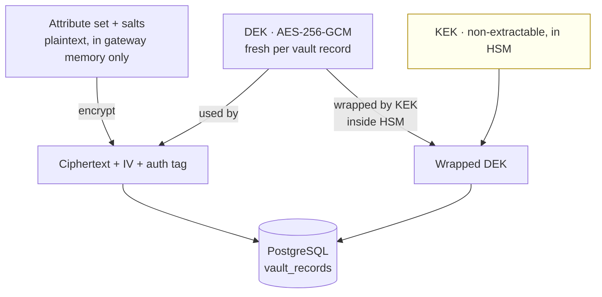
```mermaid
flowchart TB
    ATTR["Attribute set + salts<br/>plaintext, in gateway memory only"]
    DEK["DEK · AES-256-GCM<br/>fresh per vault record"]
    KEK["KEK · non-extractable, in HSM"]
    CT["Ciphertext + IV + auth tag"]
    WDEK["Wrapped DEK"]
    DB[("PostgreSQL<br/>vault_records")]

    ATTR -->|"encrypt"| CT
    DEK -->|"used by"| CT
    DEK -->|"wrapped by KEK<br/>inside HSM"| WDEK
    KEK --> WDEK
    CT --> DB
    WDEK --> DB

    style KEK fill:#ffe,stroke:#a80
```

| Element | Specification |
|---|---|
| **DEK** | AES-256-GCM, one per vault record, generated in the HSM, never persisted unwrapped |
| **KEK** | AES-256, non-extractable, HSM-resident, one active + previous retained for unwrap |
| **AAD** | `subjectId ‖ version ‖ pepperEpoch` — binds ciphertext to its record. A ciphertext moved to another record fails authentication |
| **Storage** | PostgreSQL. Encrypted at rest independently (TDE / encrypted volumes) — defence in depth, not the primary control |
| **Access** | Gateway service identity only. No human read path. DBA sees ciphertext |

**The AAD binding is worth a sentence.** Without it, an attacker with database write access could copy customer A's ciphertext row onto customer B's `vaultRef` and produce proofs for B's on-chain root using A's data — a swap attack that leaves the ledger untouched and looks entirely legitimate. With `subjectId ‖ version` as AAD, GCM authentication fails and the request errors closed.

### 3.4.3 Key hierarchy

| Key | Type | Custody | Rotation | Blast radius if compromised |
|---|---|---|---|---|
| **Pepper** | HMAC-SHA256, 256-bit | HSM, non-extractable, split knowledge | Annual or on suspicion | **Highest** — enables CNIC↔subject correlation across the entire ledger |
| **KEK** | AES-256 | HSM, non-extractable | Annual | High — all vault records, if ciphertext also obtained |
| **DEK** | AES-256 | Wrapped in DB, unwrapped in HSM per use | Per record; on re-encrypt | One record |
| **MSP signing keys** | ECDSA P-256 | HSM per org, separate partitions | Annual | Ability to endorse as that org |
| **TLS** | ECDSA P-256 | Cert manager | 90 days, automated | Transport only |

### 3.4.4 Key rotation

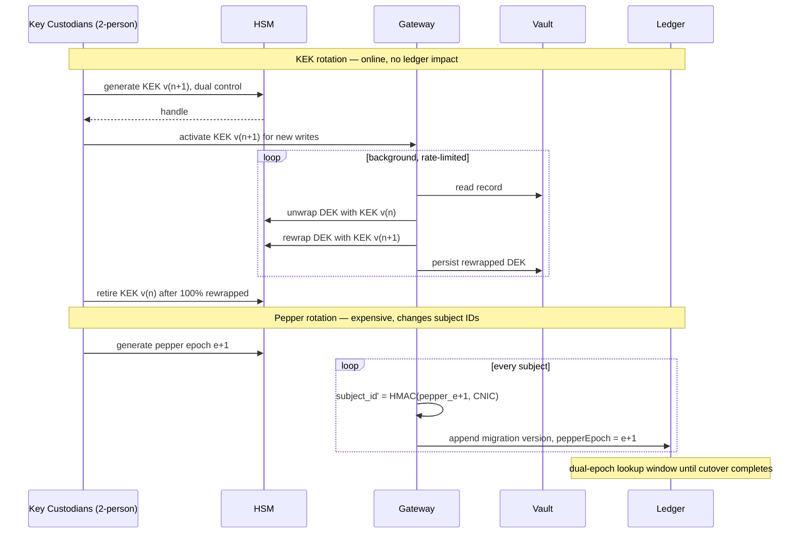
```mermaid
sequenceDiagram
    participant OPS as Key Custodians (2-person)
    participant HSM as HSM
    participant GW as Gateway
    participant VA as Vault
    participant L as Ledger

    Note over OPS,L: KEK rotation — online, no ledger impact
    OPS->>HSM: generate KEK v(n+1), dual control
    HSM-->>OPS: handle
    OPS->>GW: activate KEK v(n+1) for new writes
    loop background, rate-limited
        GW->>VA: read record
        GW->>HSM: unwrap DEK with KEK v(n)
        GW->>HSM: rewrap DEK with KEK v(n+1)
        GW->>VA: persist rewrapped DEK
    end
    OPS->>HSM: retire KEK v(n) after 100% rewrapped

    Note over OPS,L: Pepper rotation — expensive, changes subject IDs
    OPS->>HSM: generate pepper epoch e+1
    loop every subject
        GW->>GW: subject_id' = HMAC(pepper_e+1, CNIC)
        GW->>L: append migration version, pepperEpoch = e+1
    end
    Note over L: dual-epoch lookup window until cutover completes
```

**Pepper rotation is the expensive one and must be rehearsed, not improvised.** It re-derives every subject ID, which means the gateway must resolve lookups under both epochs during the migration window, and every product's cached subject reference becomes stale. This is designed for via `pepperEpoch` rather than discovered during an incident — but it is a genuine multi-day operation at full customer base, and Appendix A carries it as a production risk.

### 3.4.5 Crypto-shredding

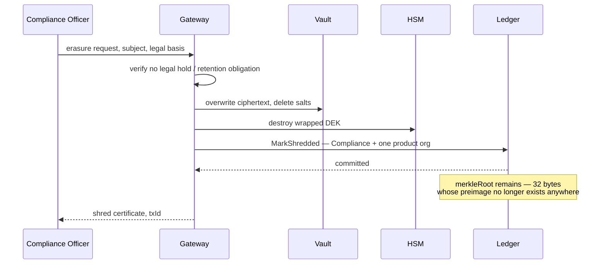
```mermaid
sequenceDiagram
    participant CO as Compliance Officer
    participant GW as Gateway
    participant VA as Vault
    participant HSM as HSM
    participant L as Ledger

    CO->>GW: erasure request, subject, legal basis
    GW->>GW: verify no legal hold / retention obligation
    GW->>VA: overwrite ciphertext, delete salts
    GW->>HSM: destroy wrapped DEK
    GW->>L: MarkShredded — Compliance + one product org
    L-->>GW: committed
    Note over L: merkleRoot remains — 32 bytes<br/>whose preimage no longer exists anywhere
    GW-->>CO: shred certificate, txId
```

What survives: the audit fact that a verification of a given assurance level occurred on a given date — which the bank is separately obliged to retain. What is destroyed: every value, every salt, every key. The root becomes an unlinkable random 32 bytes. **Destroying the salts is what makes this complete** — without them, an adversary could still brute-force low-entropy attribute leaves such as `fatca_status`.

## 3.5 Integration layer

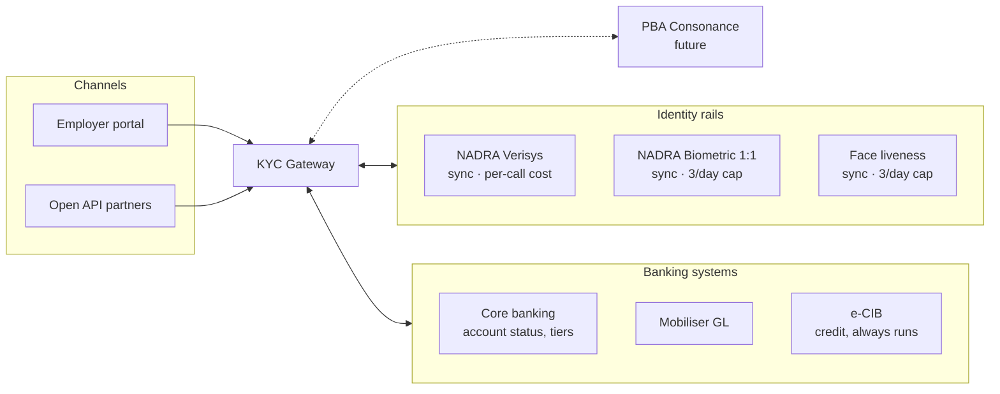
```mermaid
flowchart LR
    GW["KYC Gateway"]

    subgraph ID["Identity rails"]
        V["NADRA Verisys<br/>sync · per-call cost"]
        B["NADRA Biometric 1:1<br/>sync · 3/day cap"]
        F["Face liveness<br/>sync · 3/day cap"]
    end
    subgraph BK["Banking systems"]
        C["Core banking<br/>account status, tiers"]
        M["Mobiliser GL"]
        E["e-CIB<br/>credit, always runs"]
    end
    subgraph CH["Channels"]
        P["Employer portal"]
        O["Open API partners"]
    end
    N["PBA Consonance<br/>future"]

    GW <--> ID
    GW <--> BK
    P --> GW
    O --> GW
    GW <-.-> N
```

| Integration | Direction | Pattern | Idempotency | Failure mode | POC | Production risk |
|---|---|---|---|---|---|---|
| **NADRA Verisys** | Out | Sync request/response | Journey key | Fail closed → FULL_KYC incomplete | Mock, cost-metered | Contract, SLA, per-call billing reconciliation |
| **NADRA Biometric 1:1** | Out | Sync, both hands | Journey key + attempt counter | Fail closed; **consumes a daily attempt** | Mock, cap enforced | Attempt accounting must match NADRA's, or customers get locked out by ABHI's own counter |
| **Face liveness** | Out | Sync | Journey key + attempt counter | Fail closed | Mock | Provider selection open **[A]** |
| **e-CIB** | Out | Sync + batch cron **[M]** | Request ID | **Never bypassed** — and, since SEC-18, never ignored either | Mock | Unchanged by this programme, deliberately. The gateway originally awaited the call and discarded its result, so "never bypassed" was implemented as "always called"; the outcome is now carried to the caller as `VerifyResult.eCib`. It is deliberately not an input to `decide()` — credit standing is not identity |
| **Core banking** | Both | Sync read; event on status change | — | Degrade to ledger-only decision | Mock | Account-status ↔ KYC-status reconciliation is a real design problem — see below |
| **Mobiliser GL** | Out | Async posting | Posting ref | Queue and retry | Mock | Cost attribution only |
| **Employer portal** | In | Bulk async | Upload ID | Partial results returned | **Built — the headline demo** | CSV normalisation must match exactly |
| **Open API partners** | In | REST | Partner request ID | Reject on unknown assurance | Read-only stub | **[OPEN-7]** write access deferred |
| **PBA Consonance** | Both | TBD | TBD | N/A | Not in POC | Schema and consent mapping, Phase 3, **[OPEN-2]** |

**Two integration risks worth naming now rather than discovering in Phase 4:**

1. **Biometric attempt accounting.** The 3-per-day cap **[M]** is enforced by NADRA, and if the gateway also counts attempts, the two counters will drift — on network timeouts the gateway may count an attempt NADRA did not, or vice versa. Drift in one direction locks out legitimate customers; in the other it wastes paid calls. The gateway must treat NADRA's response as authoritative and reconcile daily.
2. **Core banking status reconciliation.** The ledger says a subject is `SUSPENDED`; the core banking system has its own freeze flags. These will disagree, and the design must state which wins. **Recommendation: the ledger governs identity standing, CBS governs account operability, and each must be able to independently block a transaction** — the union of the two blocks, never the intersection. A daily reconciliation job reports divergence as a compliance exception.

---
# 4. Data Model Design

## 4.1 Entity relationships

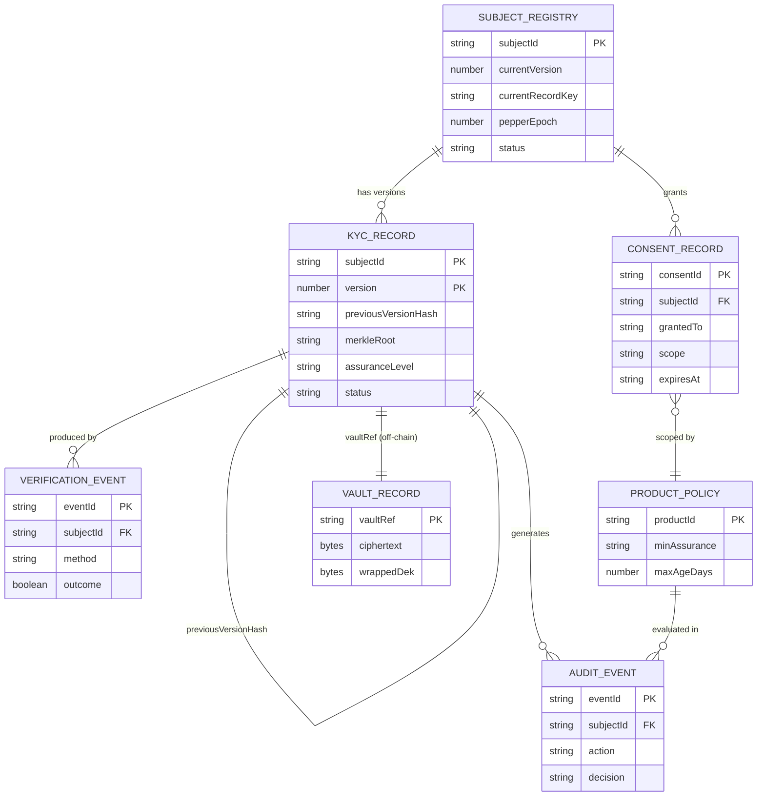
```mermaid
erDiagram
    SUBJECT_REGISTRY ||--o{ KYC_RECORD : "has versions"
    KYC_RECORD ||--|| KYC_RECORD : "previousVersionHash"
    KYC_RECORD ||--o{ VERIFICATION_EVENT : "produced by"
    KYC_RECORD ||--o{ AUDIT_EVENT : "generates"
    SUBJECT_REGISTRY ||--o{ CONSENT_RECORD : "grants"
    CONSENT_RECORD }o--|| PRODUCT_POLICY : "scoped by"
    PRODUCT_POLICY ||--o{ AUDIT_EVENT : "evaluated in"
    KYC_RECORD ||--|| VAULT_RECORD : "vaultRef (off-chain)"

    SUBJECT_REGISTRY {
        string subjectId PK
        number currentVersion
        string currentRecordKey
        number pepperEpoch
        string status
    }
    KYC_RECORD {
        string subjectId PK
        number version PK
        string previousVersionHash
        string merkleRoot
        string assuranceLevel
        string status
    }
    CONSENT_RECORD {
        string consentId PK
        string subjectId FK
        string grantedTo
        string scope
        string expiresAt
    }
    VERIFICATION_EVENT {
        string eventId PK
        string subjectId FK
        string method
        boolean outcome
    }
    AUDIT_EVENT {
        string eventId PK
        string subjectId FK
        string action
        string decision
    }
    PRODUCT_POLICY {
        string productId PK
        string minAssurance
        number maxAgeDays
    }
    VAULT_RECORD {
        string vaultRef PK
        bytes ciphertext
        bytes wrappedDek
    }
```

## 4.2 State key design

Fabric has one namespace and no secondary indexes beyond CouchDB queries. Key design is therefore a correctness concern, not a convenience.

| Entity | Composite key | Why |
|---|---|---|
| **KYCRecord** | `KYC~{subjectId}~{version:010d}` | Zero-padded version sorts lexicographically. `GetStateByRange` over `KYC~{subjectId}~` returns the full chain in order, in one call |
| **SubjectRegistry** | `SUBJ~{subjectId}` | O(1) pointer to current version. Avoids a range scan on the hot `VerifyKYC` path |
| **ConsentRecord** | `CONS~{subjectId}~{grantedTo}~{consentId}` | Range scan by subject, or by subject+org |
| **VerificationEvent** | `VEVT~{subjectId}~{timestamp}~{eventId}` | Chronological per subject |
| **AuditEvent** | `AEVT~{subjectId}~{timestamp}~{eventId}` | Chronological per subject |
| **ProductPolicy** | `POL~{productId}~{policyVersion:04d}` | Versioned; on-ledger as the *record of what was in force*, evaluated in the gateway (P5) |

**Zero-padding is not cosmetic.** Without it, `KYC~S~10` sorts before `KYC~S~2`, and `GetVersionChain` silently returns versions out of order — producing a chain that fails hash verification for reasons that take a day to find.

## 4.3 KYCRecord

```typescript
/**
 * The canonical on-ledger KYC record. One per (subject, version).
 * Contains NO personally identifying information by construction.
 */
interface KYCRecord {
  docType:             'KYCRecord';

  // ---- identity & versioning ----
  subjectId:           string;    // 64 hex — HMAC-SHA256(pepper, normalise(CNIC))
  version:             number;    // 1-based, strictly increasing, no gaps
  previousVersionHash: string | null;  // SHA-256 of predecessor AS STORED; null iff version === 1

  // ---- the commitment ----
  merkleRoot:          string;    // 64 hex — root over the salted attribute set
  attributeSetId:      string;    // e.g. 'ABHI-KYC-ATTRS-v1' — schema version of the leaf set

  // ---- assurance ----
  assuranceLevel:      AssuranceLevel;      // 'A0' | 'A1' | 'A2' | 'A3'
  methods:             VerificationMethod[]; // sorted, deduplicated

  // ---- provenance ----
  verifiedBy:          string;    // MSP ID of the verifying organization
  verifiedAt:          string;    // RFC 3339 UTC, from tx timestamp — never client clock
  expiresAt:           string;    // RFC 3339 UTC — assurance validity horizon
  cnicExpiryAt:        string;    // RFC 3339 UTC — from Verisys; independent of expiresAt

  // ---- lifecycle ----
  status:              RecordStatus;  // 'ACTIVE'|'SUSPENDED'|'SUPERSEDED'|'SHREDDED'
  statusReason:        string | null; // required when SUSPENDED or SHREDDED

  // ---- off-chain linkage ----
  vaultRef:            string;    // opaque UUID; no semantic content
  pepperEpoch:         number;    // which pepper generation derived subjectId

  // ---- audit ----
  originProduct:       string;    // 'WALLET'|'EWA'|'ASA'|'SBL'|'MF'|'EMPLOYER'|'PARTNER'
  createdTxId:         string;    // Fabric transaction ID
  schemaVersion:       number;    // record schema, for forward migration
}

type AssuranceLevel     = 'A0' | 'A1' | 'A2' | 'A3';
type RecordStatus       = 'ACTIVE' | 'SUSPENDED' | 'SUPERSEDED' | 'SHREDDED';
type VerificationMethod =
  | 'ASSERTED'          // third party supplied; nothing verified
  | 'VERISYS'           // NADRA Verisys match
  | 'DOC_AUTH'          // CNIC OCR + document authenticity cross-check
  | 'BIOMETRIC_1TO1'    // NADRA 1:1 fingerprint, both hands
  | 'LIVENESS';         // live-selfie face verification
```

**Two fields that are easy to get wrong:**

- **`verifiedAt` comes from the transaction timestamp, never from the client.** A gateway with a skewed or manipulated clock could otherwise backdate or future-date a verification, extending its validity window. Chaincode reads `ctx.stub.getTxTimestamp()`.
- **`cnicExpiryAt` is independent of `expiresAt`.** The first is NADRA's fact about the document; the second is ABHI's policy about the verification. Conflating them produces the bug where renewing a CNIC silently extends an assurance level that was never re-verified.

### Validation rules

| Field | Rule | On violation |
|---|---|---|
| `subjectId` | `/^[0-9a-f]{64}$/` | `ERR_INVALID_SUBJECT` |
| `subjectId` | **Must not match any CNIC-shaped pattern** — 13 consecutive digits anywhere in the payload | `ERR_PII_DETECTED` |
| `version` | Integer ≥ 1; must equal `registry.currentVersion + 1` | `ERR_VERSION_CONFLICT` |
| `previousVersionHash` | 64 hex; `null` **iff** `version === 1` | `ERR_CHAIN_BROKEN` |
| `merkleRoot` | `/^[0-9a-f]{64}$/`, non-zero | `ERR_INVALID_ROOT` |
| `assuranceLevel` | In enum; **must be consistent with `methods`** (§6.2 table) | `ERR_ASSURANCE_MISMATCH` |
| `methods` | Non-empty, sorted, deduplicated, all in enum | `ERR_INVALID_METHODS` |
| `expiresAt` | > `verifiedAt` | `ERR_INVALID_EXPIRY` |
| `statusReason` | Required and non-empty when status ∈ {SUSPENDED, SHREDDED} | `ERR_REASON_REQUIRED` |
| `vaultRef` | UUID v4; must not be reused across subjects | `ERR_INVALID_VAULTREF` |
| Whole payload | Byte size ≤ 4 KB | `ERR_PAYLOAD_TOO_LARGE` |

**The PII regex check is defence in depth and it should stay even though it is redundant.** The gateway is supposed to never send a CNIC. The chaincode assumes the gateway is compromised and rejects anything CNIC-shaped anyway. On an immutable ledger, one leaked CNIC is a permanent incident — the cheapest possible insurance is a regex.

### Versioning rules

1. Records are **never updated in place**. Every change appends a new version.
2. Before writing version *n*, version *n−1* is set to `SUPERSEDED` **and persisted**.
3. **`previousVersionHash` is computed over version *n−1* as stored — i.e. after the supersession update**, using canonical JSON (keys sorted, no whitespace).
4. `SubjectRegistry.currentVersion` is updated in the same transaction. Fabric's MVCC makes the read-write set conflict-safe: two concurrent writers for one subject produce one commit and one `MVCC_READ_CONFLICT`, which the gateway retries.
5. `SUSPENDED` and `SHREDDED` are appends too, not mutations.

**Point 3 is the subtlest thing in the entire data model.** Hash the *pre*-supersession form and the chain becomes unverifiable from a state export — an auditor recomputing hashes from exported state gets a mismatch on every link, which quietly defeats the whole audit property. This must be an explicit test case, not a code comment (§12.10).

## 4.4 ConsentRecord

```typescript
interface ConsentRecord {
  docType:        'ConsentRecord';
  consentId:      string;    // UUID v4
  subjectId:      string;
  grantedTo:      string;    // MSP ID or registered partner ID
  purpose:        string;    // 'EWA_ORIGINATION' | 'SBL_ORIGINATION' | ...
  scope:          string[];  // exact attribute names disclosable — no wildcards
  grantedAt:      string;    // RFC 3339, tx timestamp
  expiresAt:      string;    // RFC 3339 — hard requirement, no perpetual consent
  status:         'ACTIVE' | 'REVOKED' | 'EXPIRED';
  revokedAt:      string | null;
  revocationReason: string | null;
  evidenceRef:    string;    // pointer to the T&C acceptance artefact [M]
  createdTxId:    string;
  schemaVersion:  number;
}
```

| Rule | Detail |
|---|---|
| **No perpetual consent** | `expiresAt` is mandatory. Max 730 days **[A]** — Compliance to confirm |
| **No wildcard scope** | `scope` lists literal attribute names. `["*"]` is rejected — a wildcard would silently widen as the attribute set grows |
| **Scope ⊆ product policy** | Consent cannot grant more than the product's policy permits; the narrower of the two governs |
| **Revocation is an append** | `RevokeConsent` writes a new state; the grant remains visible in history |
| **Revocation is not retroactive** | It cannot un-disclose what was already disclosed. Audit trail shows exactly what was released, when, under which consent |

## 4.5 VerificationEvent

```typescript
interface VerificationEvent {
  docType:       'VerificationEvent';
  eventId:       string;
  subjectId:     string;
  method:        VerificationMethod;
  outcome:       boolean;
  provider:      string;    // 'NADRA_VERISYS' | 'NADRA_BIOMETRIC' | 'LIVENESS_X' | 'PARTNER:<id>'
  providerRef:   string;    // provider's own reference — NOT a response payload
  performedBy:   string;    // MSP ID
  performedAt:   string;
  product:       string;
  costUnits:     number;    // metered cost — the ROI instrumentation of §1.6
  attemptNumber: number;    // 1..3, against the daily cap [M]
  resultingVersion: number | null;  // null if the journey did not complete
  createdTxId:   string;
}
```

**`providerRef` holds a reference, never a payload.** A NADRA response contains name, father's name and address. Persisting it on-ledger would breach P1 in the most direct way possible. The chaincode enforces `providerRef.length ≤ 128` and applies the same PII regex.

## 4.6 AuditEvent

```typescript
interface AuditEvent {
  docType:        'AuditEvent';
  eventId:        string;
  subjectId:      string;
  action:         'REGISTER'|'VERIFY'|'UPDATE'|'SUSPEND'|'REINSTATE'
                | 'CONSENT_GRANT'|'CONSENT_REVOKE'|'SHRED'|'PROOF_ISSUED';
  decision:       'ALLOW'|'STEP_UP'|'FULL_KYC'|'DENY'|null;
  decisionReason: string | null;   // machine-readable reason code
  requestedBy:    string;          // MSP ID
  requestedFor:   string;          // product
  policyId:       string | null;   // productId + policyVersion actually evaluated
  attributesDisclosed: string[];   // names only, never values
  occurredAt:     string;
  txId:           string;
  schemaVersion:  number;
}
```

`policyId` is what makes a decision reproducible two years later: an auditor can pull the policy version in force at that moment and re-run the decision. Without it, "why did the system allow this?" is unanswerable once policies change.

## 4.7 ProductPolicy

```typescript
interface ProductPolicy {
  docType:          'ProductPolicy';
  productId:        string;
  policyVersion:    number;
  minAssurance:     AssuranceLevel;
  maxAgeDays:       number;
  disclosableAttributes: string[];
  requireConsent:   boolean;
  denyOnCnicExpiry: boolean;      // true for all products in v1
  effectiveFrom:    string;
  effectiveTo:      string | null;
  approvedBy:       string[];     // ≥2 identities: Compliance + product owner
  createdTxId:      string;
}
```

Policies are **evaluated in the gateway (P5) but recorded on the ledger**, so the ledger is the authoritative record of what rule was in force when. Policy changes require Compliance co-endorsement — the same governance as a KYC write, because a policy change is a bulk KYC decision.

## 4.8 SubjectRegistry

```typescript
interface SubjectRegistry {
  docType:          'SubjectRegistry';
  subjectId:        string;
  currentVersion:   number;
  currentRecordKey: string;
  pepperEpoch:      number;
  firstSeenAt:      string;
  lastUpdatedAt:    string;
  status:           RecordStatus;   // denormalised from current version
  versionCount:     number;
}
```

Denormalising `status` costs a consistency obligation — it must be written in the same transaction as the version it mirrors — and buys the hot path a single `GetState` instead of a range scan. On `VerifyKYC`, which is by far the most-called function, that is the right trade. **Reconciliation between registry and record status is a chaincode invariant asserted on every write, and a nightly job (§13.4).**

## 4.9 Attribute set — `ABHI-KYC-ATTRS-v1`

Drawn directly from the Asaan Digital Account journey **[M]**.

| Attribute | Type tag | Captured at | Sensitivity |
|---|---|---|---|
| `cnic_number_hash` | `s:` | CNIC & DOB screen | High |
| `full_name_hash` | `s:` | Personal Details | High |
| `date_of_birth` | `d:` | CNIC & DOB screen | High |
| `cnic_expiry` | `d:` | Verisys response | Medium |
| `father_or_husband_name_hash` | `s:` | Verisys response | High |
| `address_hash` | `s:` | Verisys response | High |
| `purpose_of_account` | `s:` | Personal Details | Medium |
| `profession` | `s:` | Personal Details | Medium |
| `source_of_funds` | `s:` | Personal Details | Medium |
| `fatca_status` | `b:` | FATCA Declaration | Medium |
| `verisys_match` | `b:` | NADRA Verisys | Low |
| `document_authenticity_pass` | `b:` | OCR cross-check | Low |
| `biometric_match` | `b:` | NADRA 1:1 fingerprint | Low |
| `liveness_pass` | `b:` | Live-selfie | Low |

**Attribute set evolution.** Adding an attribute produces `ABHI-KYC-ATTRS-v2` and a new root — it does not mutate v1 records. Products declare which `attributeSetId` they can consume. Old records remain valid and verifiable under their own set. The alternative — mutating the set in place — would invalidate every historical root in the bank.

## 4.10 Record state machine

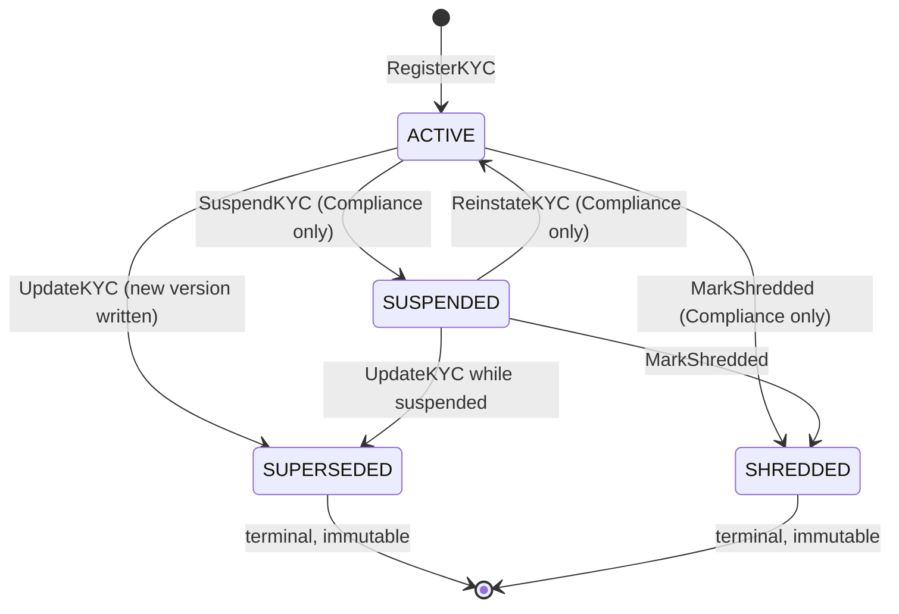
```mermaid
stateDiagram-v2
    [*] --> ACTIVE: RegisterKYC
    ACTIVE --> SUPERSEDED: UpdateKYC (new version written)
    ACTIVE --> SUSPENDED: SuspendKYC (Compliance only)
    SUSPENDED --> ACTIVE: ReinstateKYC (Compliance only)
    SUSPENDED --> SUPERSEDED: UpdateKYC while suspended
    ACTIVE --> SHREDDED: MarkShredded (Compliance only)
    SUSPENDED --> SHREDDED: MarkShredded
    SUPERSEDED --> [*]: terminal, immutable
    SHREDDED --> [*]: terminal, immutable
```

| Transition | Guard |
|---|---|
| → `ACTIVE` (register) | No existing registry entry for subject |
| `ACTIVE` → `SUPERSEDED` | Only as a side effect of writing version *n+1* |
| `ACTIVE` → `SUSPENDED` | Caller MSP = `ABHIComplianceMSP` **and** `kyc.role=compliance-officer`; reason mandatory |
| `SUSPENDED` → `ACTIVE` | Same authority; **new** reason mandatory. Does not alter assurance or expiry |
| any → `SHREDDED` | Compliance only; no legal hold; vault destruction confirmed *before* the ledger call |
| `SUPERSEDED` → anything | **Forbidden.** Superseded versions are immutable history |
| `SHREDDED` → anything | **Forbidden.** Terminal |

**Note `SUSPENDED → SUPERSEDED` is permitted.** A suspended customer can still have a CNIC renewal recorded. The suspension is carried onto the new version — suppressing the update instead would create a gap in history at exactly the moment the record is under scrutiny.

---

# 5. Smart Contract Design

## 5.1 Chaincode overview

| | |
|---|---|
| **Name / language** | `kyc-registry` · TypeScript (`fabric-contract-api`) |
| **Endorsement** | `AND('ABHIComplianceMSP.peer', OR('ABHIBankMSP.peer','ABHILendingMSP.peer'))` for all writes |
| **State DB** | CouchDB |
| **Determinism** | No `Date.now()`, no `Math.random()`, no external I/O. Time from `getTxTimestamp()`, IDs from the gateway |

**Determinism is not a style preference in Fabric — it is a correctness requirement.** Every endorsing peer executes the same transaction independently and their read-write sets must match byte-for-byte. A single `Date.now()` produces divergent proposals and the transaction fails endorsement with an error that looks like a network fault.

## 5.2 Common security checks

Applied by every mutating function, in this order:

```typescript
async function guard(ctx: Context, required: Guard): Promise<void> {
  // 1. Caller MSP is a known network member
  const mspId = ctx.clientIdentity.getMSPID();
  assertIn(mspId, ['ABHIBankMSP','ABHILendingMSP','ABHIComplianceMSP'], 'ERR_UNKNOWN_MSP');

  // 2. Role attribute, where the function demands one
  if (required.role) {
    const role = ctx.clientIdentity.getAttributeValue('kyc.role');
    assertEq(role, required.role, 'ERR_INSUFFICIENT_ROLE');
  }

  // 3. Compliance-exclusive operations
  if (required.complianceOnly) {
    assertEq(mspId, 'ABHIComplianceMSP', 'ERR_COMPLIANCE_ONLY');
  }

  // 4. PII tripwire over the entire serialised payload
  assertNoPII(required.payload);   // 13-consecutive-digit regex, and more

  // 5. Payload size ceiling
  assertMaxBytes(required.payload, 4096, 'ERR_PAYLOAD_TOO_LARGE');
}
```

**Check 3 deserves emphasis: Fabric's endorsement policy governs whether a transaction commits, not who may propose it.** A product organization can propose `SuspendKYC`; without the in-chaincode MSP check it would fail only at endorsement, producing a confusing error and no clean audit record. The explicit check makes the rejection deliberate, attributable and logged.

## 5.3 Function specifications

### 5.3.1 `RegisterKYC`

| | |
|---|---|
| **Purpose** | Create version 1 for a subject the ledger has never seen |
| **Endorsement** | Compliance **AND** (Bank **OR** Lending) |
| **Caller** | Any member MSP |

**Inputs** — `subjectId`, `merkleRoot`, `attributeSetId`, `assuranceLevel`, `methods[]`, `expiresAt`, `cnicExpiryAt`, `vaultRef`, `pepperEpoch`, `originProduct`

**Outputs** — `{ subjectId, version: 1, txId, status: 'ACTIVE', recordHash }`

**Business logic**
```
1  guard(ctx, { payload })
2  assert !exists(SUBJ~subjectId)                     → ERR_SUBJECT_EXISTS
3  validate all fields per §4.3
4  assert assuranceLevel consistent with methods      → ERR_ASSURANCE_MISMATCH
5  now := ctx.getTxTimestamp()
6  assert expiresAt > now                             → ERR_ALREADY_EXPIRED
7  record := { version: 1, previousVersionHash: null,
               verifiedAt: now, verifiedBy: callerMSP,
               status: 'ACTIVE', createdTxId: ctx.getTxID(), ... }
8  putState(KYC~subjectId~0000000001, canonical(record))
9  putState(SUBJ~subjectId, registry{currentVersion:1, status:'ACTIVE'})
10 putState(AEVT~... , auditEvent{action:'REGISTER'})
11 setEvent('KYCRegistered', {subjectId, assuranceLevel, version:1})
12 return { ..., recordHash: sha256(canonical(record)) }
```

**Security checks** — no existing subject (prevents chain-reset overwrite); PII tripwire; caller MSP recorded as `verifiedBy` and not accepted from the payload; timestamp from the transaction, not the client.

---

### 5.3.2 `VerifyKYC`

| | |
|---|---|
| **Purpose** | Return the current record and sufficiency inputs for a product's decision |
| **Endorsement** | **Query — no commit.** Single-peer evaluate |
| **Caller** | Any member MSP with a registered product |

**Inputs** — `subjectId`, `productId`, `consentId?`

**Outputs**
```typescript
{
  found: boolean;
  subjectId: string;
  version: number | null;
  assuranceLevel: AssuranceLevel | null;
  methods: VerificationMethod[];
  status: RecordStatus | null;
  verifiedAt: string | null;
  expiresAt: string | null;
  cnicExpiryAt: string | null;
  merkleRoot: string | null;
  attributeSetId: string | null;
  ageDays: number | null;
  cnicExpired: boolean;
}
```

**Business logic**
```
1  guard(ctx, {})
2  registry := getState(SUBJ~subjectId)
3  if !registry → return { found: false }              // gateway maps to FULL_KYC
4  record := getState(registry.currentRecordKey)
5  assert record.version === registry.currentVersion   → ERR_REGISTRY_DIVERGENCE
6  now := ctx.getTxTimestamp()
7  compute ageDays, cnicExpired
8  return projection above
```

**Design note.** `VerifyKYC` deliberately returns **facts, not a decision** — the decision is the gateway's (P5). This keeps the chaincode free of product policy, which changes far more often than the ledger should. The *decision* is written back as an `AuditEvent`, so the ledger still holds the complete record of what was decided and why.

**Step 5 is a real invariant, not a defensive nicety.** Registry/record divergence means a partially-applied write or state corruption; failing loudly is far safer than answering from a stale pointer.

---

### 5.3.3 `UpdateKYC`

| | |
|---|---|
| **Purpose** | Append a new version — step-up, CNIC renewal, attribute change, re-verification |
| **Endorsement** | Compliance **AND** (Bank **OR** Lending) |

**Inputs** — `subjectId`, `expectedCurrentVersion`, `merkleRoot`, `attributeSetId`, `assuranceLevel`, `methods[]`, `expiresAt`, `cnicExpiryAt`, `vaultRef`, `updateReason`

**Outputs** — `{ subjectId, version: n+1, previousVersionHash, txId, recordHash }`

**Business logic**
```
1  guard(ctx, { payload })
2  registry := getState(SUBJ~subjectId)               → ERR_SUBJECT_NOT_FOUND
3  assert registry.currentVersion === expectedCurrentVersion  → ERR_VERSION_CONFLICT
4  prev := getState(registry.currentRecordKey)
5  assert prev.status ∈ {ACTIVE, SUSPENDED}           → ERR_INVALID_TRANSITION
6  assert prev.status ≠ SHREDDED                      → ERR_SHREDDED
7  validate new fields; assert assurance/methods consistency
8  --- ORDER IS LOAD-BEARING ---
   prev.status := 'SUPERSEDED'
   putState(prevKey, canonical(prev))                 // persist FIRST
   prevHash := sha256(canonical(prev))                // hash AS STORED
9  newRecord := { version: n+1, previousVersionHash: prevHash,
                  status: prev.status was SUSPENDED ? 'SUSPENDED' : 'ACTIVE', ... }
10 putState(KYC~subjectId~pad(n+1), canonical(newRecord))
11 putState(SUBJ~subjectId, registry{currentVersion:n+1, ...})
12 putState(AEVT~..., auditEvent{action:'UPDATE', reason: updateReason})
13 setEvent('KYCUpdated', {subjectId, version:n+1, from:prev.assuranceLevel, to:...})
```

**Step 8 is the single most important sequencing rule in the chaincode.** Hashing `prev` before persisting the supersession produces a chain that cannot be verified from a state export. It must have a dedicated test (§12.10, test `chain-hash-post-supersession`).

**On assurance downgrade.** `UpdateKYC` permits a *lower* assurance level than the predecessor — for example when a re-verification fails a method that previously passed. Blocking downgrades would force the truth to be discarded. The downgrade is explicit, reasoned and visible in history, which is the correct outcome.

**Step 9 carries suspension forward.** An update to a suspended subject does not silently clear the suspension; only `ReinstateKYC` does that.

---

### 5.3.4 `SuspendKYC`

| | |
|---|---|
| **Purpose** | Freeze a subject's identity standing across every product, immediately |
| **Endorsement** | Compliance **AND** (Bank **OR** Lending) |
| **Caller** | **`ABHIComplianceMSP` only**, `kyc.role=compliance-officer` |

**Inputs** — `subjectId`, `reason`, `referenceId` (case/ticket reference)

**Outputs** — `{ subjectId, version, status: 'SUSPENDED', txId }`

**Business logic**
```
1  guard(ctx, { complianceOnly: true, role: 'compliance-officer', payload })
2  registry := getState(SUBJ~subjectId)               → ERR_SUBJECT_NOT_FOUND
3  record := getState(registry.currentRecordKey)
4  assert record.status === 'ACTIVE'                  → ERR_INVALID_TRANSITION
5  assert reason non-empty, length ≤ 512              → ERR_REASON_REQUIRED
6  record.status := 'SUSPENDED'; record.statusReason := reason + ' [' + referenceId + ']'
7  putState(recordKey, canonical(record))             // in-place status flip on current version
8  putState(SUBJ~subjectId, registry{status:'SUSPENDED'})
9  putState(AEVT~..., auditEvent{action:'SUSPEND'})
10 setEvent('KYCSuspended', {subjectId, reason})
```

**A deliberate exception to append-only, and it needs justifying.** Suspension flips status on the current version rather than appending. Two reasons: it must take effect on the *current* record with no window in which products could read a stale ACTIVE pointer, and the change is confined to two fields with the full prior state recoverable via `GetHistoryForKey`. The `AuditEvent` is the permanent append. **This is the one place where operational safety was chosen over model purity, and it is called out here so a reviewer can challenge it rather than discover it.**

**Why this function matters more than any other.** This is the control that makes a risk function comfortable with the entire idea: the ability to stop a customer everywhere, instantly, without opening tickets with five product teams. Attempted from a product organization, it fails at step 1.

---

### 5.3.5 `ReinstateKYC`

| | |
|---|---|
| **Purpose** | Lift a suspension after investigation closes |
| **Caller** | Compliance only, `kyc.role=compliance-officer` |

**Inputs** — `subjectId`, `reason`, `referenceId`

**Business logic** — mirrors `SuspendKYC`: assert current status is `SUSPENDED`; require a **new** non-empty reason (the reinstatement rationale, not the suspension's); flip to `ACTIVE`; update registry; append `AuditEvent`; emit `KYCReinstated`.

**Explicitly does not** alter `assuranceLevel`, `expiresAt` or `verifiedAt`. Reinstatement restores standing; it is not a re-verification. Conflating the two would let a suspension-and-reinstatement cycle silently refresh a stale KYC — which is precisely the kind of quiet control bypass an auditor looks for.

---

### 5.3.6 `RecordConsent`

| | |
|---|---|
| **Purpose** | Record a customer's grant of access to specified attributes, for a purpose, with an expiry |
| **Endorsement** | Compliance **AND** (Bank **OR** Lending) |

**Inputs** — `subjectId`, `grantedTo`, `purpose`, `scope[]`, `expiresAt`, `evidenceRef`

**Business logic**
```
1  guard(ctx, { payload })
2  assert exists(SUBJ~subjectId)                      → ERR_SUBJECT_NOT_FOUND
3  assert scope non-empty and contains no wildcard    → ERR_INVALID_SCOPE
4  assert every scope entry ∈ attributeSet(record.attributeSetId) → ERR_UNKNOWN_ATTRIBUTE
5  assert expiresAt > now and ≤ now + 730d            → ERR_INVALID_EXPIRY
6  assert grantedTo is a known MSP or registered partner → ERR_UNKNOWN_GRANTEE
7  assert evidenceRef non-empty                       → ERR_EVIDENCE_REQUIRED
8  putState(CONS~subjectId~grantedTo~consentId, consent{status:'ACTIVE'})
9  putState(AEVT~..., auditEvent{action:'CONSENT_GRANT', attributesDisclosed: scope})
10 setEvent('ConsentRecorded', {subjectId, grantedTo, purpose})
```

Step 4 prevents consent to an attribute that does not exist — which would otherwise silently widen when a future attribute of that name is introduced.

---

### 5.3.7 `RevokeConsent`

| | |
|---|---|
| **Purpose** | Withdraw a previously granted consent |
| **Caller** | Compliance, or the organization that holds the grant, or on customer instruction via any member |

**Inputs** — `consentId`, `subjectId`, `grantedTo`, `reason`

**Business logic** — assert consent exists and is `ACTIVE`; set `REVOKED` with `revokedAt` and reason; append `AuditEvent`; emit `ConsentRevoked`.

**Not retroactive.** Revocation stops future disclosure. It cannot un-disclose what was already released, and the design does not pretend otherwise — the audit trail shows exactly what was released, when, under which consent. Claiming retroactive effect would be an overclaim that fails the first serious compliance question.

---

### 5.3.8 `MarkShredded`

| | |
|---|---|
| **Purpose** | Record that off-chain data for a subject has been destroyed |
| **Caller** | Compliance only, `kyc.role=compliance-officer` |

**Inputs** — `subjectId`, `reason`, `legalBasis`, `shredCertificateRef`

**Business logic**
```
1  guard(ctx, { complianceOnly: true, role: 'compliance-officer', payload })
2  registry := getState(SUBJ~subjectId)               → ERR_SUBJECT_NOT_FOUND
3  record := getState(registry.currentRecordKey)
4  assert record.status ∈ {ACTIVE, SUSPENDED}         → ERR_INVALID_TRANSITION
5  assert legalBasis non-empty                        → ERR_LEGAL_BASIS_REQUIRED
6  assert shredCertificateRef non-empty               → ERR_EVIDENCE_REQUIRED
7  record.status := 'SHREDDED'; record.statusReason := reason
   record.vaultRef := ''                              // pointer cleared
8  putState(recordKey, canonical(record))
9  putState(SUBJ~subjectId, registry{status:'SHREDDED'})
10 revoke all ACTIVE consents for subject
11 putState(AEVT~..., auditEvent{action:'SHRED', legalBasis})
12 setEvent('KYCShredded', {subjectId})
```

**Ordering across systems, not just within the transaction.** Vault destruction happens **before** the ledger call. If the ledger call then fails, the system is in a recoverable state — data gone, ledger not yet marked — and a reconciliation job (§13.4) detects and completes it. Reverse the order and a failed vault destruction leaves the ledger asserting an erasure that did not happen, which is a false compliance record and far worse than an incomplete one.

`merkleRoot` is deliberately **not** cleared. It remains as 32 bytes whose preimage no longer exists anywhere — the audit fact survives, the personal data does not.

---

### 5.3.9 `GetVersionChain`

| | |
|---|---|
| **Purpose** | Return the complete version history for a subject, with hash-link integrity verified |
| **Type** | Query |
| **Caller** | Any member; typically Compliance, Internal Audit, or an external auditor identity |

**Inputs** — `subjectId`, `verifyIntegrity?: boolean` (default `true`)

**Outputs**
```typescript
{
  subjectId: string;
  versionCount: number;
  chainValid: boolean;
  brokenAt: number | null;      // version where verification failed
  versions: KYCRecord[];        // ascending
}
```

**Business logic**
```
1  iterate GetStateByRange('KYC~subjectId~', 'KYC~subjectId~~')
2  assert versions are 1..n with no gaps               → ERR_CHAIN_GAP
3  if verifyIntegrity:
     for i in 2..n:
       expected := sha256(canonical(versions[i-1]))
       if versions[i].previousVersionHash ≠ expected:
          chainValid := false; brokenAt := i; break
4  return
```

**This is the audit deliverable.** Fabric maintains its own key history via `GetHistoryForKey`, but the chain is modelled *explicitly in record state* rather than relying on the ledger's history API — so any third party can verify the chain from a state export alone, without peer access or an understanding of Fabric's internals. For an audit deliverable, that distinction matters: an SBP inspector should not need to trust ABHI's blockchain to verify ABHI's history.

**If `chainValid` is ever `false` in production, that is a P1 security incident**, not a data-quality ticket — it means state was altered outside the chaincode path. §8.10 covers detection and response.

---

### 5.3.10 `GenerateProof`

| | |
|---|---|
| **Purpose** | Authorise and record the issuance of a selective-disclosure proof |
| **Endorsement** | Compliance **AND** (Bank **OR** Lending) |

**Important:** the chaincode does **not** build Merkle proofs — it cannot, because it has no access to salts or values by design (P1). It authorises issuance, records it, and returns the root the gateway must verify against.

**Inputs** — `subjectId`, `productId`, `requestedAttributes[]`, `consentId`

**Outputs** — `{ authorised, merkleRoot, attributeSetId, version, grantedAttributes[], denied[], proofIssuanceId }`

**Business logic**
```
1  guard(ctx, {})
2  record := current version                          → ERR_SUBJECT_NOT_FOUND
3  assert record.status === 'ACTIVE'                  → ERR_NOT_ACTIVE
4  consent := getState(CONS~subjectId~callerMSP~consentId)
5  assert consent.status === 'ACTIVE' and not expired → ERR_NO_VALID_CONSENT
6  policy := getState(POL~productId~current)
7  granted := requestedAttributes ∩ consent.scope ∩ policy.disclosableAttributes
8  denied  := requestedAttributes \ granted
9  putState(AEVT~..., auditEvent{action:'PROOF_ISSUED', attributesDisclosed: granted})
10 setEvent('ProofIssued', {subjectId, productId, count: granted.length})
11 return { authorised: granted.length > 0, merkleRoot: record.merkleRoot, ... }
```

**Step 7 is the least-disclosure principle (P4) as one line of code.** Three-way intersection: what was asked for, what the customer consented to, and what the product's policy permits. **The narrowest wins, always.** A product asking for ten attributes with consent for four and policy for three receives three, and the audit event records exactly which three.

## 5.4 Error codes

| Code | Meaning | Class |
|---|---|---|
| `ERR_UNKNOWN_MSP` | Caller MSP not a network member | Auth |
| `ERR_COMPLIANCE_ONLY` | Function restricted to Compliance | Auth |
| `ERR_INSUFFICIENT_ROLE` | Certificate lacks required `kyc.role` | Auth |
| `ERR_PII_DETECTED` | Payload contains CNIC-shaped data | **Security — alert** |
| `ERR_SUBJECT_EXISTS` / `ERR_SUBJECT_NOT_FOUND` | Registry state mismatch | State |
| `ERR_VERSION_CONFLICT` | Concurrent update; retry with fresh version | State |
| `ERR_CHAIN_BROKEN` / `ERR_CHAIN_GAP` | Hash-link or version-sequence failure | **Security — P1** |
| `ERR_REGISTRY_DIVERGENCE` | Registry pointer disagrees with record | **Security — P1** |
| `ERR_INVALID_TRANSITION` | Illegal state-machine move | State |
| `ERR_ASSURANCE_MISMATCH` | Level inconsistent with methods | Validation |
| `ERR_NO_VALID_CONSENT` | Missing, expired or revoked consent | Consent |
| `ERR_INVALID_SCOPE` / `ERR_UNKNOWN_ATTRIBUTE` | Scope malformed or unknown | Consent |
| `ERR_SHREDDED` | Operation on erased subject | State |

The three marked **Security** never surface to a customer-facing channel. They page.

## 5.5 Emitted events

| Event | Consumers |
|---|---|
| `KYCRegistered` | Product systems, analytics, Compliance dashboard |
| `KYCUpdated` | **All products — this is how updates propagate without integration** |
| `KYCSuspended` / `KYCReinstated` | All products, Compliance, core banking freeze reconciliation |
| `ConsentRecorded` / `ConsentRevoked` | Consent dashboard, audit |
| `KYCShredded` | Vault reconciliation, retention register |
| `ProofIssued` | Disclosure audit, per-product disclosure metrics |

`KYCUpdated` is the mechanism behind §5.3 of the concept document: *"every product resolves to v2 on its next call, no batch job, no per-product migration."*

---

# 6. Assurance Framework

## 6.1 The ladder

This is the single most consequential idea in the design. It is what finally separates *"an employer typed this CNIC into a spreadsheet"* from *"NADRA matched this person's fingerprints"* — a distinction with real risk consequences that ABHI presently cannot make.

| Level | Name | Description |
|---|---|---|
| **A0** | Asserted | A third party supplied a CNIC. Nothing verified |
| **A1** | Document-verified | CNIC OCR + document authenticity + NADRA Verisys match |
| **A2** | Biometric-verified | A1 + NADRA 1:1 fingerprint match, both hands |
| **A3** | Biometric + liveness | A2 + live-selfie face verification |

## 6.2 Level definitions

| | **A0 — Asserted** |
|---|---|
| **Required methods** | `ASSERTED` |
| **Evidence** | Third-party submission (employer portal, partner) |
| **Products permitted** | **None.** Origination lead only |
| **Expiry** | 180 days **[A]** — then it is stale hearsay |
| **Risk rating** | **Unacceptable for any financial decision** |
| **Upgrade path** | Full journey → A1/A2/A3 |
| **Source** | Touchpoints 5, 6, 9 **[M]** |

| | **A1 — Document-verified** |
|---|---|
| **Required methods** | `VERISYS` + `DOC_AUTH` |
| **Evidence** | Verisys match; OCR/document authenticity pass; CNIC not expired |
| **Products permitted** | Limited-tier accounts, low-value flows **[OPEN-A]** — Compliance to map to SBP tiers |
| **Expiry** | 365 days, or CNIC expiry, whichever is sooner **[A]** |
| **Risk rating** | Medium — document verified, person not bound to it |
| **Upgrade path** | + biometric → A2 |
| **Residual risk** | Verisys confirms the CNIC is genuine and matches NADRA's record; it does **not** confirm the person presenting it is its holder |

| | **A2 — Biometric-verified** |
|---|---|
| **Required methods** | `VERISYS` + `DOC_AUTH` + `BIOMETRIC_1TO1` |
| **Evidence** | A1 evidence + NADRA 1:1 fingerprint match, both hands |
| **Products permitted** | **EWA, ASA** — full KYC/CDD products **[M]** |
| **Expiry** | 365 days **[A]** |
| **Risk rating** | Low — person cryptographically bound to the CNIC by NADRA |
| **Upgrade path** | + liveness → A3 |
| **Source** | Asaan Digital Account journey **[M]** |

| | **A3 — Biometric + liveness** |
|---|---|
| **Required methods** | `VERISYS` + `DOC_AUTH` + `BIOMETRIC_1TO1` + `LIVENESS` |
| **Evidence** | A2 evidence + live-selfie face verification |
| **Products permitted** | **SBL, Merchant Financing**; step-up re-verification |
| **Expiry** | 180 days **[A]** — shorter because it backs higher-value credit |
| **Risk rating** | Lowest available |
| **Upgrade path** | Terminal in v1 |
| **Note** | Adds presence and anti-spoofing on top of biometric binding |

## 6.3 Level ↔ methods consistency

Enforced in chaincode (`ERR_ASSURANCE_MISMATCH`). This table is the authority.

| Claimed | `ASSERTED` | `VERISYS` | `DOC_AUTH` | `BIOMETRIC_1TO1` | `LIVENESS` |
|---|---|---|---|---|---|
| **A0** | required | — | — | — | — |
| **A1** | — | **required** | **required** | — | optional |
| **A2** | — | **required** | **required** | **required** | optional |
| **A3** | — | **required** | **required** | **required** | **required** |

**A record claiming A3 without `LIVENESS` in `methods` is rejected at write time.** This closes the assurance-inflation attack: a compromised gateway cannot simply assert a higher level, because the level must be derivable from the methods list, and the methods list is corroborated by `VerificationEvent` records written by the orchestrator.

## 6.4 Product policy matrix

| Product | Requires | Max age | Attributes disclosed | Rationale |
|---|---|---|---|---|
| **EWA** | A2 | 365 d | `verisys_match`, `biometric_match`, `cnic_expiry`, `fatca_status` | Full KYC/CDD applies **[M]**; disbursement to an existing account |
| **ASA** | A2 | 365 d | same as EWA | Same risk profile |
| **SBL** | A3 | 180 d | + `liveness_pass`, `date_of_birth` | Higher value, longer tenor |
| **Merchant Financing** | A3 | 180 d | `verisys_match`, `biometric_match`, `liveness_pass`, `cnic_expiry` | Highest exposure |
| **Employer bulk onboard** | A2 | 365 d | `verisys_match`, `biometric_match`, `cnic_expiry` | Activation eligibility only |
| **Wallet / Asaan Account** | — (originates) | — | — | Source of A2 |
| **Open API partner (read)** | A2 | 365 d | `verisys_match`, `cnic_expiry` | Minimum viable disclosure **[OPEN-7]** |

**These are engineering defaults, not Compliance-approved policy.** They are drawn from product documentation **[M]** and must be signed off by Compliance and Risk before any production use — that sign-off is a Phase 1 gate (§9.1), not an afterthought.

## 6.5 Step-up matrix

The practical value of the whole system sits here. Cell = methods that must be run.

| From ↓ / To → | **A1** | **A2** | **A3** |
|---|---|---|---|
| **None** | Verisys + doc auth | Verisys + doc auth + biometric | Verisys + doc auth + biometric + liveness |
| **A0** | Verisys + doc auth | Verisys + doc auth + biometric | Verisys + doc auth + biometric + liveness |
| **A1** | *(re-affirm if stale)* | **biometric only** | **biometric + liveness** |
| **A2** | — | *(re-affirm if stale)* | **liveness only** |
| **A3** | — | — | *(re-affirm if stale)* |

Two cells carry most of the value:

- **A2 → A3 = liveness only.** Today an A2 wallet customer applying for SBL repeats the entire onboarding pack **[M]**. Under this model: one selfie.
- **A1 → A2 = biometric only.** No repeat of Verisys, no repeat of document capture.

**Re-affirmation when stale.** A record inside its assurance level but past `maxAgeDays` needs its *strongest* method re-run — not the whole set. An A2 record 400 days old re-runs the fingerprint match; Verisys and document authenticity are not repeated, because the document's continued validity is separately tracked by `cnicExpiryAt`. **[A]** — Compliance to confirm this is acceptable as periodic CDD refresh, because if it is not, the saving from re-affirmation disappears and only the cross-product saving remains.

## 6.6 Mapping to SBP account tiers

**[OPEN-A] This mapping is the most consequential open item in the framework and cannot be closed by engineering.**

SBP's Consolidated Customer Onboarding Framework (BPRD Circular No. 01 of 2025) consolidates onboarding requirements across customer types and account/wallet categories **[R]**. The assurance ladder must map onto those categories, and the mapping determines which products may rely on which level.

| Assurance | Plausible mapping **[A] — unverified** | Required action |
|---|---|---|
| A0 | No account category | None — A0 grants nothing |
| A1 | Lower-tier / limited digital account | **Compliance to confirm** whether Verisys + document authenticity alone satisfies the relevant category |
| A2 | Asaan Digital Account and equivalents | **Compliance to confirm** — this is the level EWA and ASA depend on |
| A3 | Full-service / higher-limit | **Compliance to confirm** |

**Engineering must not guess at this mapping.** The framework is written for Compliance to interpret, the interpretation carries regulatory consequence, and a wrong guess embedded in policy configuration is a control failure that would only surface at inspection. §9.1 makes this a Phase 1 exit gate.

## 6.7 Expiry and refresh

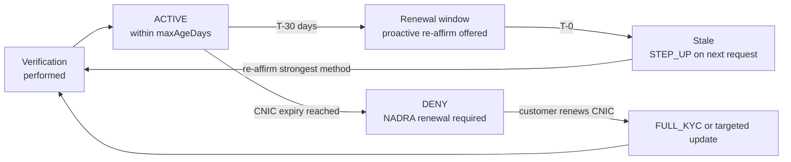
```mermaid
flowchart LR
    A["Verification<br/>performed"] --> B["ACTIVE<br/>within maxAgeDays"]
    B -->|"T-30 days"| C["Renewal window<br/>proactive re-affirm offered"]
    C -->|"T-0"| D["Stale<br/>STEP_UP on next request"]
    B -->|"CNIC expiry reached"| E["DENY<br/>NADRA renewal required"]
    D -->|"re-affirm strongest method"| A
    E -->|"customer renews CNIC"| F["FULL_KYC or targeted update"]
    F --> A
```

Two clocks run independently and must never be conflated:

| Clock | Set by | Effect at zero |
|---|---|---|
| **`expiresAt`** | ABHI policy per assurance level | STEP_UP — re-affirm the strongest method |
| **`cnicExpiryAt`** | NADRA, from the Verisys response | **DENY** — no re-scanning fixes an expired identity document |

The proactive renewal window at T-30 is where the customer-experience win compounds: the bank can re-affirm a customer during a low-friction moment rather than at the moment they need money. **[A]** — subject to product and marketing agreement.

---
# 7. Regulatory & Compliance Analysis

## 7.1 Scope and method — read this first

This section maps the design against Pakistani banking regulation **at instrument level**. It deliberately does **not** cite clause numbers.

**Why.** Clause-level citation carries regulatory consequence. A blueprint that asserts *"this satisfies AML/CFT Regulation R-x(y)"* invites reliance on an engineering author's reading of a document written for Compliance to interpret. Where an interpretation is needed, this section names the requirement in substance, states how the design addresses it, and marks the interpretation as a **Compliance action with an owner**.

**The output Compliance owes back** is a clause-mapped control matrix — a Phase 1 deliverable (§9.1), gating any production build.

## 7.2 SBP BPRD Circular Letter No. 22 of 2023 — Shared e-KYC Platform **[R]**

| | |
|---|---|
| **Requirement in substance** | Banks advised to join the PBA's shared e-KYC platform and to *"dedicate required financial, technological and human resources for its timely and effective implementation."* The platform uses distributed ledger technology, holds data at the banks rather than centrally, and gates access on explicit customer consent |
| **How the ledger complies** | The architecture is a structural match on all three counts: DLT (Fabric), bank-held data (off-chain vault at ABHI), consent-gated access (on-ledger consent with scope and expiry). **This is regulatory endorsement of exactly this architecture** |
| **Remaining gaps** | ABHI's schema is not yet mapped to Consonance's. The consent model is compatible in shape but unverified in detail. Membership terms, node hosting and liability are unknown **[OPEN-2]** |
| **Controls required** | Consonance readiness assessment (Phase 3); schema mapping; confirm ABHI's participation position and target date |

**The strongest strategic argument in this document sits here.** Joining Consonance requires publishing one canonical KYC record per customer. ABHI does not have one. The internal ledger is the prerequisite, not the competitor.

## 7.3 SBP BPRD Circular No. 01 of 2025 — Consolidated Customer Onboarding Framework **[R]**

| | |
|---|---|
| **Requirement in substance** | Consolidates customer onboarding requirements across customer types and account/wallet categories for SBP regulated entities |
| **How the ledger complies** | Makes the *strength* of onboarding verification explicit, machine-readable and auditable per customer — which the framework's category distinctions presuppose but ABHI's systems cannot currently express |
| **Remaining gaps** | **The A0–A3 ↔ account category mapping is not established [OPEN-A].** Until it is, the ladder is an internal risk construct, not a regulatory one |
| **Controls required** | **Compliance-owned mapping document (Phase 1 exit gate).** Product policy sign-off by Compliance and Risk. Re-review on any framework amendment |

## 7.4 SBP AML/CFT/CPF Regulations **[R]**

| | |
|---|---|
| **Requirement in substance** | Customer due diligence, ongoing due diligence, record keeping, risk profiling, sanctions and PEP screening |
| **How the ledger complies** | Alters **no** obligation. It evidences that CDD was discharged, to what standard, by whom, when — and preserves that evidence in tamper-evident form. On reliance: ABHI relies on **a record ABHI itself produced** and can cryptographically prove is unaltered, which is a stronger evidentiary position than today's, not a weaker one |
| **Remaining gaps** | **Screening is explicitly out of scope and stays out.** AML and sanctions screening are point-in-time checks against lists that change; a verification from last year says nothing about today's list. Ongoing due diligence periodicity by risk rating is a Compliance parameter the ledger consumes, not one it sets |
| **Controls required** | Sanctions/PEP screening continues at every origination, unchanged. `maxAgeDays` per product must be set to satisfy ODD periodicity, not merely operational convenience. Risk rating remains a Compliance function |

**The distinction that must not blur:** the ledger answers *"has this person's identity been verified, how strongly, and when?"* It does not answer *"is this person on a sanctions list today?"* Conflating the two would be the most dangerous possible misreading of this design, and §15 restates it in the recommendation.

## 7.5 Prudential Regulations for Microfinance Banks **[R]**

| | |
|---|---|
| **Requirement in substance** | Exposure limits — R-6's PKR 500,000 limit is referenced in the EWA product specification **[M]** |
| **How the ledger complies** | Unchanged. Exposure limits are a credit control operating on aggregate exposure; the ledger is an identity control |
| **Remaining gaps** | None material. **However:** reliable subject identity *improves* exposure aggregation, because the same person under two records is exactly how limits get breached accidentally |
| **Controls required** | Exposure aggregation continues in the credit systems. Consider `subjectId` as a de-duplication key for exposure — a genuine secondary benefit worth flagging to Risk |

## 7.6 Banking Companies Ordinance 1962 · Payment Systems and EFT Act 2007 **[R]**

| | |
|---|---|
| **Requirement in substance** | Confidentiality of customer information, absent a general data protection statute |
| **How the ledger complies** | Strengthens it. No personal data on-chain (P1); envelope-encrypted vault with no human read path; disclosure limited to policy-named attributes and audited per issuance |
| **Remaining gaps** | Cross-organization disclosure inside ABHI — Bank → Lending — must be confirmed as permissible under customer terms. Likely yes within one legal entity; **Legal to confirm** |
| **Controls required** | Legal review of intra-group disclosure basis; customer terms and privacy notice updated to describe reuse |

## 7.7 Personal Data Protection Bill 2023 — not enacted as at Aug 2026 **[R]**

| | |
|---|---|
| **Requirement in substance** | As drafted: right to erasure, localization of critical personal data, 72-hour breach notification |
| **How the ledger complies** | **Erasure** — crypto-shredding (§3.4.5): destroy ciphertext, DEK and salts; the 32-byte root becomes an unlinkable random value. **Localization** — all components deployable in-country; no dependency on offshore processing. **Breach notification** — audit trail identifies precisely which attributes were disclosed to which organization, which is exactly what a 72-hour notification requires |
| **Remaining gaps** | The Bill is not enacted and its final text may differ. **Whether crypto-shredding satisfies a statutory erasure right in Pakistan is a legal opinion nobody has yet given** |
| **Controls required** | Track enactment. Obtain external legal opinion on crypto-shredding **before** production go-live, not after. Retention register reconciling erasure requests against retention obligations |

### The erasure/retention tension, stated plainly

There is a real conflict and the design does not dissolve it:

- **Retention** obligations require the bank to keep CDD records for a defined period after the relationship ends.
- **Erasure** rights would require deletion on request.

The design's answer: **the audit fact survives, the personal data does not.** What remains on-chain after shredding is that a verification of a stated assurance level occurred on a stated date, performed by a stated organization — no attribute values, no identifiers resolvable to a person. Whether that satisfies both obligations simultaneously is a legal question, not an engineering one. **The engineering position is that this is the best available structure; the legal position must be obtained separately.** Presenting crypto-shredding as a settled answer to a right that does not yet exist in enacted law would be exactly the kind of overclaim that costs credibility.

## 7.8 Compliance control matrix

| Control ID | Control | Regulation family | Implemented by | Evidence | Owner |
|---|---|---|---|---|---|
| **C-01** | No unilateral KYC status change | AML/CFT governance | Endorsement policy | Fabric channel config; failed single-org attempts | Compliance |
| **C-02** | Complete, tamper-evident verification history | Record keeping | Hash-chained versions | `GetVersionChain` with `chainValid` | Compliance |
| **C-03** | Verification strength recorded per customer | CDD | Assurance ladder | `assuranceLevel` + `methods` | Risk |
| **C-04** | Instant cross-product freeze | AML/CFT | `SuspendKYC` | Audit events; product denials | Compliance |
| **C-05** | Consent recorded before disclosure | e-KYC / data protection | `RecordConsent` + gateway gate | Consent records; `ProofIssued` events | Compliance |
| **C-06** | Least disclosure | Data protection | Three-way intersection (§5.3.10) | `attributesDisclosed` per event | Compliance |
| **C-07** | No PII on ledger | Data protection | P1 + chaincode PII tripwire | Rejected-transaction log; ledger scan report | Security |
| **C-08** | Erasure capability | PDPB (anticipated) | Crypto-shredding | Shred certificate + `MarkShredded` txId | Compliance |
| **C-09** | Screening not displaced | AML/CFT | e-CIB and sanctions unchanged | Per-origination screening logs | Compliance |
| **C-10** | Expired CNIC blocks reliance | CDD | Policy engine hard DENY | Decision audit events | Risk |
| **C-11** | Policy changes require dual approval | Governance | `ProductPolicy.approvedBy` ≥ 2 | Policy version history | Compliance |
| **C-12** | Key custody under split knowledge | Operational risk | HSM, dual control | Key ceremony records | Security |

## 7.9 Regulatory risks

| Risk | Severity | Mitigation |
|---|---|---|
| **A0–A3 mapping to SBP categories is wrong** | **High** | Compliance-owned mapping as a Phase 1 exit gate; no production use before sign-off |
| Reliance on an internal record challenged at inspection | Medium | Position as *evidenced discharge of ABHI's own CDD*, never as third-party reliance. §13.8 gives inspectors a verification tool |
| PDPB enacted with terms inconsistent with crypto-shredding | Medium | Track enactment; external legal opinion pre-go-live; vault-only architecture means the fallback is deleting vault rows |
| Consonance membership terms conflict with the internal model | Medium | Early engagement **[OPEN-2]**; keep the interop projection separate from the canonical record |
| Immutability challenged as inconsistent with data protection | Low | No personal data on-chain by construction. Anticipated in §7.7 |
| Perception that the ledger reduces CDD obligations | **High if it occurs** | §15 states the opposite explicitly and in writing to every audience |

---

# 8. Security Architecture

## 8.1 Zero trust posture

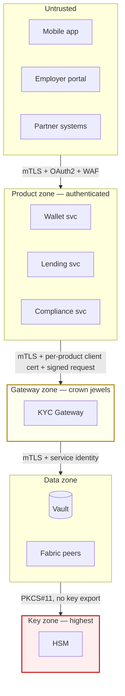
```mermaid
flowchart TB
    subgraph Z0["Untrusted"]
        APP["Mobile app"]
        POR["Employer portal"]
        PRT["Partner systems"]
    end
    subgraph Z1["Product zone — authenticated"]
        WAL["Wallet svc"]
        LEN["Lending svc"]
        CMP["Compliance svc"]
    end
    subgraph Z2["Gateway zone — crown jewels"]
        GW["KYC Gateway"]
    end
    subgraph Z3["Data zone"]
        VA[("Vault")]
        FAB["Fabric peers"]
    end
    subgraph Z4["Key zone — highest"]
        HSM["HSM"]
    end

    Z0 -->|"mTLS + OAuth2 + WAF"| Z1
    Z1 -->|"mTLS + per-product client cert + signed request"| Z2
    Z2 -->|"mTLS + service identity"| Z3
    Z3 -->|"PKCS#11, no key export"| Z4

    style Z2 fill:#ffe,stroke:#a80,stroke-width:2px
    style Z4 fill:#fee,stroke:#c00,stroke-width:2px
```

| Principle | Implementation |
|---|---|
| **Never trust the network** | mTLS on every hop including intra-cluster |
| **Verify explicitly** | Every request carries a workload identity; no shared API keys anywhere |
| **Least privilege** | Per-product client certificates scoped to that product's policy |
| **Assume breach** | Gateway compromise is modelled (§8.9 S-4) with detection and blast-radius limits |
| **Explicit trust boundaries** | Zone crossings are the only place authentication decisions are made, and each is logged |

## 8.2 Identity and access management

| Principal | Authenticates with | Authorised by | Rotation |
|---|---|---|---|
| **Product service → gateway** | mTLS client cert + OAuth2 client credentials | Per-product scope | 90 d cert, 1 h token |
| **Gateway → Fabric** | X.509 from org CA, `kyc.role=gateway` | MSP + chaincode ABAC | 90 d |
| **Compliance officer** | mTLS + SSO + **MFA** | `kyc.role=compliance-officer` | 1 y, quarterly recertification |
| **Auditor** | mTLS + SSO + MFA | `kyc.role=auditor`, **read-only** | 1 y |
| **MSP admin** | HSM-held key, **dual control** | `OU=admin` | 1 y, ceremony |
| **Gateway → HSM** | PKCS#11 session, per-workload credential | HSM policy per key handle | 90 d |

**No human being holds a credential that can write a KYC record.** Writes originate from the gateway service identity, under a request authenticated to a product service. Compliance officers hold credentials for status operations only — suspend, reinstate, shred — never for registration or update. This separation is what makes the audit trail meaningful: a `RegisterKYC` can always be traced to a customer journey, never to a person with database access.

> **Annotated 24 August 2026 — the POC console moved towards this paragraph, and has
> not arrived.**
>
> **The credential claim was never at risk.** Every write in the POC goes through the
> gateway service identity; no console persona has ever held a ledger credential. What
> was at odds with this paragraph was the second half of it — the claim that an update
> traces to a **customer journey rather than to a person**.
>
> Until 24 August the customer profile carried a *"Run missing checks"* button that
> initiated `POST /kyc/update` from a member of staff's screen, for checks the customer
> had not performed. The credential was the gateway's; the intent was an operator's.
> That control is removed. A step-up is now committed by the customer's own journey
> when they clear their last outstanding check, and the ledger's `updateReason` records
> it as such — *"Customer completed Live selfie check for SBL"*.
>
> **What still falls short, stated so this is not read as conformance.** The
> verification queue retains an operator-initiated *"Run … only"* step-up, which is the
> same pattern on a different screen and is deliberately kept for the operations
> workflow. And the whole of the table above is aspirational in the POC: the console
> authenticates with `X-ABHI-MSP` headers, not mTLS or SSO or MFA, and
> `services/gateway/src/security.ts` refuses header identity outright when
> `NODE_ENV=production` precisely because it is not an identity mechanism. Nothing in
> the POC demonstrates the IAM design in this section.

## 8.3 MSP governance

| Control | Requirement |
|---|---|
| **Infrastructure separation** | Each MSP's peers, CA and HSM partition in separate cloud accounts/subscriptions with separate IAM boundaries |
| **Administrative separation** | No individual holds admin credentials for more than one MSP. **Enforced by HR-linked access review, not by policy document** |
| **Dual control** | Two named admins per org; MSP admin operations require both |
| **Channel config changes** | Majority of orgs; Compliance mandatory; recorded as a config transaction |
| **Chaincode lifecycle** | All three orgs must approve a definition before commit |
| **Quarterly attestation** | Each org's head attests to its admin roster; divergence is a compliance exception |

**§3.2.3's honest verdict applies here.** These controls are what convert "three MSPs on one org chart" into a defensible separation. If ABHI will not commit to them operationally, the architecture's central governance claim weakens, and the alternative in §9.1 becomes the better decision. **This is a management commitment, not an engineering deliverable, and it should be secured before build starts.**

## 8.4 Key management

### 8.4.1 HSM architecture

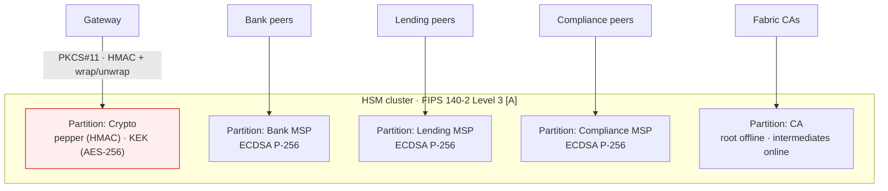
```mermaid
flowchart TB
    subgraph HSM["HSM cluster · FIPS 140-2 Level 3 [A]"]
        P1["Partition: Crypto<br/>pepper (HMAC) · KEK (AES-256)"]
        P2["Partition: Bank MSP<br/>ECDSA P-256"]
        P3["Partition: Lending MSP<br/>ECDSA P-256"]
        P4["Partition: Compliance MSP<br/>ECDSA P-256"]
        P5["Partition: CA<br/>root offline · intermediates online"]
    end
    GW["Gateway"] -->|"PKCS#11 · HMAC + wrap/unwrap"| P1
    PB["Bank peers"] --> P2
    PL["Lending peers"] --> P3
    PC["Compliance peers"] --> P4
    CA["Fabric CAs"] --> P5

    style P1 fill:#fee,stroke:#c00
```

Partition separation matters: a compromise of the Lending MSP partition must not yield the pepper, and a compromise of the crypto partition must not yield the ability to endorse.

### 8.4.2 Pepper custody

| Control | Requirement |
|---|---|
| **Generation** | Inside the HSM, during a witnessed key ceremony, minuted |
| **Extractability** | **Non-extractable.** No wrapped export, no backup outside the HSM's own cluster replication |
| **Split knowledge** | ≥3 custodians, quorum 2, no single custodian can activate |
| **Access** | Gateway workload identity only; every HMAC operation logged |
| **Monitoring** | Operation-rate baseline; **anomalous volume pages immediately** — bulk correlation of the ledger would show up here first |
| **Rotation** | Annual, or immediately on suspicion, per §8.4.3 |

### 8.4.3 Pepper rotation procedure

```
PREP   1. Generate epoch e+1 in HSM, ceremony, dual control
       2. Enable dual-epoch resolution in gateway: try e+1, fall back to e
       3. Freeze new-subject registration briefly at cutover
MIGRATE 4. For each subject: re-derive subjectId under e+1
       5. Append a migration version (UpdateKYC, reason MIGRATION_PEPPER_EPOCH)
       6. Re-key vault index; verify chain integrity per subject
CUTOVER 7. Verify 100% migrated; disable epoch-e resolution
       8. Retain epoch e in HSM (disabled) for the audit window, then destroy
```

**Realistic cost.** At full customer base this is a multi-day operation writing one transaction per subject, and every product's cached subject reference becomes stale. It must be **rehearsed in a lower environment annually**, not improvised during an incident. Appendix A carries it as a standing production risk.

### 8.4.4 Key inventory

| Key | Algorithm | Custody | Rotation | Recovery |
|---|---|---|---|---|
| Pepper | HMAC-SHA256, 256-bit | HSM, non-extractable | Annual | HSM cluster replication only |
| KEK | AES-256 | HSM, non-extractable | Annual | HSM cluster replication only |
| DEK | AES-256-GCM | Wrapped in DB | Per record | Re-derivable only via KEK |
| MSP signing | ECDSA P-256 | HSM per partition | Annual | Re-enrol via org CA |
| CA root | ECDSA P-384 | **Offline**, air-gapped HSM | 20 y | Ceremony |
| TLS | ECDSA P-256 | Cert manager | 90 d automated | Re-issue |

**Note what has no recovery path: the pepper and the KEK.** Losing the pepper makes every existing `subjectId` underivable from a CNIC — new lookups fail, though the ledger remains internally consistent. Losing the KEK makes every vault record permanently undecryptable, which is a bank-wide crypto-shred nobody asked for. HSM cluster replication and tested restore are therefore **availability controls of the highest order**, not routine backup hygiene.

## 8.5 Gateway security — the crown jewel

The gateway sees plaintext attributes in transit. It is the most attractive target in the system, and the design should not pretend otherwise.

| Control | Implementation |
|---|---|
| **No plaintext at rest** | Attributes exist only in process memory; never written to disk, logs, traces or crash dumps |
| **Log redaction** | Structured logging with a deny-list on attribute names **and** a CNIC-shaped-value scrubber applied to every field before emission |
| **Memory hygiene** | Sensitive buffers zeroed after use; core dumps disabled; swap disabled on gateway nodes |
| **Minimal image** | Distroless container, non-root, read-only root filesystem, no shell |
| **Admission control** | Signed images only; SBOM; vulnerability gate in CI |
| **Runtime detection** | eBPF-based syscall monitoring; alert on unexpected egress, exec or file write |
| **Supply chain** | Dependency pinning, lockfile integrity, provenance attestation |
| **Segregation** | Gateway nodes run **nothing else**. No shared tenancy with product services |

**Blast radius if the gateway is fully compromised**, stated honestly: the attacker sees attributes for customers verified during the compromise window, can request the HSM to compute HMACs (but cannot extract the pepper), can propose transactions as the gateway identity — **but cannot commit any KYC write without Compliance's endorsement**. That last clause is precisely what the endorsement policy buys, and it is the clearest illustration of why P2 is worth its cost.

## 8.6 API security

| Layer | Control |
|---|---|
| **Transport** | TLS 1.3, mTLS, HSTS, pinned CA |
| **Authn** | OAuth2 client credentials + client certificate binding |
| **Authz** | Per-product scopes; policy engine enforces disclosure limits |
| **Integrity** | Request signing over method, path, body hash, timestamp, nonce |
| **Replay** | Nonce cache + 60-second clock skew tolerance |
| **Idempotency** | Mandatory key on all mutating endpoints; 24 h dedupe window |
| **Rate limiting** | Per product, per subject, per endpoint — subject-level limits also blunt enumeration |
| **Input validation** | Schema-first (OpenAPI), reject-unknown-fields, strict types |
| **Output** | Attribute allow-list per product; never echo request payloads |
| **Enumeration defence** | `VerifyKYC` on an unknown subject returns `found: false` in **constant time**; no distinguishable error, no timing signal |

## 8.7 Vault security

| Control | Implementation |
|---|---|
| **Encryption** | AES-256-GCM per record; DEK wrapped by HSM KEK |
| **AAD binding** | `subjectId ‖ version ‖ pepperEpoch` — defeats ciphertext swap (§3.4.2) |
| **Access** | Gateway service account only; **no human read path**; DBA sees ciphertext |
| **Network** | Private subnet, no public route, security-group allow-list |
| **At rest** | Disk/TDE encryption independently of application encryption |
| **Backup** | Encrypted; restore rehearsed quarterly; **backups inherit crypto-shredding** — a shredded DEK is unrecoverable from backup, which is the property that makes erasure real rather than theatrical |
| **Audit** | Every decrypt logged with requesting identity, subject, purpose, correlation ID |

**The backup point deserves emphasis** because it is where most "right to erasure" implementations quietly fail. Deleting a database row does not delete it from six months of backups. Destroying the DEK does — the ciphertext in every backup becomes permanently undecryptable at the moment of shredding, without touching the backups at all. This is the strongest single argument for envelope encryption in this design.

## 8.8 Threat model — STRIDE

| Threat | Vector | Mitigation | Residual |
|---|---|---|---|
| **Spoofing** | Forged product identity | mTLS + client cert binding + request signing | Low |
| **Spoofing** | Forged MSP identity | HSM-held keys, non-extractable | Low |
| **Tampering** | Alter historical KYC | Hash chain; any edit breaks `GetVersionChain` | **Very low** |
| **Tampering** | Swap vault ciphertext | GCM AAD binding | Low |
| **Tampering** | Forge a proof | Gateway self-verifies against on-chain root before release | Very low |
| **Tampering** | Merkle second-preimage | Domain-separated prefixes; odd nodes promoted | Very low |
| **Repudiation** | "We never verified them" | Signed, endorsed, hash-chained record | Very low |
| **Info disclosure** | Ledger exfiltration | Keyed hashes + metadata only; no PII | **Very low** |
| **Info disclosure** | Brute-force CNIC → subjectId | HMAC with HSM pepper | Low — **rises to critical on pepper compromise** |
| **Info disclosure** | Guess low-entropy attributes from leaves | Per-attribute 32-byte salts | Very low |
| **Info disclosure** | Over-broad product request | Three-way intersection (§5.3.10) | Low |
| **DoS** | Rail exhaustion / cost attack | Rate limits, circuit breakers, cost caps with alerting | Medium |
| **DoS** | Vault unavailable | Ledger still answers ALLOW/DENY on metadata; degrade to decision-without-proof | Medium |
| **Elevation** | Product self-certifies verification | Endorsement requires Compliance | **Very low** |
| **Elevation** | Product invokes `SuspendKYC` | Chaincode MSP check + endorsement | Very low |
| **Elevation** | Assurance inflation in payload | Level↔methods consistency check (§6.3) | Low |

## 8.9 Attack scenarios

### S-1 · Malicious insider upgrades a historical assurance level

**Attempt.** A privileged operator edits an old record to show A3 where A2 was recorded, to make a past lending decision look compliant.

**Path.** Direct CouchDB write, bypassing chaincode.

**Detection.** The record's hash no longer matches the `previousVersionHash` in its successor. `GetVersionChain` returns `chainValid: false` with `brokenAt`. The nightly integrity sweep (§13.4) detects it within 24 hours; an audit query detects it immediately.

**Why it fails.** Peers hold independent copies. Altering one peer's state database diverges it from the others; the block hashes are unchanged and still commit to the original data. To succeed the attacker must alter every peer in every organization *and* forge the block chain itself — which requires the orderer signing keys and every MSP's keys simultaneously.

**Response.** P1 incident. Isolate the peer, rebuild state from blocks, forensics on access logs.

---

### S-2 · Product team self-certifies a customer

**Attempt.** Lending, under commercial pressure, writes an A3 record for a customer who completed only A1.

**Path.** `RegisterKYC` proposal signed by `ABHILendingMSP`.

**Why it fails.** The endorsement policy requires `ABHIComplianceMSP.peer`. Without Compliance's endorsement the transaction is rejected at validation and never commits. **The rejected attempt is itself recorded** — an invalid transaction is written into the block with its validation code, so the attempt is permanently visible.

**Secondary control.** Even with Compliance endorsement, the level↔methods consistency check (§6.3) rejects A3 without `LIVENESS` in `methods`, and the absence of a corresponding `VerificationEvent` from the orchestrator is a reconciliation exception.

---

### S-3 · Pepper compromise — the worst case

**Attempt.** An attacker obtains the pepper and a copy of the ledger, then correlates every `subjectId` to a real CNIC by computing HMACs over all 10¹³ candidates.

**Impact.** Severe. The attacker learns which CNICs ABHI has verified, to what assurance level, when, and their status. **They do not learn any attribute values** — those are salted leaves in an off-chain vault they do not have.

**Detection.** Anomalous HMAC operation volume on the HSM partition (§8.4.2) is the primary signal, and it is why that metric pages rather than alerts.

**Why it is hard.** The pepper is non-extractable and under split knowledge. Extraction requires HSM compromise or custodian collusion.

**Response.** Emergency pepper rotation (§8.4.3), forensic review of all HSM operations, regulatory notification assessment, customer notification assessment.

**Stated plainly for the record:** this is the highest-impact residual risk in the design. It is mitigated, not eliminated. Anyone reviewing this architecture should assess whether ABHI's HSM operational maturity justifies the reliance placed on it — and if it does not, that is an argument for investing in key management, not for abandoning the design, because the alternative (unkeyed hashes) is strictly worse.

---

### S-4 · Gateway compromise

**Attempt.** RCE on a gateway node.

**Impact during the window.** Plaintext attributes for customers being verified; ability to call the HSM's HMAC and unwrap operations; ability to propose transactions as the gateway identity; ability to request proofs.

**Limits.** Cannot extract the pepper or KEK. Cannot commit KYC writes without Compliance endorsement. Cannot read historical vault records at scale without generating a decrypt-audit trail that trips volume alerts.

**Detection.** eBPF runtime monitoring; unexpected egress; anomalous decrypt volume; HSM operation-rate anomaly.

**Response.** Revoke the gateway client certificate — which severs it from Fabric and the HSM in one action — rotate credentials, rebuild from a signed image, assess disclosure for breach notification.

---

### S-5 · Employer portal poisoning

**Attempt.** A malicious or careless employer uploads a CSV of CNICs belonging to people who are not its employees, hoping to have them treated as verified.

**Why it fails.** Employer uploads produce **A0 only**, and A0 permits nothing. No product accepts A0 (§6.2). The upload creates a lead, not an identity.

**Residual.** Enumeration — an employer could learn which CNICs are already A2 from the activation split. **Control:** the bulk response returns counts and eligibility flags for CNICs the employer has a demonstrated employment relationship with, rate-limited, with per-employer volume anomaly alerting. **[A]** — this needs a product decision on exactly what the portal displays, and it is a genuine privacy consideration that a naive implementation would miss.

> **Amended 23 Aug 2026 — the control above was built and not connected (`SEC-16`).**
> `EmploymentRegister` existed and had unit tests, but `POST /employer/bulk-lookup`
> passed no employer id and the bootstrap constructed no register — so the roster gate
> could not engage on the only surface a caller can reach, and the shipped configuration
> answered the enumeration question for any CNIC submitted. This scenario was, in effect,
> unmitigated in the running system while being reported as mitigated. The employer id is
> now taken from the authenticated principal, and the gateway refuses to start without a
> register in production. Per-employer volume-anomaly alerting remains outstanding.

---

### S-6 · Replay of a stale proof

**Attempt.** A product replays yesterday's ALLOW + proof bundle for a customer suspended this morning.

**Why it fails.** Proof bundles carry the issuing `version`, `proofIssuanceId` and an expiry. Consuming products must call `VerifyKYC` at decision time; the bundle is evidence of attributes, never of current standing. `SuspendKYC` flips status on the current version, so the next call denies.

**Design requirement made explicit:** *a proof bundle is not a session token.* Any product implementation that caches an ALLOW decision beyond the request is a defect, and this must be stated in the integration guide — it is the most likely way for a well-built system to be misused by an integrating team in a hurry.

## 8.10 Detection and monitoring

| Signal | Threshold | Severity | Response |
|---|---|---|---|
| `chainValid: false` | Any | **P1** | Isolate peer, rebuild state, forensics |
| `ERR_PII_DETECTED` | Any | **P1** | Halt calling service, investigate gateway |
| `ERR_REGISTRY_DIVERGENCE` | Any | **P1** | Freeze writes for subject, reconcile |
| HSM HMAC rate | >3σ over baseline | **P1** | Suspected correlation attack |
| Vault decrypt rate | >3σ over baseline | P2 | Suspected exfiltration |
| Endorsement failures by one MSP | >5/hour | P2 | Possible unilateral-write attempt |
| Rail spend | >120% of daily budget | P2 | Cost attack or integration defect |
| Proof self-verification failure | Any | P2 | Defect or tampering |
| Suspension→reinstatement cycles | >2 per subject per quarter | P3 | Possible control abuse |
| Biometric cap exhaustion | Trending up | P3 | UX and friction signal |

**Every P1 in this table is an integrity signal, not an availability one.** That ordering is deliberate: a ledger that is down is an incident, but a ledger that is silently wrong is a catastrophe.

---
# 9. Development Roadmap

## 9.0 Two tracks, one gate

The roadmap is deliberately split. Conflating them is how blockchain initiatives at banks end up eighteen months in with no decision point.

| Track | Sprints | Duration | Rails | Output |
|---|---|---|---|---|
| **A — POC** | S0–S3 | 8 weeks | **Mocked** | A working demonstration, plus the **measured value of `r`** (§1.6) |
| **GATE** | — | 2 weeks | — | Go/no-go on §15.5 criteria. **Genuine no-go option** |
| **B — Production** | S4–S15 | 24 weeks | Real | Production-grade platform |

**The gate must be real.** If the POC measures `r` at 8% and Compliance declines to co-endorse, the correct decision is to stop and implement §9.1's signed append-only database instead. A roadmap without a credible stopping point is a budget request wearing a plan's clothes.

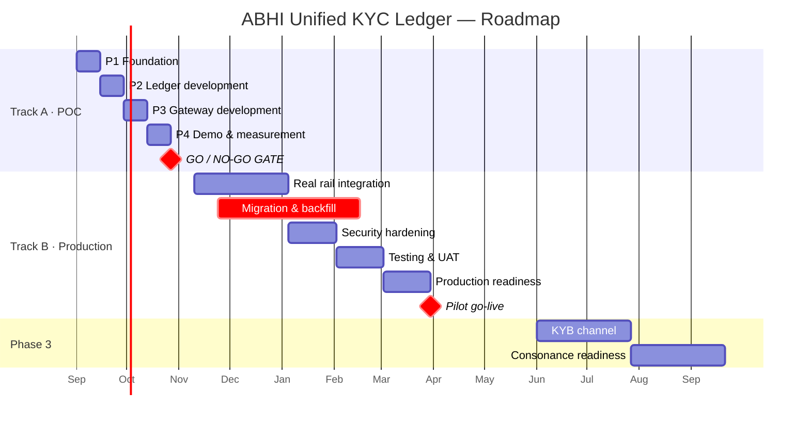
```mermaid
gantt
    title ABHI Unified KYC Ledger — Roadmap
    dateFormat YYYY-MM-DD
    axisFormat %b

    section Track A · POC
    P1 Foundation              :a1, 2026-09-01, 14d
    P2 Ledger development      :a2, after a1, 14d
    P3 Gateway development     :a3, after a2, 14d
    P4 Demo & measurement      :a4, after a3, 14d
    GO / NO-GO GATE            :milestone, crit, after a4, 0d

    section Track B · Production
    Real rail integration      :b1, 2026-11-10, 56d
    Migration & backfill       :crit, b2, 2026-11-24, 84d
    Security hardening         :b3, after b1, 28d
    Testing & UAT              :b4, after b3, 28d
    Production readiness       :b5, after b4, 28d
    Pilot go-live              :milestone, crit, after b5, 0d

    section Phase 3
    KYB channel                :c1, 2027-06-01, 56d
    Consonance readiness       :c2, after c1, 56d
```

## 9.1 Phase 1 — Foundation (S0)

| | |
|---|---|
| **Goal** | Environment, decisions and the business case's missing number |

**Deliverables**
- Monorepo scaffolded; CI green on an empty build
- 3-org Fabric network running locally (Docker Compose), channel created
- `packages/merkle` implemented and reproducing the reference hashes in `IDEA.md` §4 exactly
- **Verification event census** across existing products
- **Retrospective duplication analysis → the measured value of `r`**
- Compliance decision paper: A0–A3 ↔ SBP category mapping **[OPEN-A]**

**Tasks**
| Task | Owner | Est. |
|---|---|---|
| Monorepo, TypeScript config, lint, CI | BE1 | 3 d |
| `cryptogen`/`configtx` for 3 orgs; network up/down scripts | BC | 5 d |
| `packages/merkle`: leaves, root, proofs, canonical JSON | BC | 4 d |
| Reproduce reference hashes as a test vector suite | QA | 2 d |
| Instrument rail calls in existing products (read-only analysis) | BE2 | 5 d |
| Historical duplication analysis, derive `r` | BE2 + PM | 5 d |
| Compliance workshop: assurance ↔ SBP categories | PM + Arch | 3 d |
| Threat model workshop | Arch | 2 d |

**Dependencies** — access to historical verification logs (Data/Compliance); Compliance availability for the mapping workshop.

**Risks**
| Risk | Mitigation |
|---|---|
| Historical logs insufficient to derive `r` | Fall back to a 30-day forward-instrumented sample; delays the number, does not block the build |
| Compliance cannot resource the mapping workshop | Escalate at S0 — this is a Phase 1 exit gate and slipping it silently poisons everything downstream |
| Fabric setup consumes the sprint | Timebox to 5 days; fall back to `fabric-samples` test-network with 3 orgs |

**Acceptance criteria**
- [ ] `npm test` green; CI passing
- [ ] 3-org network starts from a single command; all peers join `kyc-channel`
- [ ] Merkle package reproduces **every** hash in `IDEA.md` §4, byte-for-byte
- [ ] `r` reported with methodology and confidence, **or** a documented reason it could not be derived and a dated plan
- [ ] Compliance mapping paper drafted **[OPEN-A]**

---

## 9.2 Phase 2 — Ledger development (S1)

| | |
|---|---|
| **Goal** | `kyc-registry` chaincode complete, with the endorsement policy demonstrably enforced |

**Deliverables** — all ten functions; version chaining with post-supersession hashing; state machine; ABAC; PII tripwire; unit tests ≥90% branch coverage; endorsement policy negative tests.

**Tasks**
| Task | Owner | Est. |
|---|---|---|
| Chaincode scaffold, contract API, canonical JSON | BC | 2 d |
| `RegisterKYC`, `VerifyKYC` | BC | 3 d |
| `UpdateKYC` incl. **post-supersession hashing** | BC | 3 d |
| `SuspendKYC`, `ReinstateKYC`, MSP/role guards | BC | 2 d |
| `RecordConsent`, `RevokeConsent` | BE1 | 3 d |
| `MarkShredded`, `GetVersionChain`, `GenerateProof` | BC | 3 d |
| PII tripwire + payload validation | BE1 | 2 d |
| Endorsement policy definition and commit | BC | 2 d |
| Unit tests + `chain-hash-post-supersession` test | QA | 6 d |
| Negative tests: single-org write, product `SuspendKYC` | QA | 3 d |

**Dependencies** — Phase 1 network and merkle package.

**Risks**
| Risk | Mitigation |
|---|---|
| Non-determinism creeps in | Lint rule banning `Date.now`/`Math.random` in chaincode; review checklist |
| Chain-hash ordering implemented wrong | Dedicated test written **before** the implementation |
| Endorsement policy misconfigured and untested | Negative test is an acceptance criterion, not a nice-to-have |

**Acceptance criteria**
- [ ] All 10 functions implemented and unit tested
- [ ] **A single-org write attempt fails**, and the failure is demonstrated in a test
- [ ] **`SuspendKYC` from `ABHILendingMSP` fails** with `ERR_COMPLIANCE_ONLY`
- [ ] A 3-version chain verifies; a tampered v2 sets `chainValid: false` with correct `brokenAt`
- [ ] Any payload containing 13 consecutive digits is rejected
- [ ] Branch coverage ≥90%

---

## 9.3 Phase 3 — Gateway development (S2)

| | |
|---|---|
| **Goal** | The gateway: subject IDs, policy decisions, proofs, consent, vault |

**Deliverables** — REST API to OpenAPI 3.1; subject ID derivation (software HSM in POC); policy engine with full decision table coverage; proof generation with self-verification; consent enforcement; vault with envelope encryption; cost-metered mock rails.

**Tasks**
| Task | Owner | Est. |
|---|---|---|
| Service scaffold, OpenAPI, mTLS, structured logging with redaction | BE1 | 3 d |
| Subject ID generator + normalisation + `pepperEpoch` | BE1 | 2 d |
| Policy engine + exhaustive decision-table tests | BE2 | 4 d |
| Proof generator + **mandatory self-verification** | BC | 3 d |
| Vault: PostgreSQL, envelope encryption, AAD binding | BE2 | 4 d |
| Consent manager | BE1 | 3 d |
| Mock rails with configurable latency, failure and **cost counters** | BE2 | 3 d |
| Fabric Gateway SDK client, retry on MVCC conflict | BC | 3 d |
| Integration tests end-to-end | QA | 5 d |

**Risks**
| Risk | Mitigation |
|---|---|
| Software pepper in POC becomes production by accident | Hard-fail on startup if `NODE_ENV=production` and no PKCS#11 provider configured |
| Policy engine and chaincode disagree on staleness | Single shared time source (tx timestamp); decision-table tests fixed against it |
| MVCC conflicts under concurrent updates | Retry with backoff; explicit concurrency test |

**Acceptance criteria**
- [ ] Every cell of the §3.3.2 decision table has a passing test
- [ ] A proof failing self-verification is never returned; request fails closed
- [ ] Attributes outside the three-way intersection are never disclosed
- [ ] Vault ciphertext moved between records fails GCM authentication
- [ ] No attribute value appears in any log at any level

---

## 9.4 Phase 4 — Integration development (S3 POC; S4–S7 production)

### POC form (S3)

**Deliverables** — demo UI covering the five operations; employer bulk-upload split; cost dashboard showing saved vs spent; auditor view rendering a version chain with integrity status; seeded demo dataset; recorded demo script.

> **Amended 24 Aug 2026 — the cost dashboard was withdrawn.** It was removed from the
> console along with every rupee-denominated figure; see the amendment note at the head
> of this document. The gateway's cost fields are untouched, so this is a UI
> withdrawal, not a capability that was never built. The other deliverables in this
> list are unaffected by the change and are not assessed here.

**Tasks**
| Task | Owner | Est. |
|---|---|---|
| Product simulator UI: wallet · EWA · SBL · MF | FE | 5 d |
| Employer bulk-upload screen + activation split | FE | 3 d |
| Compliance console: suspend, reinstate, shred | FE | 3 d |
| Auditor view: version chain, integrity, disclosure log | FE | 3 d |
| Cost dashboard: calls avoided, cost avoided, `r` observed — **withdrawn 24 Aug 2026, see the amendment note** | FE + BE2 | 3 d |
| Demo dataset + reset script | BE1 | 2 d |
| Demo script, dry runs, recorded walkthrough | PM + QA | 4 d |
| Performance baseline | QA | 2 d |

### Production form (S4–S7)

Real NADRA Verisys, NADRA biometric, liveness, e-CIB, CBS, Mobiliser. Contracts, SLAs, failure modes, attempt-cap reconciliation, cost reconciliation against invoices.

**Risks**
| Risk | Mitigation |
|---|---|
| **NADRA contracting is the long pole and is outside engineering's control** | Start commercial engagement during S0 — not S4. Flag to sponsor at kickoff |
| Real rail failure modes differ from mocks | Fault-injection testing against sandbox before production |
| Biometric attempt counters drift from NADRA's (§3.5) | Treat NADRA as authoritative; daily reconciliation |

**Acceptance criteria (POC)**
- [ ] All five operations demonstrable end-to-end
- [ ] Employer upload of 1,000 CNICs splits correctly and completes < 60 s
- [ ] ~~Cost dashboard shows calls avoided against a configurable unit cost~~ — **withdrawn 24 Aug 2026.** This criterion can no longer be met from the console and is not a pass condition. Calls avoided remain observable on `/metrics` and in the bulk-lookup response
- [ ] Auditor view detects a deliberately tampered record
- [ ] Full demo runs in ≤ 20 minutes without engineer intervention

---

## 9.5 Phase 5 — Security hardening (S8–S9)

**Deliverables** — hardware HSM integration (pepper, KEK, MSP keys); CA hierarchy with offline root; mTLS everywhere; secrets management; runtime detection; **independent penetration test**; rehearsed pepper-rotation runbook.

**Tasks** — PKCS#11 integration and migration off software keys; key ceremony with custodians; MSP admin separation and dual control; cert rotation automation; SAST/DAST/SCA in CI; container hardening; pentest and remediation; pepper-rotation rehearsal in staging.

**Risks**
| Risk | Mitigation |
|---|---|
| HSM procurement lead time | Start procurement in S4; use cloud HSM if on-prem slips |
| Pepper migration from software to hardware | Treat as a full pepper rotation with the rehearsed procedure — not as a config change |
| Pentest finds a design flaw, not just bugs | Book pentest early enough that a design fix is still affordable |

**Acceptance criteria**
- [ ] No key material outside the HSM in any environment above development
- [ ] Pepper rotation rehearsed end-to-end in staging with a measured duration
- [ ] Pentest: zero critical, zero high open at exit
- [ ] MSP admin separation attested by all three organization heads

---

## 9.6 Phase 6 — Testing (S10–S11)

| Test type | Scope | Exit criterion |
|---|---|---|
| **Unit** | Chaincode, gateway, merkle | ≥90% branch |
| **Integration** | Gateway ↔ Fabric ↔ vault ↔ rails | All 5 operations, all decision paths |
| **Contract** | Product ↔ gateway API | Consumer-driven contracts green |
| **Property-based** | Merkle proofs, canonical JSON | 10⁶ random attribute sets: proof verifies iff attribute present |
| **Performance** | `VerifyKYC` under load | p99 ≤ 300 ms at 100 TPS **[A]** |
| **Soak** | 72 h sustained | No leaks, no state growth anomaly, chain valid throughout |
| **Chaos** | Peer loss, orderer loss, vault loss, HSM loss | Documented degradation, no data loss, no wrong ALLOW |
| **Security regression** | Every §8.9 scenario | All fail as designed |
| **DR** | Full restore | Within RTO/RPO (§13.3) |
| **UAT** | Compliance, Risk, Product, Audit | Sign-off from each |

**The property-based Merkle test earns its place.** Selective disclosure is the claim most likely to be probed by a technical reviewer and least likely to be broken by an obvious bug. Random-input testing over a million attribute sets catches the ordering, padding and domain-separation errors that example-based tests miss.

**Acceptance criteria** — all above met; UAT signed by Compliance, Risk, Product and Internal Audit; performance baseline documented.

---

## 9.7 Phase 7 — Production readiness (S12–S15)

**Deliverables** — multi-AZ deployment; 5-node Raft ordering; DR site with rehearsed failover; monitoring and alerting per §8.10; runbooks; on-call rotation; **migration and backfill executed**; governance forum constituted; regulatory notification if required; pilot go-live on one product.

**The migration workstream is the largest single item in the programme and the most likely to be underestimated.** It runs from S6 in parallel, not at the end.

**Tasks (migration)**
| Task | Est. |
|---|---|
| Evidence inventory: what verification evidence survives, per customer cohort | 15 d |
| **Assurance assignment rules for incomplete evidence [OPEN-5]** — Compliance decision | 10 d |
| Backfill engine: derive subjects, build attribute sets, write v1 records | 20 d |
| Dry run on 1% cohort with manual reconciliation | 10 d |
| Full backfill, batched, with integrity verification per batch | 15 d |
| Exception handling for unresolvable customers | 15 d |

**[OPEN-5] is the largest judgment call in the programme.** For customers whose original verification evidence is incomplete, what assurance level is assigned? Assign too high and the bank grants reliance it cannot evidence. Assign too low and the platform launches with a base of customers who all need re-verification, which destroys the value proposition on day one. **This is a Compliance decision with a material commercial consequence, and it should be taken deliberately at executive level rather than settled by a backfill script's default.**

**Acceptance criteria**
- [ ] DR failover rehearsed within RTO
- [ ] Migration complete with a per-batch integrity report; exceptions documented and owned
- [ ] Runbooks exist for all §13.7 scenarios and have been walked through
- [ ] On-call rotation staffed and paging tested
- [ ] Pilot product live; rollback path tested

---

# 10. Sprint-by-Sprint Plan

## 10.1 Team and conventions

| Role | Code | Allocation |
|---|---|---|
| Product Manager | PM | 100% |
| Architect | ARCH | 100% |
| Backend Developer 1 | BE1 | 100% |
| Backend Developer 2 | BE2 | 100% |
| Blockchain Developer | BC | 100% |
| Frontend Developer | FE | 100% (from S2) |
| QA Engineer | QA | 100% |

**[A-1]** Two-week sprints. Velocity assumed at **34 points** after S0 **[A]** — recalibrate from S1 actuals; every estimate below is a planning input, not a commitment.

## 10.2 Sprint 0 — Foundation & the missing number

| | |
|---|---|
| **Goal** | Prove the crypto reproduces, the network runs, and **measure `r`** |
| **Timeline** | Weeks 1–2 |

| Story | Points | Owner | Acceptance |
|---|---|---|---|
| Monorepo + CI so the team can commit on day 3 | 3 | BE1 | CI green, lint enforced |
| 3-org Fabric network from one command | 8 | BC | All peers joined; script idempotent |
| `packages/merkle` reproducing reference hashes | 8 | BC | **Every hash in `IDEA.md` §4 matches** |
| Rail-call instrumentation across products | 5 | BE2 | Events captured with subject, method, cost tag |
| **Historical duplication analysis → `r`** | 8 | BE2, PM | Number reported with methodology |
| Compliance workshop: A0–A3 ↔ SBP categories | 5 | PM, ARCH | Draft mapping paper |
| Threat model workshop | 3 | ARCH | STRIDE table reviewed |

**Deliverables** — running network, verified merkle package, **the `r` number**, draft compliance mapping.
**Team note** — FE not yet required; QA pairs on test vectors.

## 10.3 Sprint 1 — Chaincode

| | |
|---|---|
| **Goal** | `kyc-registry` complete, endorsement enforced, chain integrity provable |
| **Timeline** | Weeks 3–4 |

| Story | Points | Owner |
|---|---|---|
| `RegisterKYC` + `SubjectRegistry` | 5 | BC |
| `VerifyKYC` query projection | 3 | BC |
| `UpdateKYC` with post-supersession hashing | 8 | BC |
| `SuspendKYC` / `ReinstateKYC` + MSP/role guards | 5 | BC |
| `RecordConsent` / `RevokeConsent` | 5 | BE1 |
| `MarkShredded` | 3 | BE1 |
| `GetVersionChain` with integrity verification | 5 | BC |
| `GenerateProof` authorisation + three-way intersection | 5 | BE1 |
| PII tripwire + payload validation | 3 | BE1 |
| Endorsement policy commit + **negative tests** | 5 | BC, QA |
| Unit suite ≥90% branch | 8 | QA |

**Deliverables** — chaincode v1.0 deployed to the local network; test report.
**Demo** — a single-org write attempt failing, live. *This is the moment the governance argument becomes visible rather than asserted, and it is worth showing to Compliance in person.*

## 10.4 Sprint 2 — Gateway

| | |
|---|---|
| **Goal** | Decisions, proofs, consent, vault |
| **Timeline** | Weeks 5–6 |

| Story | Points | Owner |
|---|---|---|
| Service scaffold, OpenAPI 3.1, mTLS, redacted logging | 5 | BE1 |
| Subject ID generator + normalisation | 5 | BE1 |
| Policy engine + exhaustive decision-table tests | 8 | BE2 |
| Proof generator + mandatory self-verification | 8 | BC |
| Vault: envelope encryption + AAD binding | 8 | BE2 |
| Consent manager enforcement | 5 | BE1 |
| Mock rails with cost counters and failure injection | 5 | BE2 |
| Fabric SDK client + MVCC retry | 5 | BC |
| Demo UI shell and design system | 5 | FE |
| Integration test harness | 5 | QA |

**Deliverables** — gateway service; full register→verify→step-up path working end-to-end.
**Demo** — EWA reusing a wallet verification with **zero rail calls**, cost counter visibly unchanged. **[OPEN-F] must be settled before this is demonstrated to a steering committee**: if §9.3's live-selfie is CDD, the honest demo is one selfie, not none.

## 10.5 Sprint 3 — Demo, measurement, gate pack

| | |
|---|---|
| **Goal** | A demonstration senior management, Compliance and a regulator can each follow |
| **Timeline** | Weeks 7–8 |

| Story | Points | Owner |
|---|---|---|
| Product simulator: wallet · EWA · SBL · MF | 8 | FE |
| Employer bulk-upload + activation split | 5 | FE |
| Compliance console: suspend / reinstate / shred | 5 | FE |
| Auditor view: version chain + integrity + disclosure log | 5 | FE |
| Cost dashboard: avoided calls, avoided cost, observed `r` — **withdrawn 24 Aug 2026** | 5 | FE, BE2 |
| Seeded dataset + one-command reset | 3 | BE1 |
| Performance baseline | 3 | QA |
| Full regression + demo dry runs | 5 | QA |
| **Gate pack**: results, measured `r`, revised ROI, recommendation | 5 | PM, ARCH |

**Deliverables** — complete POC; recorded walkthrough; **gate pack for the go/no-go decision**.

**Demo narrative — 20 minutes, in this order:**
1. New customer, full journey → v1, A2, **4 rail calls, cost shown**
2. Same customer requests EWA → **ALLOW, 0 rail calls**, four attributes proven, ten withheld
3. Same customer requests SBL → **STEP_UP: liveness only**, not the full pack
4. CNIC renewal → v3 appended; every product resolves to v3 with no batch job
5. Compliance suspends → every product denies on its next call
6. Auditor view: full chain, integrity verified; tamper a record → **`chainValid: false`**
7. Erasure: crypto-shred → root remains, data gone, audit fact survives
8. Employer uploads 1,000 CNICs → instant activate-now / needs-onboarding split
9. **Cost dashboard: the measured `r` and what it implies annually**

Item 9 is the one the CFO remembers. Everything before it is how it became credible.

> **Amended 24 Aug 2026 — item 9 is no longer demonstrable from the console.** The
> cost dashboard was withdrawn and all rupee figures were removed from the interface.
> Items 1–8 are unchanged and were each walked against the running application.
>
> **This removes the demo's commercial close, and nothing on screen replaces it.** The
> measured reuse rate `r` is still observable — the dashboard's "Checks reused today"
> card reports it as a percentage of requests, and `/metrics` carries the underlying
> counters — but the annual rupee implication is no longer rendered anywhere. A gate
> pack needing that figure must compute it outside the console and present it as the
> projection it is, against unit costs Finance has still not signed. See
> `docs/POC_DEMO_RUNBOOK.md`, which is the walked script and supersedes this spine.

## 10.6 Sprints 4–15 — Production track

| Sprint | Weeks | Goal | Key stories | Primary owners |
|---|---|---|---|---|
| **S4** | 11–12 | NADRA integration foundation | Verisys client, retries, circuit breaker, cost reconciliation, sandbox certification | BE1, BE2 |
| **S5** | 13–14 | Biometric + liveness | Biometric client, **attempt-cap reconciliation**, liveness provider integration | BE1, BE2 |
| **S6** | 15–16 | CBS + e-CIB + **migration design** | CBS status sync, e-CIB passthrough, **status reconciliation rules**, migration evidence inventory | BE2, ARCH |
| **S7** | 17–18 | Employer portal + partner read API | Bulk pipeline at production scale, partner read-only API, enumeration controls | BE1, FE |
| **S8** | 19–20 | HSM + key management | PKCS#11, key ceremony, MSP separation, cert automation | BC, ARCH |
| **S9** | 21–22 | Security hardening | Runtime detection, secrets, container hardening, **pentest** | ARCH, BE1 |
| **S10** | 23–24 | Test depth | Property-based, chaos, soak, contract tests | QA, BE2 |
| **S11** | 25–26 | Performance + UAT | Load to target, tuning, UAT with Compliance/Risk/Audit | QA, PM |
| **S12** | 27–28 | Multi-AZ + DR | 5-node Raft, DR site, **failover rehearsal** | BC, ARCH |
| **S13** | 29–30 | **Migration dry run** | 1% cohort backfill, reconciliation, exception handling | BE1, BE2 |
| **S14** | 31–32 | **Full migration** | Batched backfill, per-batch integrity reports, exception workflow | All |
| **S15** | 33–34 | Pilot go-live | One product live, monitoring, hypercare, rollback tested | All |

## 10.7 Effort and cost envelope

| | POC (S0–S3) | Production (S4–S15) | Total |
|---|---|---|---|
| **Duration** | 8 weeks | 24 weeks | 32 weeks + gate |
| **Team** | 7 (FE from S2) | 7 | — |
| **Person-weeks** | ~52 | ~168 | **~220** |
| **Non-labour** | Dev infra only | HSM, cloud, pentest, licences | — |

**Not included, and each is material**: NADRA/liveness commercial terms, Consonance membership costs, ongoing rail spend, and business-side migration effort in Compliance and Operations — which §9.7 suggests will be substantial. Finance should size all four before the gate.

---

# 11. Complete Technical Stack

## 11.1 Recommendations

| Layer | Choice | Why | Rejected |
|---|---|---|---|
| **DLT** | **Hyperledger Fabric 2.5 LTS** | Permissioned; endorsement policies express P2 directly; private data collections available for Phase 2; **the technology family SBP's own guidance points to [R]**; LTS support window; largest enterprise talent pool in this space | **Corda** — strong for bilateral finance, weaker multi-party endorsement semantics; smaller local talent pool. **Quorum/Besu** — account model and gas semantics add nothing here. **Public chains** — categorically unsuitable for banking KYC |
| **Chaincode** | **TypeScript** (`fabric-contract-api`) | Same language as the gateway — one skill set, shared types, shared canonical-JSON implementation. Go is faster; that is not the bottleneck | **Go** — better raw performance, but a second language for a 7-person team is a real cost. Revisit if `VerifyKYC` becomes latency-bound |
| **State DB** | **CouchDB** | Rich queries needed for range scans on version chains and consent lookups | **LevelDB** — faster, but key-only queries would force client-side filtering |
| **Gateway** | **Node.js 22 LTS + TypeScript + Fastify** | Mature Fabric SDK; Fastify's schema-first validation aligns with strict input handling; team familiarity | **NestJS** — more structure, more ceremony than a focused service needs. **Java/Spring** — strong Fabric support, heavier for a small team. **Go** — good fit, but splits the team's language |
| **API contract** | **OpenAPI 3.1** | Generated clients for every product team; schema validation at the edge; contract tests | Hand-written docs — drift guaranteed |
| **Vault DB** | **PostgreSQL 16** | Mature, in-house skills, TDE-capable, strong encryption ecosystem. **Note: the security property comes from envelope encryption, not the database** | MongoDB — no advantage for this shape. Cloud KMS-only — vendor lock on the most sensitive component |
| **Crypto** | **Node `crypto`** + **PKCS#11** via `graphene-pk11`/`pkcs11js` | FIPS-validated primitives; HSM-backed operations without key export | Pure-JS crypto libraries — unacceptable for key handling in a bank |
| **HSM** | **Thales Luna** or **AWS CloudHSM** **[A]** | FIPS 140-2 Level 3; PKCS#11; partition isolation. **Selection is an ABHI procurement and data-residency decision, not an engineering one** | Software KMS — insufficient for pepper custody |
| **Frontend** | **React 19 + TypeScript + Vite** | Fast iteration for a demo-heavy POC; team familiarity | Next.js — SSR unnecessary for internal consoles |
| **UI** | **Tailwind + shadcn/ui** | Consistent, accessible primitives without a design team | Component library lock-in |
| **API gateway** | **Kong** or **AWS API Gateway** **[A]** | mTLS termination, rate limiting, OAuth2 introspection, request signing | Custom middleware — reinventing a solved problem badly |
| **Auth** | **Keycloak** (client credentials + mTLS binding) | Self-hosted, no per-call vendor cost, integrates with ABHI SSO | Auth0/Okta — cost and data residency |
| **Monitoring** | **Prometheus + Grafana** | Standard, self-hosted, rich Fabric exporters | Datadog — cost at metric volume |
| **Tracing** | **OpenTelemetry + Jaeger** | Vendor-neutral; essential for multi-hop gateway→Fabric→vault→rail latency attribution | Proprietary APM |
| **Logging** | **OpenSearch** + structured JSON | Self-hosted, retention control, **redaction pipeline enforced at ingest as well as emit** | Cloud logging with PII in transit |
| **CI/CD** | **GitLab CI** or **GitHub Actions** **[A]** | Whatever ABHI already runs. **Do not introduce a second CI system for this project** | — |
| **IaC** | **Terraform + Helm** | Reproducible infra; Fabric charts available | Manual provisioning |
| **Secrets** | **HashiCorp Vault** | Dynamic credentials, HSM-backed unseal, audit log | Environment variables — non-viable |
| **Testing** | **Jest** (unit) · **fast-check** (property) · **Testcontainers** (integration) · **k6** (load) | Property-based testing for Merkle correctness is the highest-value test investment here | — |
| **Security scanning** | **Semgrep** (SAST) · **Trivy** (SCA/containers) · **OWASP ZAP** (DAST) | CI-integrated, open source | — |

## 11.2 Two choices worth defending explicitly

**Fabric over a database.** Fabric is chosen for one property: **an endorsement policy that cannot be bypassed by the application layer**. If that property is not required — because ABHI will not commit to MSP separation and will not join Consonance — then Fabric is the wrong choice and §15.4 says so. The stack recommendation is therefore conditional on the governance commitment, and reviewers should treat it that way.

**TypeScript chaincode over Go.** Go chaincode is meaningfully faster and is the Fabric community default. TypeScript is chosen because a seven-person team sharing one language, one canonical-JSON implementation and one set of types will make fewer correctness mistakes than a faster team split across two runtimes — and in this system, correctness mistakes are permanent. If `VerifyKYC` latency becomes the constraint, porting the chaincode is a contained, well-understood piece of work with the test suite already in place.

## 11.3 POC vs production

| Component | POC | Production |
|---|---|---|
| Fabric | Docker Compose, 1 peer/org, 3 orderers, one host | Kubernetes, 2 peers/org, 5 orderers, multi-AZ |
| HSM | **Software pepper/KEK, hard-fails outside dev** | Hardware HSM, PKCS#11, split knowledge |
| Vault | PostgreSQL container | Managed PostgreSQL, HA, PITR, encrypted backups |
| Rails | Mocks, cost-metered | Real contracts, SLAs, reconciliation |
| Auth | Self-signed mTLS + static clients | ABHI PKI + Keycloak + SSO/MFA |
| Monitoring | Prometheus + Grafana local | Full stack + paging + SOC integration |
| CI/CD | Build + test | + security gates, signed images, staged rollout |

---
# 12. POC Build Guide

Written for an engineer who has not used Hyperledger Fabric before. Every step states what it does and how to know it worked. Where a step commonly fails, the failure and its fix are given inline.

## 12.1 Prerequisites

| Tool | Version | Check |
|---|---|---|
| Docker Desktop | ≥ 24 | `docker --version` |
| Docker Compose | ≥ 2.20 | `docker compose version` |
| Node.js | 22 LTS | `node --version` |
| Go | ≥ 1.21 (Fabric binaries) | `go version` |
| jq | any | `jq --version` |
| Git | ≥ 2.40 | `git --version` |

Minimum machine: 16 GB RAM, 8 cores, 40 GB free. Fabric plus CouchDB plus the gateway plus PostgreSQL is roughly 12 containers.

**Windows note.** Run everything inside WSL2 (Ubuntu 22.04). Fabric's shell tooling assumes POSIX, and CRLF line endings in scripts produce failures that look like Docker faults. Set `git config --global core.autocrlf input` before cloning.

## 12.2 Repository layout

```
abhi-kyc-ledger/
├── packages/
│   ├── merkle/            # salted Merkle tree — the crypto core
│   ├── types/             # shared TypeScript types (§4)
│   └── canonical/         # deterministic JSON serialisation
├── chaincode/
│   └── kyc-registry/      # Fabric chaincode (§5)
├── services/
│   ├── gateway/           # KYC Gateway (§3.3)
│   └── mock-rails/        # NADRA / e-CIB / liveness simulators
├── network/
│   ├── configtx.yaml
│   ├── crypto-config.yaml
│   ├── docker-compose.yaml
│   └── scripts/           # up.sh, down.sh, deploy-cc.sh
├── apps/
│   └── console/           # React demo UI
├── docs/
└── package.json           # npm workspaces
```

## 12.3 Steps 1–4 · Scaffold

**1. Initialise the monorepo.**
```bash
mkdir abhi-kyc-ledger && cd abhi-kyc-ledger && git init && npm init -y
```

**2. Enable workspaces** — add to `package.json`:
```json
{
  "private": true,
  "workspaces": ["packages/*", "services/*", "chaincode/*", "apps/*"],
  "engines": { "node": ">=22" }
}
```

**3. Shared TypeScript config** at `tsconfig.base.json`:
```json
{
  "compilerOptions": {
    "target": "ES2022", "module": "commonjs", "strict": true,
    "esModuleInterop": true, "declaration": true, "sourceMap": true,
    "noUncheckedIndexedAccess": true, "exactOptionalPropertyTypes": true
  }
}
```
`strict` plus `noUncheckedIndexedAccess` is not pedantry here — the Merkle code indexes arrays constantly, and an off-by-one produces a wrong root rather than a crash.

**4. Download Fabric binaries and images.**
```bash
curl -sSLO https://raw.githubusercontent.com/hyperledger/fabric/main/scripts/install-fabric.sh
chmod +x install-fabric.sh && ./install-fabric.sh --fabric-version 2.5.9 binary docker
export PATH=$PWD/bin:$PATH
```
**Verify:** `peer version` prints 2.5.9. If "command not found", the `PATH` export did not persist — add it to your shell profile.

## 12.4 Steps 5–8 · The Merkle package

This is the cryptographic core. Build it first, and prove it against the reference hashes before anything else exists.

**5. Canonical value encoding** — `packages/merkle/src/canonical.ts`:
```typescript
export type AttrValue = string | boolean | number | Date;

/** Type-tagged canonical form. Without the tag, the string "true"
 *  and the boolean true collide onto the same leaf. */
export function canonicalValue(v: AttrValue): string {
  if (typeof v === 'boolean') return `b:${v ? 1 : 0}`;
  if (typeof v === 'number')  return `n:${v.toString()}`;
  if (v instanceof Date)      return `d:${v.toISOString().slice(0, 10)}`;
  return `s:${v}`;
}
```

**6. Leaf and node hashing** — `packages/merkle/src/hash.ts`:
```typescript
import { createHash, randomBytes } from 'crypto';

const LEAF = Buffer.from([0x00]);
const NODE = Buffer.from([0x01]);
const SEP  = Buffer.from([0x00]);

export const newSalt = (): Buffer => randomBytes(32);

/** leaf = SHA256( 0x00 ‖ salt ‖ 0x00 ‖ name ‖ 0x00 ‖ canonical(value) ) */
export function leafHash(salt: Buffer, name: string, canonical: string): Buffer {
  return createHash('sha256')
    .update(LEAF).update(salt).update(SEP)
    .update(Buffer.from(name, 'utf8')).update(SEP)
    .update(Buffer.from(canonical, 'utf8'))
    .digest();
}

/** node = SHA256( 0x01 ‖ left ‖ right ) */
export function nodeHash(left: Buffer, right: Buffer): Buffer {
  return createHash('sha256').update(NODE).update(left).update(right).digest();
}
```
The `0x00`/`0x01` prefixes are domain separation. Without them an internal node can be presented as a leaf — the Merkle second-preimage attack.

**7. Tree construction** — `packages/merkle/src/tree.ts`:
```typescript
export function buildRoot(leaves: Buffer[]): Buffer {
  if (leaves.length === 0) throw new Error('empty attribute set');
  let level = [...leaves];                       // caller sorts by attribute name
  while (level.length > 1) {
    const next: Buffer[] = [];
    for (let i = 0; i < level.length; i += 2) {
      if (i + 1 < level.length) next.push(nodeHash(level[i]!, level[i + 1]!));
      else next.push(level[i]!);                 // PROMOTE the odd node — never duplicate
    }
    level = next;
  }
  return level[0]!;
}
```
**Promoting rather than duplicating the odd node is deliberate.** Duplicating the last node — the Bitcoin approach — admits distinct leaf sets that produce the same root.

**8. Proof generation and verification.** Emit sibling hashes with a left/right flag; verify by folding the path back to the root. Then write the test that matters:

```typescript
it('reproduces the reference subject and root from IDEA.md §4', () => {
  const { subjectId, merkleRoot } = buildReferenceRecord();
  expect(subjectId).toBe('922324175cf6fff3eeab3bbaf8fb90b16fa8e39552cfd32d91c6632782344592');
  expect(merkleRoot).toBe('3a4fb24dcefb85a57f62425bc20b5aab310ea6667f46257d8b323aea9d5af7b8');
});
```

**Verify:** `npm test -w packages/merkle` passes. **If the root differs, stop and fix it now.** Every later artefact depends on this being byte-exact, and a wrong root discovered in Sprint 3 costs a week. The usual causes, in order of likelihood: leaves not sorted by attribute name; a missing separator byte; the odd node duplicated instead of promoted; the type tag omitted.

## 12.5 Steps 9–14 · Fabric network

**9. Crypto material** — `network/crypto-config.yaml` defines three peer organizations (`bank.abhi.local`, `lending.abhi.local`, `compliance.abhi.local`) and one orderer organization, each with 1 peer and 1 user for the POC.

```bash
cryptogen generate --config=./crypto-config.yaml --output=organizations
```
**Verify:** `ls organizations/peerOrganizations` shows three directories.

**10. Channel configuration** — `network/configtx.yaml`. The section that matters:

```yaml
Organizations:
  - &ABHIBank
      Name: ABHIBankMSP
      ID: ABHIBankMSP
      MSPDir: ../organizations/peerOrganizations/bank.abhi.local/msp
      Policies:
        Readers:  { Type: Signature, Rule: "OR('ABHIBankMSP.member')" }
        Writers:  { Type: Signature, Rule: "OR('ABHIBankMSP.member')" }
        Admins:   { Type: Signature, Rule: "OR('ABHIBankMSP.admin')" }
        Endorsement: { Type: Signature, Rule: "OR('ABHIBankMSP.peer')" }
  # ABHILending and ABHICompliance follow the same shape

Profiles:
  KycChannel:
    Consortium: ABHIConsortium
    Application:
      Organizations: [ *ABHIBank, *ABHILending, *ABHICompliance ]
      Policies:
        Endorsement:
          Type: ImplicitMeta
          Rule: "MAJORITY Endorsement"
```

**11. Genesis block and channel.**
```bash
configtxgen -profile KycChannel -outputBlock ./channel-artifacts/kyc-channel.block \
            -channelID kyc-channel
```

**12. Start the network.**
```bash
docker compose -f network/docker-compose.yaml up -d
```
**Verify:** `docker ps` shows 3 peers, 3 CouchDB, 3 orderers. **Common failure:** ports 7051/8051/9051 already bound — a previous run did not shut down. Fix with `./network/scripts/down.sh` which also prunes volumes.

**13. Join peers to the channel.** For each org, with that org's env vars set:
```bash
peer channel join -b ./channel-artifacts/kyc-channel.block
```
**Verify:** `peer channel list` shows `kyc-channel` for all three.

**14. Anchor peers.** Update the channel config with each org's anchor peer so cross-org gossip works. Skipping this produces endorsement failures later that look like network faults — it is the single most common Fabric setup omission.

## 12.6 Steps 15–22 · Chaincode

**15. Scaffold** `chaincode/kyc-registry` with `fabric-contract-api`.

**16. Canonical JSON** — used for both storage and hashing, and it must be identical in both places:
```typescript
export function canonicalJSON(o: unknown): string {
  return JSON.stringify(o, Object.keys(o as object).sort());   // recursive in the real impl
}
```

**17. Guards** — implement §5.2 exactly: MSP membership, role attribute, compliance-only, PII tripwire, size ceiling.

**18. `RegisterKYC`, `VerifyKYC`** per §5.3.1–2.

**19. `UpdateKYC`** — the ordering rule, written so it cannot be reordered by accident:
```typescript
// 1. Mark predecessor superseded and PERSIST it
prev.status = 'SUPERSEDED';
const prevCanonical = canonicalJSON(prev);
await ctx.stub.putState(prevKey, Buffer.from(prevCanonical));

// 2. Hash the predecessor AS STORED — post-supersession
const prevHash = createHash('sha256').update(prevCanonical).digest('hex');

// 3. Only now build the successor
const next: KYCRecord = { ...input, version: prev.version + 1, previousVersionHash: prevHash };
```

**20. Status functions** — `SuspendKYC`, `ReinstateKYC`, `MarkShredded`, all compliance-only.

**21. Consent and proof authorisation** — `RecordConsent`, `RevokeConsent`, `GenerateProof` with the three-way intersection.

**22. `GetVersionChain`** with integrity verification per §5.3.9.

**Package and deploy:**
```bash
peer lifecycle chaincode package kyc-registry.tar.gz \
  --path ./chaincode/kyc-registry --lang node --label kyc-registry_1.0

# install on all three peers (repeat with each org's env)
peer lifecycle chaincode install kyc-registry.tar.gz

# approve for each org — note the endorsement policy
peer lifecycle chaincode approveformyorg -o localhost:7050 --channelID kyc-channel \
  --name kyc-registry --version 1.0 --package-id $PKG_ID --sequence 1 \
  --signature-policy "AND('ABHIComplianceMSP.peer', OR('ABHIBankMSP.peer','ABHILendingMSP.peer'))"

peer lifecycle chaincode checkcommitreadiness --channelID kyc-channel \
  --name kyc-registry --version 1.0 --sequence 1 --output json

peer lifecycle chaincode commit -o localhost:7050 --channelID kyc-channel \
  --name kyc-registry --version 1.0 --sequence 1 \
  --signature-policy "AND('ABHIComplianceMSP.peer', OR('ABHIBankMSP.peer','ABHILendingMSP.peer'))" \
  --peerAddresses localhost:7051 --peerAddresses localhost:8051 --peerAddresses localhost:9051 \
  --tlsRootCertFiles $BANK_TLS --tlsRootCertFiles $LENDING_TLS --tlsRootCertFiles $COMPLIANCE_TLS
```
**Verify:** `checkcommitreadiness` shows `true` for all three orgs before you commit. If one is `false`, that org has not approved with *byte-identical* parameters — the signature policy string must match exactly, including quote style.

## 12.7 Steps 23–30 · Gateway

**23. Fastify scaffold** with OpenAPI 3.1 schema-first routes and structured logging.

**24. Redaction at emit** — configure the logger before writing a single route:
```typescript
const logger = pino({
  redact: {
    paths: ['*.cnic', '*.fullName', '*.address', '*.attributes', 'req.body.attributes'],
    censor: '[REDACTED]'
  }
});
```
Then add a value-level scrubber that replaces any 13-consecutive-digit run in any emitted string. Path-based redaction alone fails the moment someone logs a whole request object from a new endpoint.

**25. Subject ID generator:**
```typescript
export function normaliseCnic(raw: string): string {
  const digits = raw.replace(/\D/g, '');
  if (digits.length !== 13) throw new ValidationError('ERR_INVALID_CNIC');
  if (/^(\d)\1{12}$/.test(digits)) throw new ValidationError('ERR_INVALID_CNIC');
  return digits;
}

export async function subjectId(cnic: string): Promise<string> {
  return hsm.hmacSha256(PEPPER_HANDLE, Buffer.from(normaliseCnic(cnic), 'utf8'));
}
```
In the POC `hsm` is a software shim. **Make it refuse to start outside development:**
```typescript
if (process.env.NODE_ENV === 'production' && !process.env.PKCS11_LIB) {
  throw new Error('FATAL: software pepper is not permitted in production');
}
```
This four-line guard is what stops the POC's software pepper reaching production by accident, which is the single most likely way this project causes a real incident.

**26. Policy engine** — a pure function, no I/O, exactly the §3.3.2 order:
```typescript
export function decide(rec: KYCRecord | null, pol: ProductPolicy, now: Date): Decision {
  if (!rec)                          return { outcome: 'FULL_KYC', reason: 'NO_RECORD' };
  if (rec.status === 'SUSPENDED')    return { outcome: 'DENY',     reason: 'SUSPENDED' };
  if (rec.status === 'SHREDDED')     return { outcome: 'FULL_KYC', reason: 'SHREDDED' };
  if (new Date(rec.cnicExpiryAt) <= now)
                                     return { outcome: 'DENY',     reason: 'CNIC_EXPIRED' };
  if (rank(rec.assuranceLevel) < rank(pol.minAssurance))
    return { outcome: 'STEP_UP', reason: 'ASSURANCE_LOW', missing: missingMethods(rec, pol) };
  if (ageDays(rec.verifiedAt, now) > pol.maxAgeDays)
    return { outcome: 'STEP_UP', reason: 'STALE', missing: [strongestMethod(rec)] };
  return { outcome: 'ALLOW', reason: 'SUFFICIENT' };
}
```
Keeping this pure is what makes it exhaustively testable — and it is the function auditors will read.

**27. Vault** — PostgreSQL schema:
```sql
CREATE TABLE vault_records (
  vault_ref     UUID PRIMARY KEY,
  subject_id    CHAR(64) NOT NULL,
  version       INTEGER  NOT NULL,
  pepper_epoch  INTEGER  NOT NULL,
  ciphertext    BYTEA    NOT NULL,
  iv            BYTEA    NOT NULL,
  auth_tag      BYTEA    NOT NULL,
  wrapped_dek   BYTEA    NOT NULL,
  created_at    TIMESTAMPTZ NOT NULL DEFAULT now(),
  UNIQUE (subject_id, version)
);
```
Encrypt with AES-256-GCM and set AAD to `subjectId ‖ version ‖ pepperEpoch`:
```typescript
const aad = Buffer.from(`${subjectId}|${version}|${pepperEpoch}`, 'utf8');
const cipher = createCipheriv('aes-256-gcm', dek, iv);
cipher.setAAD(aad);
```
**Test this deliberately:** copy one row's ciphertext onto another `vault_ref` and confirm decryption throws. That test is the proof the swap attack (§3.4.2) is closed.

**28. Consent manager**, **29. Fabric client** with MVCC retry, **30. Mock rails** with configurable latency, failure rate and per-call cost counters.

## 12.8 Steps 31–36 · Console UI

**31.** Vite + React + TypeScript + Tailwind + shadcn/ui.
**32.** Product simulator — wallet, EWA, SBL, MF; each shows the decision, the reason, and the rail calls made.
**33.** Employer bulk upload — CSV in, activation split out. **Extended 24 Aug 2026:** the Review stage now lists the customers in each bucket with a per-row *View profile* opening a slide-over — KYC status, confirmed checks, identifiers and check progress — so a reviewer can inspect employees without losing the upload they are reviewing within. It reuses the existing customer record; no duplicate customer data was introduced.
**34.** Compliance console — suspend, reinstate, shred, with mandatory reason fields.
**35.** Auditor view — version chain with per-link integrity status, disclosure log.
**36.** Cost dashboard — calls made, calls avoided, cost avoided, observed reuse rate. **Withdrawn 24 Aug 2026; steps 31–35 stand as written.** Three of these four survive: the observed reuse rate is on the dashboard as a percentage of requests, calls avoided is on the queue request page and the application review screen, and calls made is on the registration receipt. **Only `cost avoided` is gone** — as is every other rupee figure in the console. What was withdrawn is the money, not the measurement.

**Design note for the demo:** show the *reason code* on every decision, not just the outcome. "STEP_UP — ASSURANCE_LOW — missing: LIVENESS" is what makes the system legible to a compliance officer in a 20-minute demo. An unexplained "STEP_UP" is a black box, and black boxes do not get approved.

## 12.9 Steps 37–39 · Seed and demo

**37. Seed dataset** — six personas that between them exercise every decision path:

| Persona | State | Demonstrates |
|---|---|---|
| Fresh customer | No record | FULL_KYC |
| Wallet customer | A2, 71 days old | **ALLOW for EWA — the headline** |
| A2 customer wanting SBL | A2, needs A3 | **STEP_UP — liveness only** |
| Employer-uploaded | A0 | A0 grants nothing |
| Expired CNIC | A2, CNIC expired | Hard DENY |
| Suspended | A2, SUSPENDED | DENY, suspension outranks all |

**38. One-command reset** — `npm run demo:reset` tears down, restarts, redeploys and reseeds. A demo that cannot be reset in 90 seconds will be demoed once.

**39. Demo script** — the nine-step narrative in §10.5, with expected output at each step so anyone on the team can run it.

## 12.10 Steps 40–41 · Test and verify

**40. The test suite that must exist before the gate:**

| Test | Asserts |
|---|---|
| `merkle-reference-vectors` | Every hash in `IDEA.md` §4 reproduces exactly |
| `merkle-property` | 10⁶ random sets: proof verifies **iff** attribute is in the set |
| `chain-hash-post-supersession` | `previousVersionHash` = hash of predecessor **as stored** |
| `chain-tamper-detection` | Editing v2 sets `chainValid: false`, `brokenAt: 2` |
| `endorsement-single-org-fails` | A Bank-only write does not commit |
| `suspend-requires-compliance` | Lending calling `SuspendKYC` → `ERR_COMPLIANCE_ONLY` |
| `assurance-methods-consistency` | A3 without `LIVENESS` rejected |
| `pii-tripwire` | Any 13-digit run in the payload rejected |
| `decision-table-exhaustive` | Every §3.3.2 path covered |
| `disclosure-intersection` | Only request ∩ consent ∩ policy released |
| `vault-aad-binding` | Swapped ciphertext fails authentication |
| `selective-disclosure-negative` | Withheld values absent from the serialised bundle |
| `constant-time-not-found` | Unknown-subject lookups show no timing signal |

**41. Verify the selective-disclosure claim mechanically**, exactly as `IDEA.md` §4 does — a byte-level check over the serialised proof bundle, not an assurance:

```typescript
const bundle = JSON.stringify(await generateProof(subject, 'EWA'));
for (const withheld of ['Machine Operator', 'Salary disbursement', '1994-02-17', '486ea46224d1bb4f']) {
  expect(bundle.includes(withheld)).toBe(false);
}
```

**This is the test to run live in front of a technical reviewer.** It converts "selective disclosure" from a claim into an observation.

---

# 13. Production Readiness Plan

## 13.1 Scalability

**Capacity model.** `VerifyKYC` is a query — it evaluates on a single peer and does not commit, so it does not consume ordering throughput. Only writes do.

| Operation | Type | Cost |
|---|---|---|
| `VerifyKYC` | Query | Single-peer read; scales with peer count |
| `GenerateProof` | Write | Ordering + endorsement |
| `RegisterKYC` / `UpdateKYC` | Write | Ordering + endorsement |
| `SuspendKYC` | Write | Rare |

Write volume ≈ (new customers) + (step-ups) + (proof issuances). Fabric on modest hardware sustains hundreds of TPS with this record size; the ledger is **not** the expected bottleneck. **The HSM is** — every subject-ID derivation is an HMAC operation on the critical path.

| Scaling lever | When |
|---|---|
| Add read peers | `VerifyKYC` latency rises |
| Batch proof issuance | Write TPS approaches ordering capacity |
| **HSM cluster scaling** | **HMAC operations become the p99 driver — plan for this first** |
| Subject-ID cache (keyed, short TTL, memory-only) | HSM round-trips dominate. **Requires security review** — a subject-ID cache is a partial pepper oracle |
| CouchDB indexes | Range scans slow as version counts grow |

**Growth consideration.** Records are ~1 KB; a customer with ten versions is ~10 KB. At 1 million customers averaging 3 versions, state is ~3 GB — trivial. Block storage grows monotonically and never shrinks; plan storage on a multi-year horizon and never assume pruning.

## 13.2 High availability

| Component | HA design | Tolerates |
|---|---|---|
| Peers | 2 per org across ≥2 AZs | 1 peer per org |
| Ordering | 5-node Raft across 3 AZs | 2 orderer failures |
| CouchDB | Per-peer, rebuildable from blocks | Peer-local loss |
| Gateway | ≥3 stateless replicas behind a load balancer | N−1 |
| Vault | Primary + sync standby, automatic failover | Primary loss |
| HSM | Cluster ≥2 appliances/partitions | 1 appliance |

**Fabric's endorsement policy is itself an availability constraint, and this is easy to miss:** if *all* Compliance peers are down, **no write can commit anywhere**. Compliance peers therefore need the same redundancy as product peers — arguably more, since they are on the critical path for every write in the system.

## 13.3 Disaster recovery

| Scenario | RTO | RPO | Procedure |
|---|---|---|---|
| Single peer loss | 15 min | 0 | Rebuild state from blocks |
| Single org total loss | 1 h | 0 | Redeploy peers; sync from other orgs |
| Ordering service loss | 30 min | 0 | Raft quorum from surviving nodes |
| Vault primary loss | 5 min | < 1 min | Automatic standby failover |
| **Vault total loss** | 4 h | < 15 min | Restore from encrypted backup; **requires KEK** |
| **HSM loss** | 2 h | 0 | Failover to cluster peer |
| **HSM cluster total loss** | **Catastrophic** | — | **No recovery without an off-site HSM backup partition. This must be established before go-live** |
| Region loss | 8 h | < 15 min | DR region promotion; rehearsed |

**The HSM row is the one to take seriously.** Losing every HSM copy of the KEK makes every vault record permanently undecryptable — a bank-wide crypto-shred nobody asked for. Losing the pepper makes every existing `subjectId` underivable from a CNIC. Off-site HSM backup, with a tested restore, is a go-live blocker and should be written into the readiness checklist as such.

## 13.4 Monitoring

| Layer | Signals |
|---|---|
| **Business** | Reuse rate `r`, calls avoided, cost avoided, step-up ratio, drop-off |
| **Decision** | ALLOW/STEP_UP/FULL_KYC/DENY distribution per product; reason-code mix |
| **Application** | Gateway p50/p95/p99, error rate, rail latency and failures |
| **Ledger** | Block height, endorsement latency, MVCC conflicts, failed-transaction rate by code |
| **Security** | §8.10 in full |
| **Infrastructure** | CPU, memory, disk, HSM ops/sec, CouchDB size |

**Scheduled integrity jobs — these are controls, not housekeeping:**

| Job | Frequency | Action on failure |
|---|---|---|
| Chain integrity sweep (sampled, all subjects over 30 days) | Nightly | **P1** |
| Registry ↔ record status reconciliation | Nightly | **P1** |
| Vault ↔ ledger `vaultRef` reconciliation | Nightly | P2 |
| Shredded-record vault-absence verification | Weekly | P2 |
| CBS freeze ↔ ledger suspension reconciliation | Daily | P2 compliance exception |
| Rail cost reconciliation against invoices | Monthly | P3 |
| Consent expiry sweep | Daily | Auto-expire |

## 13.5 Governance

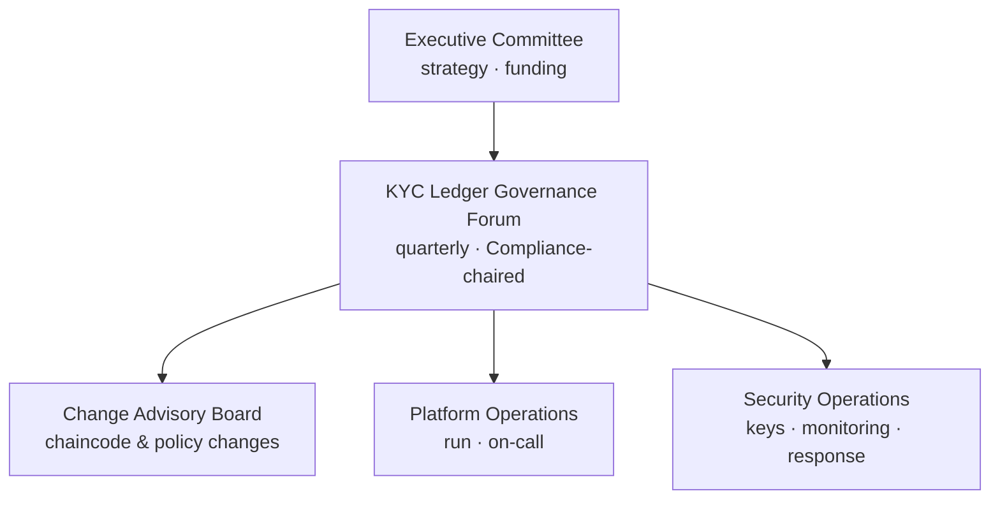
```mermaid
flowchart TB
    EXCO["Executive Committee<br/>strategy · funding"]
    GOV["KYC Ledger Governance Forum<br/>quarterly · Compliance-chaired"]
    CAB["Change Advisory Board<br/>chaincode & policy changes"]
    OPS["Platform Operations<br/>run · on-call"]
    SEC["Security Operations<br/>keys · monitoring · response"]

    EXCO --> GOV
    GOV --> CAB
    GOV --> OPS
    GOV --> SEC
```

| Decision | Authority | Quorum |
|---|---|---|
| Chaincode upgrade | CAB | All 3 org approvals + Compliance sign-off |
| Product policy change (`minAssurance`, `maxAgeDays`) | Governance Forum | Compliance + product owner |
| Assurance framework change | Governance Forum + ExCo | Compliance chair mandatory |
| Adding an organization to the network | ExCo | Legal + Compliance + Security |
| Pepper rotation | Security Ops | Dual custodian + Compliance notified |
| Emergency suspension (bulk) | Compliance head | Post-hoc Forum review |

**Chair the Governance Forum from Compliance, not Technology.** The platform's defining property is a compliance control; the forum's chair should reflect that, and it materially changes how the platform is perceived internally.

## 13.6 Operational ownership

| Function | Owner | Responsibility |
|---|---|---|
| Platform run | Technology — Platform Ops | Uptime, capacity, upgrades, DR |
| Chaincode | Technology — Blockchain | Development, lifecycle, testing |
| Gateway | Technology — Backend | Development, policy configuration |
| Key custody | Security | HSM, ceremonies, rotation |
| Policy content | **Compliance** | Assurance levels, product policies, `maxAgeDays` |
| Suspension decisions | **Compliance** | Investigation, suspend, reinstate |
| Erasure decisions | **Compliance + Legal** | Basis, retention conflicts, shred authorisation |
| Audit access | Internal Audit | Read-only verification |
| Business metrics | Product + Finance | Reuse rate, savings, drop-off |

**[OPEN-1] remains unanswered:** who owns the ledger *operationally* — Compliance, Technology, or a joint arrangement? The table above splits it functionally, which works. What it does not settle is who is accountable when the platform is wrong, and that must be named before go-live.

## 13.7 Runbooks required

`chainValid: false` · `ERR_PII_DETECTED` · registry divergence · pepper rotation · pepper compromise · KEK rotation · gateway compromise · peer/orderer recovery · vault failover and restore · HSM failover · chaincode upgrade · emergency bulk suspension · migration batch failure · rail outage degradation · DR failover · shred reconciliation failure.

**Each runbook is walked through by its on-call owner before go-live.** A runbook nobody has executed is documentation, not a control.

## 13.8 Compliance reviews and the audit interface

| Review | Frequency | Owner |
|---|---|---|
| Policy configuration review | Quarterly | Compliance |
| Access recertification | Quarterly | Security + HR |
| MSP admin separation attestation | Quarterly | Org heads |
| Key ceremony audit | Annual | Internal Audit |
| Pentest | Annual + on major change | Security |
| Chain integrity audit | Annual | Internal Audit |
| Regulatory change assessment | On publication | Compliance |
| DR rehearsal | Semi-annual | Platform Ops |

**The audit interface** — the tool an SBP inspector or internal auditor uses to answer *"what did the bank know about this customer, and when?"*:

1. Enter a CNIC → gateway derives `subjectId` (the inspector never sees it, and never needs to)
2. `GetVersionChain` returns every version with assurance, methods, verifier, timestamps
3. **Integrity status is displayed prominently, per link**
4. Disclosure log: which organization received which attributes, when, under which consent
5. **Export a signed state extract that a third party can verify offline, without peer access**

Point 5 is why the chain is modelled explicitly in record state rather than relying on Fabric's history API. **An inspector should not have to trust ABHI's blockchain in order to verify ABHI's history** — they should be able to recompute the hashes themselves from an export, with a published algorithm and any SHA-256 implementation.

## 13.9 Run cost

| Component | Driver |
|---|---|
| Fabric infrastructure | 6 peers + 5 orderers + CouchDB, multi-AZ |
| Gateway | 3+ replicas, autoscaled |
| Vault | Managed PostgreSQL HA + PITR |
| **HSM** | **Typically the largest single line — appliance or cloud HSM, per-partition** |
| Monitoring | Metrics volume, log retention |
| DR | Standby capacity |
| **People** | **~2–3 FTE steady state [A]** — platform ops, blockchain, and a share of security |

Not sized here **[A-2]**. Finance should model it against the §1.6 savings to establish whether the platform is self-funding on rail savings alone — and §1.6's grid suggests that at low volumes it will not be, which is why the strategic case must carry it.

---

# 14. Success Metrics

## 14.1 KPI definitions

| # | KPI | Definition / formula | Baseline | Target | Source | Owner |
|---|---|---|---|---|---|---|
| **1** | **KYC reuse rate** | ALLOW decisions ÷ total `VerifyKYC` calls | **Unknown [OPEN-3]** | ≥40% by M6 **[A]** | Decision events | Product |
| **2** | **NADRA call reduction** | 1 − (calls after ÷ calls before, volume-adjusted) | **Unmeasured** | ≥30% by M6 **[A]** | Rail metering | Technology |
| **3** | **Cost saving** | Calls avoided × unit cost | Unknown | Per §1.6 model | Rail metering + Finance | Finance |
| **4** | **Verification time** | Median seconds from KYC start to decision | Unknown | ≥60% reduction on ALLOW **[A]** | Journey telemetry | Product |
| **5** | **Step-up ratio** | STEP_UP ÷ (STEP_UP + FULL_KYC) | 0 — does not exist | ≥50% **[A]** | Decision events | Product |
| **6** | **Drop-off reduction** | Abandonment at identity steps, before vs after | Unknown | ≥20% relative **[A]** | Funnel analytics | Product |
| **7** | **Biometric lockout rate** | Subjects hitting the 3/day cap ÷ attempts | Unknown | ≥50% reduction **[A]** | Orchestrator counters | Product |
| **8** | **Audit readiness** | Median time to answer "what was known, when" | Days | **< 5 minutes** | Audit interface | Compliance |
| **9** | **Chain integrity** | Subjects with `chainValid: true` | n/a | **100%, always** | Nightly sweep | Security |
| **10** | **Suspension propagation** | Time from `SuspendKYC` to all products denying | Manual, days | **< 1 request cycle** | Decision events | Compliance |
| **11** | **Disclosure minimisation** | Mean attributes disclosed ÷ attributes held | 14/14 today | ≤ 4/14 **[A]** | `ProofIssued` events | Compliance |
| **12** | **Compliance efficiency** | Analyst hours per KYC investigation | Unknown | ≥40% reduction **[A]** | Compliance timesheets | Compliance |

**Every "Unknown" in the baseline column is a finding, not a gap in this document.** A bank that cannot measure how often it re-verifies the same person cannot manage that cost. Establishing these baselines is a Sprint 0 deliverable and has value even if the ledger is never built.

## 14.2 Targets by horizon

| Horizon | Focus | Gate |
|---|---|---|
| **POC exit** (W8) | `r` measured; all functional criteria met | §15.5 go/no-go |
| **Pilot** (M8) | One product live; KPIs 1, 2, 9, 10 instrumented | Reuse rate > 25% on the pilot product **[A]** |
| **6 months post-launch** | All products integrated | KPIs 1–7 at target |
| **12 months** | Migration complete; Consonance assessment done | KPIs 8–12 at target |

## 14.3 Counter-metrics — what would tell us this is going wrong

Tracking only success metrics is how a platform gets declared successful while causing harm. These four are watched with equal weight:

| Counter-metric | Concern | Threshold |
|---|---|---|
| **False-ALLOW rate** | Reuse permitted where it should not have been | **Any confirmed instance is a P1** |
| **Assurance inflation** | Levels claimed above methods performed | Zero tolerance; chaincode-enforced |
| **Disclosure creep** | Products requesting more attributes over time | Quarterly review; any policy widening needs Compliance approval |
| **Suspension latency** | Time from decision to effect | > 1 minute investigated |

---

# 15. Executive Recommendations

## 15.1 Should ABHI proceed?

**Yes — proceed with the POC. Do not yet approve the production programme.**

The POC is an eight-week, seven-person, mocked-rails build with no production integration, no customer-facing change and no regulatory dependency. It produces two things: a working demonstration of every claim in this document, and — more valuable — **the measured duplicate-verification rate `r`, from ABHI's own historical data**.

The production programme should be approved at the gate, on evidence, against §15.5. That sequencing is deliberate: it converts a strategic argument into a measured one before the expensive commitment.

**Three conditions, any of which failing should stop this at the gate:**

1. **Compliance commits to co-endorsing every KYC status change** and confirms it has the operational capacity **[OPEN-4]**. Without this, the endorsement policy is decoration and the central architectural claim is void.
2. **ABHI commits to genuine administrative separation between the three MSPs** (§8.3). Without it, §3.2.3's objection stands and the database alternative is the better engineering decision.
3. **`r` is material.** If measured `r` is very low, the operational case weakens sharply and only the Consonance argument remains — which may still justify proceeding, but should then be argued explicitly on strategic grounds rather than hidden inside an ROI slide.

## 15.2 Risks versus benefits

| Benefit | Confidence |
|---|---|
| Eliminates duplicate verification across products | **High** — mechanically follows from the design |
| Makes verification strength explicit and risk-usable | **High** — the A0/A2 distinction cannot be made today |
| Instant cross-product suspension | **High** |
| Provable, tamper-evident identity history | **High** |
| Consonance prerequisite established | **High** — strategically, the strongest argument |
| Reduces customer friction and drop-off | Medium — depends on measured drop-off |
| Material cost saving | **Unknown — this is what the POC measures** |

| Risk | Severity | Mitigation | Residual |
|---|---|---|---|
| **Migration/backfill underestimated** | **High** | Dedicated workstream from S6; 1% dry run; **[OPEN-5]** decided at executive level | Medium — this remains the most likely source of slippage |
| Compliance capacity for co-endorsement | High | Automate the endorsement path; **[OPEN-4]** answered before the gate | Medium |
| Pepper compromise | High | HSM, split knowledge, rotation, monitoring | Low |
| A0–A3 ↔ SBP mapping wrong | High | Compliance-owned; Phase 1 exit gate | Low if gated |
| NADRA contracting delays production | Medium | Start commercial engagement at S0 | Medium — outside engineering control |
| Fabric operational skills scarce locally | Medium | Training in S0–S1; managed service considered; TypeScript chosen partly for this | Medium |
| Three-MSP governance seen as theatre | Medium | §8.3 controls; external auditor peer in Phase 2 | Low if committed |
| Gateway compromise | Medium | §8.5; endorsement limits blast radius | Low |
| **Perceived as reducing CDD obligations** | **High if it occurs** | §7 states the opposite in writing to every audience | Low |

## 15.3 Build versus buy

| Option | Assessment |
|---|---|
| **Build (recommended)** | The domain logic — assurance ladder, product policies, ABHI's attribute set, the employer-portal A0 problem — is specific to ABHI's product mix. No vendor ships this. The generic parts (Fabric, HSM, PostgreSQL) are already bought rather than built |
| **Buy a KYC platform** | Commercial platforms *perform* KYC. ABHI's problem is not performing KYC — NADRA does that well — it is **remembering** that KYC was performed, provably, across products. Different problem; buying solves the one ABHI does not have |
| **Buy a blockchain platform** | Managed Fabric shortens setup but the entire value is in the chaincode and gateway, which are bespoke either way. **Worth considering for the managed *operation*** if Fabric skills prove scarce |
| **Wait for Consonance** | Consonance addresses **inter-bank** duplication. ABHI's problem is **intra-bank**. Joining requires one canonical record per customer, which ABHI lacks. **The internal ledger is the prerequisite, not the competitor** |

**Recommendation: build the chaincode and gateway; buy the infrastructure; consider managed Fabric operation.**

## 15.4 Blockchain versus traditional database — the honest comparison

| Property | Signed append-only PostgreSQL | Hyperledger Fabric | Material? |
|---|---|---|---|
| Append-only versioning | ✅ Triggers + WORM archival | ✅ Native | No — tie |
| Tamper-evidence | ✅ HSM-signed hash chain | ✅ Native | No — tie |
| Selective disclosure | ✅ Same Merkle scheme | ✅ Same | No — tie |
| Crypto-shredding | ✅ Same vault design | ✅ Same | No — tie |
| **No unilateral write** | ❌ **A sufficiently privileged DBA can bypass application controls** | ✅ **Enforced by endorsement policy below the application layer** | **YES — the decisive difference** |
| Independent multi-party verification | ⚠️ Single operator | ✅ Independent peers per org | Yes |
| Consonance structural alignment | ❌ Migration later | ✅ Integration later | Yes |
| Build cost | **Lower** | Higher | Yes |
| Run cost | **Lower** | Higher | Yes |
| Talent availability | **Much better** | Scarce | Yes |
| Operational complexity | **Low** | High | Yes |

### The verdict, stated as plainly as it can be

**If ABHI does not want multi-party governance over KYC status, and has no intention of joining the shared national platform, the signed append-only database is the better engineering decision.** It delivers most of the value at a fraction of the cost and complexity, and it hires easily.

**Saying that out loud is what makes the case for the ledger credible when the answer to both is yes.**

The blockchain earns its place on exactly two properties: **no unilateral write**, enforced below the application layer, and **structural alignment with Consonance**. Everything else in this design — the Merkle commitments, the assurance ladder, the vault, crypto-shredding, the policy engine — works identically on PostgreSQL. **Anyone advocating this platform on the grounds that "blockchain is more secure" is making an argument that will not survive a conversation with a CISO, and should not make it.**

A concrete recommendation that strengthens the ledger case materially and cheaply: **add a read-only external auditor peer in Phase 2** — ABHI's external auditor, or Internal Audit under separate infrastructure control. It converts the multi-party claim from an internal org-chart argument into an external one, and it costs one peer.

## 15.5 POC success criteria

Binary. Assessed at the gate. No partial credit.

| # | Criterion | Pass condition |
|---|---|---|
| **1** | Merkle reproducibility | Every hash in `IDEA.md` §4 reproduced byte-for-byte |
| **2** | Selective disclosure | Withheld values mechanically absent from the serialised bundle |
| **3** | **No unilateral write** | A single-org write attempt **fails**, demonstrated live |
| **4** | Compliance-only operations | Product-org `SuspendKYC` → `ERR_COMPLIANCE_ONLY` |
| **5** | Version chain integrity | 3-version chain verifies; tampering sets `chainValid: false` with correct `brokenAt` |
| **6** | Reuse path | EWA after wallet → **ALLOW with zero rail calls**. **Conditional on [OPEN-F]:** this criterion holds only if §9.3's live-selfie is transaction authorisation rather than CDD. Under the CDD reading the correct expectation is STEP_UP naming liveness, and this criterion is testing the wrong thing |
| **7** | Step-up path | SBL after A2 → **STEP_UP naming liveness only** |
| **8** | Hard stops | Expired CNIC and SUSPENDED both DENY, in the correct precedence |
| **9** | Propagation | CNIC renewal visible to all products with no batch job |
| **10** | Erasure | Crypto-shred: data gone, root remains, audit fact survives |
| **11** | Employer split | 1,000 CNICs split correctly in < 60 s |
| **12** | No PII on ledger | Full state export scanned; zero PII; tripwire rejects a CNIC-shaped payload |
| **13** | **`r` measured** | Duplicate verification rate reported with methodology, **or** a documented reason and dated plan |
| **14** | Compliance mapping | A0–A3 ↔ SBP category mapping drafted and reviewed by Compliance **[OPEN-A]** |
| **15** | Demo | 20-minute walkthrough runs unaided |

**Criterion 13 is the one that matters most to the business, and criterion 3 is the one that matters most to the architecture.** A POC that passes every criterion except 3 has built an expensive database. A POC that passes every criterion except 13 has built something impressive that nobody can justify funding.

## 15.6 Production adoption strategy

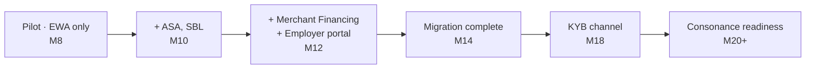
```mermaid
flowchart LR
    A["Pilot · EWA only<br/>M8"] --> B["+ ASA, SBL<br/>M10"]
    B --> C["+ Merchant Financing<br/>+ Employer portal<br/>M12"]
    C --> D["Migration complete<br/>M14"]
    D --> E["KYB channel<br/>M18"]
    E --> F["Consonance readiness<br/>M20+"]
```

| Principle | Rationale |
|---|---|
| **EWA first** | Highest duplication, lowest complexity, clearest saving. Its own spec says full CDD applies to an already-verified customer **[M]** |
| **Shadow mode before enforcement** | Run decisions in parallel with the existing flow, log divergence, change nothing. Any disagreement is investigated **before** the ledger governs a real outcome. **This is the single most important de-risking step in the whole rollout** |
| **Feature flag per product** | Instant rollback to the existing flow, per product, without a deployment |
| **Migration in parallel, not first** | Backfill runs alongside pilot; new verifications write to the ledger from day one so the base grows while the backlog is cleared |
| **A0 never grants anything** | Employer-sourced records create leads, never entitlements — from the first day to the last |

## 15.7 Consonance integration readiness

| Readiness dimension | Status | Action |
|---|---|---|
| One canonical record per customer | **Achieved by this platform** — currently absent | Build it |
| DLT-based architecture | Structural match (Fabric) | — |
| Bank-held data | Match — vault at ABHI | — |
| Consent-gated access | Match — on-ledger consent with scope and expiry | — |
| Schema mapping to Consonance | **Not started** | Phase 3, needs platform specifications |
| Consent model compatibility | Compatible in shape, unverified in detail | Phase 3 |
| Membership terms, hosting, liability | **Unknown** | **[OPEN-2]** — commercial and legal, start early |

**[OPEN-2] materially changes the priority of this entire initiative.** If ABHI intends to join Consonance within 24 months, the internal ledger moves from *"a good idea"* to *"the prerequisite work, and it is already late."* If ABHI has no such intention, §15.4's database alternative deserves a genuine second look. **This question should be answered by the executive sponsor before the gate, not after.**

## 15.8 Recommendation in one paragraph

ABHI verifies the same person repeatedly, cannot distinguish an employer's assertion from a NADRA biometric match, cannot propagate an update across products, and cannot measure what any of that costs. A permissioned ledger holding cryptographic commitments rather than personal data fixes all four, aligns structurally with the platform SBP has advised banks to join, and requires no regulatory approval to build internally. **Approve the eight-week POC.** Hold the production decision until the gate, and take it on the measured duplicate-verification rate, Compliance's commitment to co-endorsement, and ABHI's position on Consonance. If those three land well, build it. If they do not, build the signed append-only database instead — and be glad the POC cost eight weeks rather than eighteen months to find out.

---

# Appendix A — Open questions and assumptions

## A.1 Open questions

| ID | Question | Owner | Impact if unanswered | Needed by |
|---|---|---|---|---|
| **OPEN-1** | Who owns the ledger operationally — Compliance, Technology, or joint? | ExCo | Accountability gap at go-live | Pre-production |
| **OPEN-2** | ABHI's position on joining PBA Consonance, and target date? | ExCo sponsor | **Changes the priority of the whole initiative** | **Before the gate** |
| **OPEN-3** | Real NADRA per-call costs, monthly volumes, and **what proportion are repeat verifications?** | Finance + Technology | **The business case cannot be sized** | **Sprint 0 — measured, not asked** |
| **OPEN-4** | Does Compliance accept co-endorsing every status change, and can it resource that? | Compliance head | **The central architectural property is void without it** | **Before the gate** |
| **OPEN-5** | At migration, what assurance level is assigned where original evidence is incomplete? | Compliance + ExCo | **Largest judgment call in the programme**; sets the platform's day-one value | Before S13 |
| **OPEN-6** | Does the Compliance module's LFD tab bear on identity verification? | Compliance | Possible missing input | Before S6 |
| **OPEN-7** | Should Open API partners write to the ledger, or only read? | Product + Risk | Assurance-laundering exposure | Before S7 |
| **OPEN-A** | A0–A3 ↔ SBP account category mapping | **Compliance** | **Phase 1 exit gate**; policy is unapproved without it | **Sprint 0–1** |
| **OPEN-B** | Is re-affirming only the strongest method acceptable as periodic CDD refresh? | Compliance | Removes most of the staleness saving if not | Before S2 |
| **OPEN-C** | Is intra-group disclosure (Bank → Lending) permitted under current customer terms? | Legal | May require terms and privacy-notice update | Before pilot |
| **OPEN-D** | What exactly may the employer portal display about non-employees' status? | Product + Legal | Enumeration/privacy exposure (§8.9 S-5) | Before S7 |
| **OPEN-E** | Does crypto-shredding satisfy a statutory erasure right in Pakistan? | Legal (external opinion) | PDPB readiness claim unsupported | Before production |
| **OPEN-F** | Is the fingerprint + live-selfie step at Part Two §9.3 customer due diligence, or per-request transaction authorisation? | **Compliance + Product** | **Moves the business case in either direction.** If CDD, EWA and ASA require A3 and the "zero rail calls" target below is wrong. If transaction authorisation, it is not reusable by anything and part of the modelled saving is spend that occurs regardless | **Before the gate** |

## A.2 Assumptions

| ID | Assumption | If wrong |
|---|---|---|
| **A-1** | Two-week sprints, team of 7 as specified | §10 re-phases; duration scales |
| **A-2** | No ROI figure here is an ABHI number | The whole of §1.6 is replaced by measured inputs |
| **A-3** | POC uses mocked rails only | Timeline extends by the contracting lead time |
| A-4 | Expiry: A0 180 d · A1 365 d · A2 365 d · A3 180 d | Policy config change; no code change |
| A-5 | Product policies in §6.4 are engineering defaults | **Must be Compliance-approved before production** |
| A-6 | Max consent duration 730 days | Config change |
| A-7 | HSM is FIPS 140-2 Level 3 | Procurement decision; affects §8 assurance claims |
| A-8 | `VerifyKYC` p99 ≤ 300 ms at 100 TPS is achievable | Re-baseline after S3 performance test |
| A-9 | Reuse efficiency `e ≈ 0.7` | Only affects the §1.6 grid, not the design |
| A-10 | ~2–3 FTE steady-state run cost | Finance to model |
| A-11 | Fabric 2.5 LTS remains supported through the programme | Version bump within the LTS line |

# Appendix B — RACI

| Activity | Compliance | Technology | Risk | Product | Finance | Legal |
|---|---|---|---|---|---|---|
| Assurance framework definition | **A** | C | R | C | I | I |
| SBP category mapping **[OPEN-A]** | **A/R** | I | C | I | I | C |
| Product policy configuration | **A** | R | C | R | I | I |
| Chaincode development | I | **A/R** | I | I | I | I |
| Endorsement policy | **A** | R | C | I | I | I |
| Key custody | C | R | I | I | I | I |
| Suspension decisions | **A/R** | I | C | I | I | I |
| Erasure decisions | **A/R** | R | I | I | I | **C** |
| Migration assurance assignment **[OPEN-5]** | **A/R** | R | C | C | I | C |
| ROI model and validation | I | C | I | C | **A/R** | I |
| Consonance engagement | C | C | I | C | I | **A** |
| Audit interface | **A** | R | I | I | I | I |

*R = Responsible · A = Accountable · C = Consulted · I = Informed*

# Appendix C — Glossary

| Term | Meaning |
|---|---|
| **A0–A3** | The assurance ladder — asserted, document-verified, biometric-verified, biometric + liveness |
| **AAD** | Additional Authenticated Data — bound into AES-GCM so ciphertext cannot be relocated |
| **CDD** | Customer Due Diligence |
| **Chaincode** | Hyperledger Fabric's term for a smart contract |
| **CNIC** | Computerised National Identity Card — Pakistan's national ID, 13 digits |
| **Consonance** | The PBA's shared e-KYC platform, built by Avanza Innovations |
| **Crypto-shredding** | Erasure by destroying the encryption key rather than the ciphertext |
| **DEK / KEK** | Data Encryption Key, encrypting one record; Key Encryption Key, wrapping the DEK |
| **e-CIB** | SBP's Electronic Credit Information Bureau — a *credit* check, not identity |
| **Endorsement policy** | The Fabric rule stating which organizations must sign a transaction for it to commit |
| **Envelope encryption** | Encrypting data with a per-record DEK, then encrypting that DEK with a KEK |
| **EWA / ASA / SBL** | Earned Wage Access · Advance Salary Access · Salary-Backed Lending |
| **HSM** | Hardware Security Module — tamper-resistant key custody |
| **MSP** | Membership Service Provider — a Fabric organization's identity domain |
| **MVCC** | Multi-Version Concurrency Control — Fabric's read-write-set conflict detection |
| **NADRA** | National Database and Registration Authority — Pakistan's identity authority |
| **Pepper** | A secret key used in HMAC, held in an HSM; distinct from a salt, which is stored beside the data |
| **PDC** | Private Data Collection — Fabric's per-organization data visibility mechanism |
| **Selective disclosure** | Proving specific attributes without revealing the others |
| **STEP_UP** | A decision requiring only the missing verification methods, not a full re-onboarding |
| **Verisys** | NADRA's identity verification service |

# Appendix D — References

**ABHI source documents**
- *Consolidated Product Manual v2* — Part One: Digital Products; Part Two: Lending Products
- *ABHI Lending Products Manual V10*
- `ABHI_KYC_Ledger_IDEA.md` — the concept document this blueprint implements

**Regulatory**
- [SBP BPRD Circular Letter No. 22 of 2023](https://www.sbp.org.pk/bprd/2023/CL22.htm) — Implementation of Shared Electronic KYC Platform, 18 December 2023
- [SBP BPRD Circular No. 01 of 2025](https://www.sbp.org.pk/bprd/2025/C1-Consolidated-Customer-Onboarding-Framework.pdf) — Consolidated Customer Onboarding Framework, 25 July 2025
- SBP AML/CFT/CPF Regulations, as amended
- SBP Prudential Regulations for Microfinance Banks
- Banking Companies Ordinance 1962; Payment Systems and Electronic Fund Transfers Act 2007
- Personal Data Protection Bill 2023 (draft, not enacted as at August 2026)

**Technical**
- [Hyperledger Fabric 2.5 documentation](https://hyperledger-fabric.readthedocs.io/en/release-2.5/)
- [Fabric private data collections](https://hyperledger-fabric.readthedocs.io/en/release-2.5/private-data/private-data.html)

**Context**
- [Shared e-KYC introduced for banks — Profit / Pakistan Today](https://profit.pakistantoday.com.pk/2023/12/20/shared-e-kyc-introduced-for-banks-as-pba-and-sbp-move-towards-more-open-banking/)
- [Pakistan central bank backs blockchain KYC sharing — Ledger Insights](https://www.ledgerinsights.com/central-bank-pakistan-blockchain-kyc-shared/)
- [CKYC Registry in India, and CKYC 2.0](https://www.befisc.com/fintechsherlock/ckyc-registry-guide-india/)

---

*All hashes referenced in this document are reproducible from `packages/merkle` using the demonstration salts and pepper noted in `IDEA.md` §4. Never use those constants outside a demo.*

*Prepared by Muhammad Shahnoor Sajid, Digital Products, ABHI Microfinance Bank · 17 August 2026*
